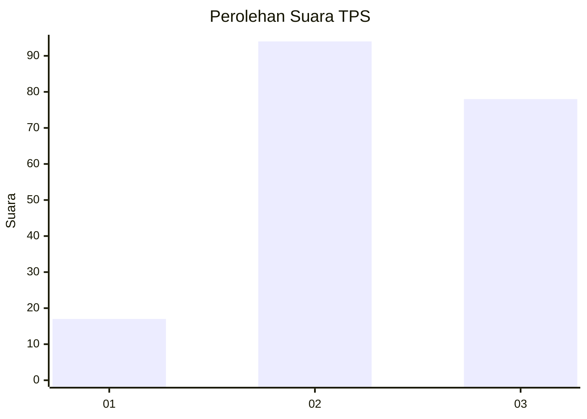
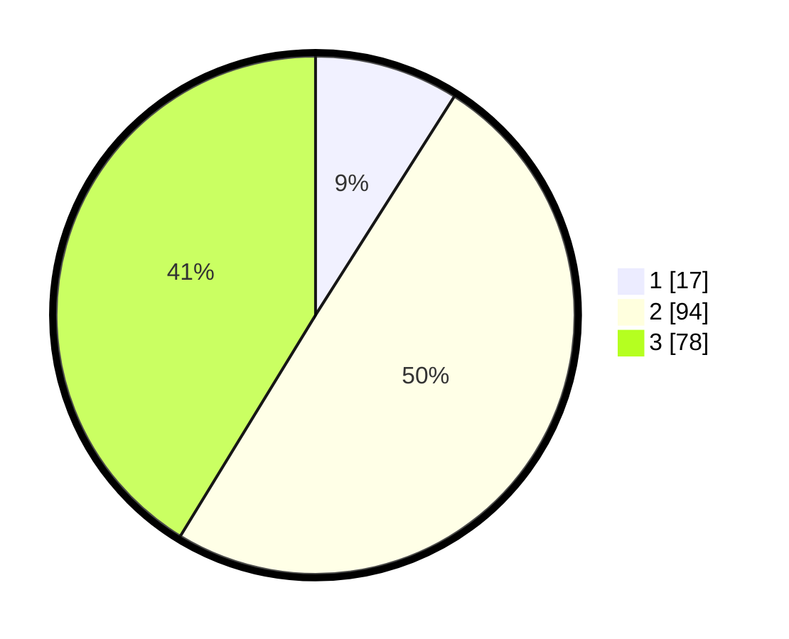

# Hasil

## Grafik

## Tabel

| No. | Nama Paslon    | Suara | Suara (raw) | Persentase |
|:--- |:-------------- | -----:| -----------:| ----------:|
| 1   | ANIES MUHAIMIN | 17    | [17][p-1]   | 8,99       |
| 2   | PRABOWO GIBRAN | 94    | [94][p-2]   | 49,74      |
| 3   | GANJAR MAHFUD  | 78    | [78][p-3]   | 41,27      |

[p-1]: https://github.com/gigit-pemilu/pemilu-2024/blob/main/pilpres/hitung-suara/sub/33-jawa-tengah/sub/01-cilacap/sub/01-kedungreja/sub/2001-tambakreja/sub/001-tps/sub/paslon-1.txt
[p-2]: https://github.com/gigit-pemilu/pemilu-2024/blob/main/pilpres/hitung-suara/sub/33-jawa-tengah/sub/01-cilacap/sub/01-kedungreja/sub/2001-tambakreja/sub/001-tps/sub/paslon-2.txt
[p-3]: https://github.com/gigit-pemilu/pemilu-2024/blob/main/pilpres/hitung-suara/sub/33-jawa-tengah/sub/01-cilacap/sub/01-kedungreja/sub/2001-tambakreja/sub/001-tps/sub/paslon-3.txt

## Foto C Plano

https://sirekap-obj-formc.kpu.go.id/ada5/pemilu/ppwp/33/01/01/20/01/3301012001001-20240215-111338--7fbc2a2a-3d0f-4099-807b-bfb39d7672e9.jpg

https://sirekap-obj-formc.kpu.go.id/ada5/pemilu/ppwp/33/01/01/20/01/3301012001001-20240215-111359--c27a3bd1-03b0-4d2d-8142-e980338877e6.jpg

https://sirekap-obj-formc.kpu.go.id/ada5/pemilu/ppwp/33/01/01/20/01/3301012001001-20240215-111348--ae8414f7-9a2b-4994-ba4d-5c67d6464922.jpg

## Metadata

| Key        | Value               |
| ---------- | ------------------- |
| Time Stamp | 2024-02-15 15:00:29 |

## DATA PEMILIH TETAP

Jumlah pemilih dalam DPT: **265**.
 * L: **132**.
 * P: **133**.

## DATA PENGGUNA HAK PILIH

Jumlah pengguna hak pilih dalam DPT: **191**.
 * L: **88**.
 * P: **103**.

Jumlah pengguna hak pilih dalam DPTb: **2**.
 * L: **1**.
 * P: **1**.

Jumlah pengguna hak pilih dalam DPK: **0**.
 * L: **0**.
 * P: **0**.

Jumlah pengguna hak pilih: **193**.
 * L: **89**.
 * P: **104**.

## JUMLAH SUARA SAH DAN TIDAK SAH

JUMLAH SELURUH SUARA SAH: **189**.

JUMLAH SUARA TIDAK SAH: **4**.

JUMLAH SELURUH SUARA SAH DAN SUARA TIDAK SAH: **193**.

