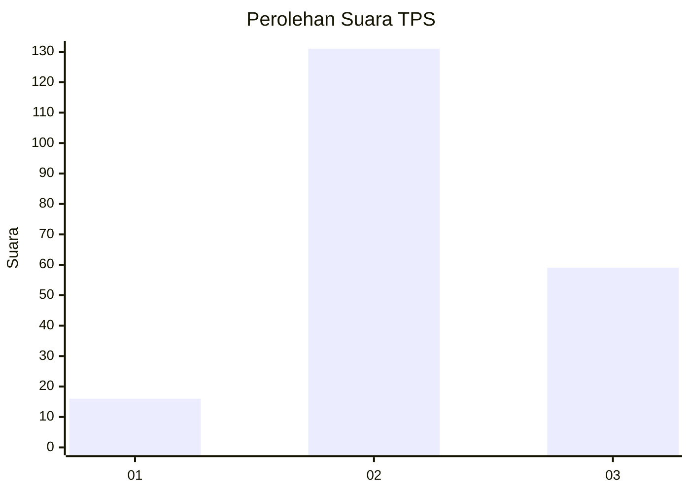
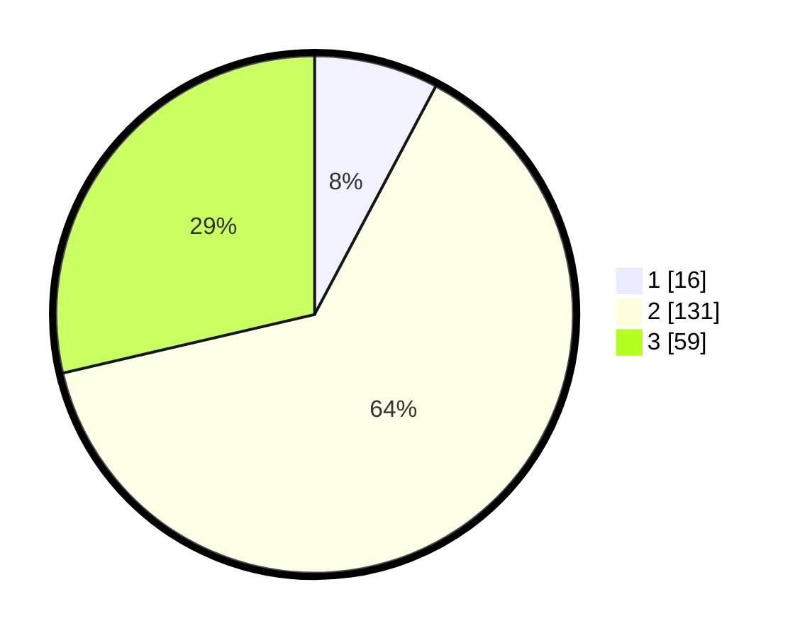

# Hasil

## Grafik

## Tabel

| No. | Nama Paslon    | Suara | Suara (raw) | Persentase |
|:--- |:-------------- | -----:| -----------:| ----------:|
| 1   | ANIES MUHAIMIN | 16    | [16][p-1]   | 7,77       |
| 2   | PRABOWO GIBRAN | 131   | [131][p-2]  | 63,59      |
| 3   | GANJAR MAHFUD  | 59    | [59][p-3]   | 28,64      |

[p-1]: https://github.com/gigit-pemilu/pemilu-2024-33-jawa-tengah/blob/main/pilpres/hitung-suara/sub/33-jawa-tengah/sub/01-cilacap/sub/01-kedungreja/sub/2001-tambakreja/sub/002-tps/sub/paslon-1.txt
[p-2]: https://github.com/gigit-pemilu/pemilu-2024-33-jawa-tengah/blob/main/pilpres/hitung-suara/sub/33-jawa-tengah/sub/01-cilacap/sub/01-kedungreja/sub/2001-tambakreja/sub/002-tps/sub/paslon-2.txt
[p-3]: https://github.com/gigit-pemilu/pemilu-2024-33-jawa-tengah/blob/main/pilpres/hitung-suara/sub/33-jawa-tengah/sub/01-cilacap/sub/01-kedungreja/sub/2001-tambakreja/sub/002-tps/sub/paslon-3.txt

## Foto C Plano

https://sirekap-obj-formc.kpu.go.id/faa5/pemilu/ppwp/33/01/01/20/01/3301012001002-20240214-190650--e919fe96-21ea-48d1-af9e-60bccfcd9fa3.jpg

https://sirekap-obj-formc.kpu.go.id/faa5/pemilu/ppwp/33/01/01/20/01/3301012001002-20240214-190818--3fb23183-c279-4121-937d-3a04fb505b77.jpg

https://sirekap-obj-formc.kpu.go.id/faa5/pemilu/ppwp/33/01/01/20/01/3301012001002-20240215-113500--339a5976-5e21-41ef-8cfb-1ed448de5591.jpg

## Metadata

| Key        | Value               |
| ---------- | ------------------- |
| Time Stamp | 2024-02-15 12:00:28 |

## DATA PEMILIH TETAP

Jumlah pemilih dalam DPT: **288**.
 * L: **144**.
 * P: **144**.

## DATA PENGGUNA HAK PILIH

Jumlah pengguna hak pilih dalam DPT: **206**.
 * L: **103**.
 * P: **103**.

Jumlah pengguna hak pilih dalam DPTb: **0**.
 * L: **0**.
 * P: **0**.

Jumlah pengguna hak pilih dalam DPK: **0**.
 * L: **0**.
 * P: **0**.

Jumlah pengguna hak pilih: **206**.
 * L: **103**.
 * P: **103**.

## JUMLAH SUARA SAH DAN TIDAK SAH

JUMLAH SELURUH SUARA SAH: **206**.

JUMLAH SUARA TIDAK SAH: **0**.

JUMLAH SELURUH SUARA SAH DAN SUARA TIDAK SAH: **206**.

