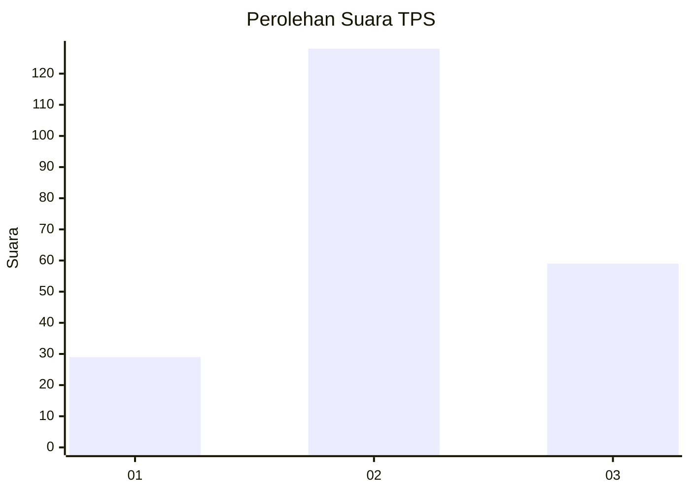
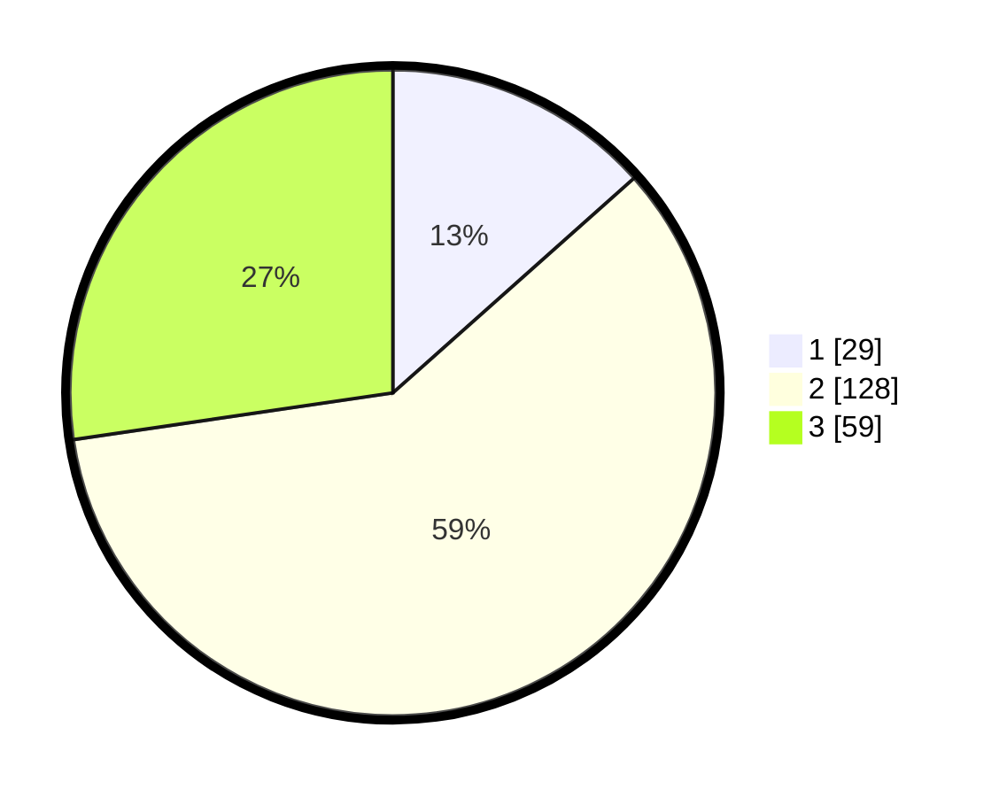

# Hasil

## Grafik

## Tabel

| No. | Nama Paslon    | Suara | Suara (raw) | Persentase |
|:--- |:-------------- | -----:| -----------:| ----------:|
| 1   | ANIES MUHAIMIN | 29    | [29][p-1]   | 13,43      |
| 2   | PRABOWO GIBRAN | 128   | [128][p-2]  | 59,26      |
| 3   | GANJAR MAHFUD  | 59    | [59][p-3]   | 27,31      |

[p-1]: https://github.com/gigit-pemilu/pemilu-2024-33-jawa-tengah/blob/main/pilpres/hitung-suara/sub/33-jawa-tengah/sub/01-cilacap/sub/01-kedungreja/sub/2001-tambakreja/sub/003-tps/sub/paslon-1.txt
[p-2]: https://github.com/gigit-pemilu/pemilu-2024-33-jawa-tengah/blob/main/pilpres/hitung-suara/sub/33-jawa-tengah/sub/01-cilacap/sub/01-kedungreja/sub/2001-tambakreja/sub/003-tps/sub/paslon-2.txt
[p-3]: https://github.com/gigit-pemilu/pemilu-2024-33-jawa-tengah/blob/main/pilpres/hitung-suara/sub/33-jawa-tengah/sub/01-cilacap/sub/01-kedungreja/sub/2001-tambakreja/sub/003-tps/sub/paslon-3.txt

## Foto C Plano

https://sirekap-obj-formc.kpu.go.id/54f8/pemilu/ppwp/33/01/01/20/01/3301012001003-20240216-192157--c62289ea-292d-40ff-97ee-e12524ae1290.jpg

https://sirekap-obj-formc.kpu.go.id/54f8/pemilu/ppwp/33/01/01/20/01/3301012001003-20240216-192158--8605d669-dddc-49db-a939-c06ef0cf9cb2.jpg

https://sirekap-obj-formc.kpu.go.id/54f8/pemilu/ppwp/33/01/01/20/01/3301012001003-20240216-192157--a951aaa2-fd62-4dac-a56d-37c79215eba2.jpg

## Metadata

| Key        | Value               |
| ---------- | ------------------- |
| Time Stamp | 2024-02-16 21:01:00 |

## DATA PEMILIH TETAP

Jumlah pemilih dalam DPT: **272**.
 * L: **140**.
 * P: **132**.

## DATA PENGGUNA HAK PILIH

Jumlah pengguna hak pilih dalam DPT: **217**.
 * L: **110**.
 * P: **107**.

Jumlah pengguna hak pilih dalam DPTb: **0**.
 * L: **0**.
 * P: **0**.

Jumlah pengguna hak pilih dalam DPK: **0**.
 * L: **0**.
 * P: **0**.

Jumlah pengguna hak pilih: **217**.
 * L: **110**.
 * P: **107**.

## JUMLAH SUARA SAH DAN TIDAK SAH

JUMLAH SELURUH SUARA SAH: **216**.

JUMLAH SUARA TIDAK SAH: **1**.

JUMLAH SELURUH SUARA SAH DAN SUARA TIDAK SAH: **217**.

