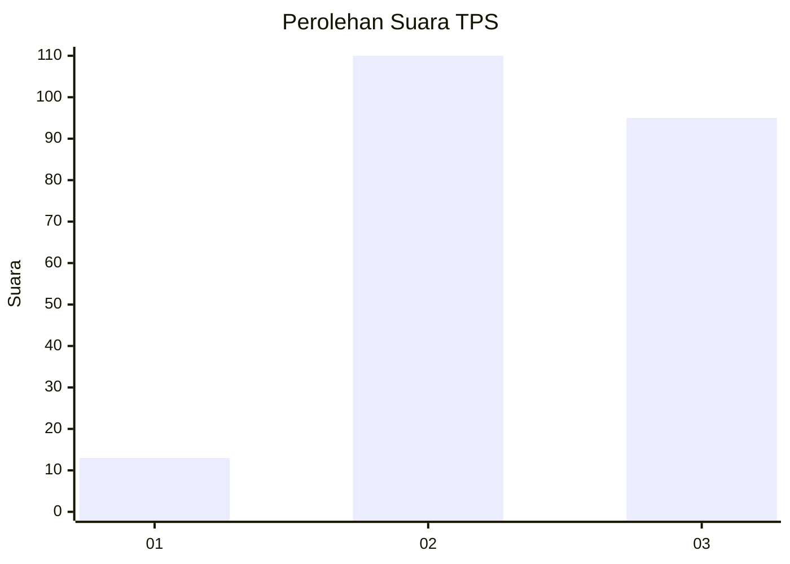
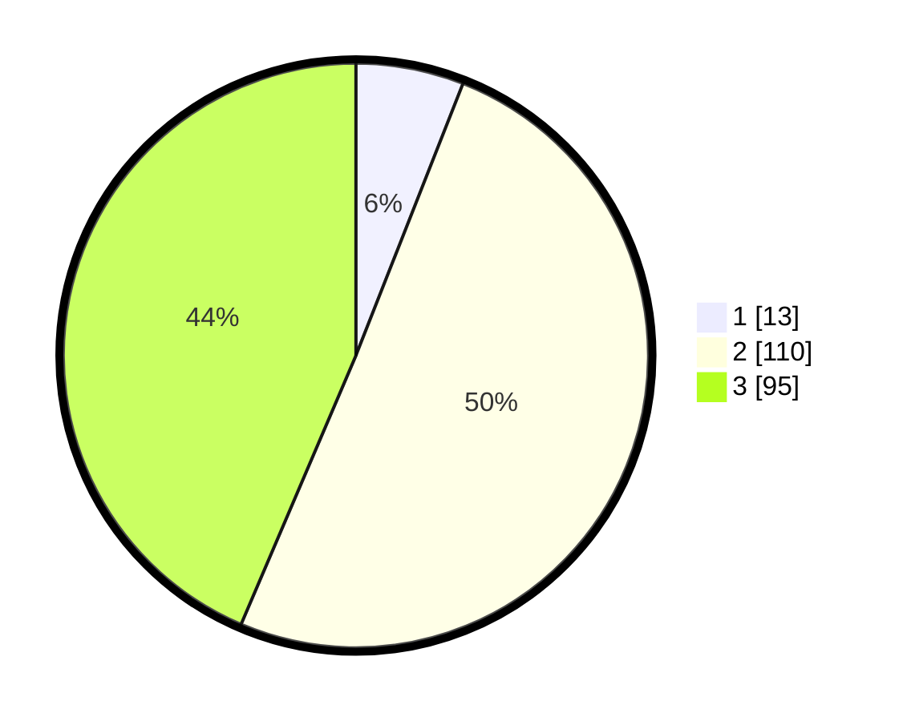

# Hasil

## Grafik

## Tabel

| No. | Nama Paslon    | Suara | Suara (raw) | Persentase |
|:--- |:-------------- | -----:| -----------:| ----------:|
| 1   | ANIES MUHAIMIN | 13    | [13][p-1]   | 5,96       |
| 2   | PRABOWO GIBRAN | 110   | [110][p-2]  | 50,46      |
| 3   | GANJAR MAHFUD  | 95    | [95][p-3]   | 43,58      |

[p-1]: https://github.com/gigit-pemilu/pemilu-2024/blob/main/pilpres/hitung-suara/sub/33-jawa-tengah/sub/01-cilacap/sub/01-kedungreja/sub/2001-tambakreja/sub/004-tps/sub/paslon-1.txt
[p-2]: https://github.com/gigit-pemilu/pemilu-2024/blob/main/pilpres/hitung-suara/sub/33-jawa-tengah/sub/01-cilacap/sub/01-kedungreja/sub/2001-tambakreja/sub/004-tps/sub/paslon-2.txt
[p-3]: https://github.com/gigit-pemilu/pemilu-2024/blob/main/pilpres/hitung-suara/sub/33-jawa-tengah/sub/01-cilacap/sub/01-kedungreja/sub/2001-tambakreja/sub/004-tps/sub/paslon-3.txt

## Foto C Plano

https://sirekap-obj-formc.kpu.go.id/7df0/pemilu/ppwp/33/01/01/20/01/3301012001004-20240216-054117--5481d363-5748-40d0-8ad1-e37b492ea975.jpg

https://sirekap-obj-formc.kpu.go.id/7df0/pemilu/ppwp/33/01/01/20/01/3301012001004-20240216-054125--de7ed6d3-716b-4c99-9f38-303cab3e4f0d.jpg

https://sirekap-obj-formc.kpu.go.id/7df0/pemilu/ppwp/33/01/01/20/01/3301012001004-20240216-054124--9bc4af12-3f7c-4ce2-8461-cd0515f0ec8e.jpg

## Metadata

| Key        | Value               |
| ---------- | ------------------- |
| Time Stamp | 2024-02-16 08:30:27 |

## DATA PEMILIH TETAP

Jumlah pemilih dalam DPT: **291**.
 * L: **153**.
 * P: **138**.

## DATA PENGGUNA HAK PILIH

Jumlah pengguna hak pilih dalam DPT: **219**.
 * L: **116**.
 * P: **103**.

Jumlah pengguna hak pilih dalam DPTb: **0**.
 * L: **0**.
 * P: **0**.

Jumlah pengguna hak pilih dalam DPK: **0**.
 * L: **0**.
 * P: **0**.

Jumlah pengguna hak pilih: **219**.
 * L: **116**.
 * P: **103**.

## JUMLAH SUARA SAH DAN TIDAK SAH

JUMLAH SELURUH SUARA SAH: **218**.

JUMLAH SUARA TIDAK SAH: **1**.

JUMLAH SELURUH SUARA SAH DAN SUARA TIDAK SAH: **219**.

