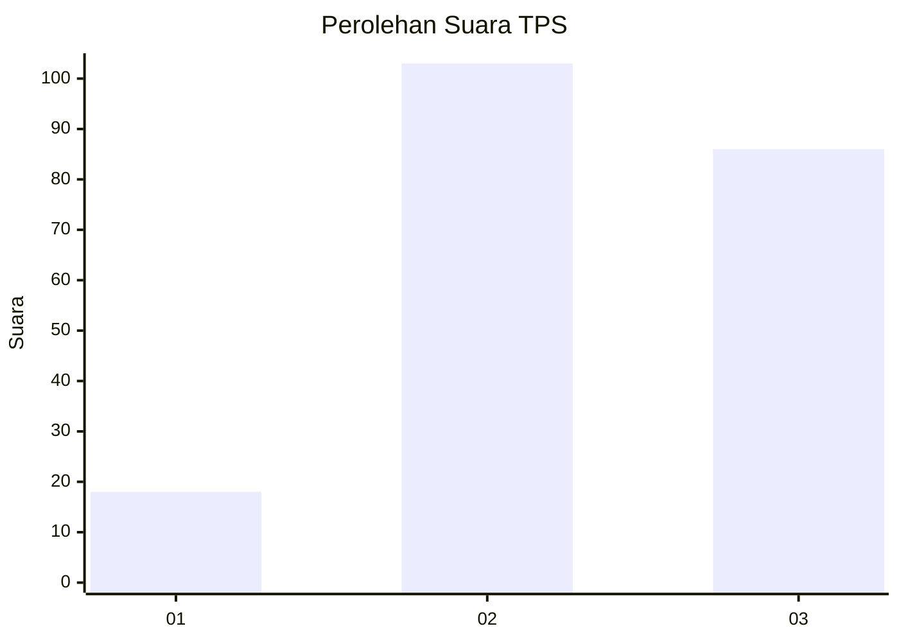
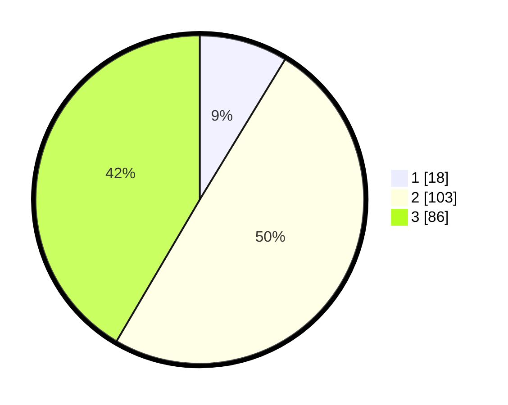

# Hasil

## Grafik

## Tabel

| No. | Nama Paslon    | Suara | Suara (raw) | Persentase |
|:--- |:-------------- | -----:| -----------:| ----------:|
| 1   | ANIES MUHAIMIN | 18    | [18][p-1]   | 8,70       |
| 2   | PRABOWO GIBRAN | 103   | [103][p-2]  | 49,76      |
| 3   | GANJAR MAHFUD  | 86    | [86][p-3]   | 41,55      |

[p-1]: https://github.com/gigit-pemilu/pemilu-2024-33-jawa-tengah/blob/main/pilpres/hitung-suara/sub/33-jawa-tengah/sub/01-cilacap/sub/01-kedungreja/sub/2001-tambakreja/sub/005-tps/sub/paslon-1.txt
[p-2]: https://github.com/gigit-pemilu/pemilu-2024-33-jawa-tengah/blob/main/pilpres/hitung-suara/sub/33-jawa-tengah/sub/01-cilacap/sub/01-kedungreja/sub/2001-tambakreja/sub/005-tps/sub/paslon-2.txt
[p-3]: https://github.com/gigit-pemilu/pemilu-2024-33-jawa-tengah/blob/main/pilpres/hitung-suara/sub/33-jawa-tengah/sub/01-cilacap/sub/01-kedungreja/sub/2001-tambakreja/sub/005-tps/sub/paslon-3.txt

## Foto C Plano

https://sirekap-obj-formc.kpu.go.id/4665/pemilu/ppwp/33/01/01/20/01/3301012001005-20240217-163701--be2bbfb5-a390-43f6-8a41-8a9af11d3f8f.jpg

https://sirekap-obj-formc.kpu.go.id/4665/pemilu/ppwp/33/01/01/20/01/3301012001005-20240217-163703--88bf9cd7-ac3e-429a-8a6c-971d1f7a8753.jpg

https://sirekap-obj-formc.kpu.go.id/4665/pemilu/ppwp/33/01/01/20/01/3301012001005-20240217-163702--845ec736-e319-4f20-aa4e-d0da2f771631.jpg

## Metadata

| Key        | Value               |
| ---------- | ------------------- |
| Time Stamp | 2024-02-17 16:52:47 |

## DATA PEMILIH TETAP

Jumlah pemilih dalam DPT: **272**.
 * L: **136**.
 * P: **136**.

## DATA PENGGUNA HAK PILIH

Jumlah pengguna hak pilih dalam DPT: **210**.
 * L: **100**.
 * P: **110**.

Jumlah pengguna hak pilih dalam DPTb: **0**.
 * L: **0**.
 * P: **0**.

Jumlah pengguna hak pilih dalam DPK: **1**.
 * L: **1**.
 * P: **0**.

Jumlah pengguna hak pilih: **211**.
 * L: **101**.
 * P: **110**.

## JUMLAH SUARA SAH DAN TIDAK SAH

JUMLAH SELURUH SUARA SAH: **207**.

JUMLAH SUARA TIDAK SAH: **4**.

JUMLAH SELURUH SUARA SAH DAN SUARA TIDAK SAH: **211**.

