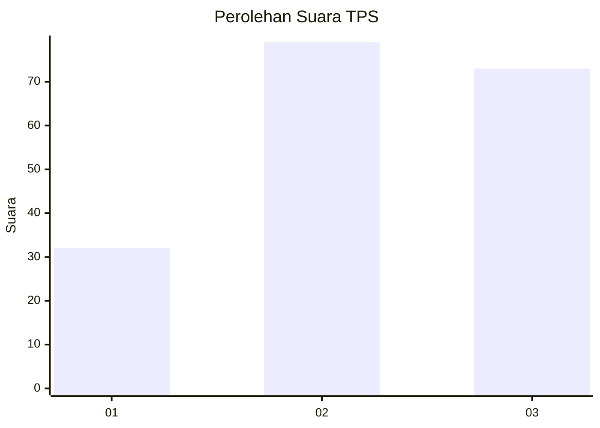
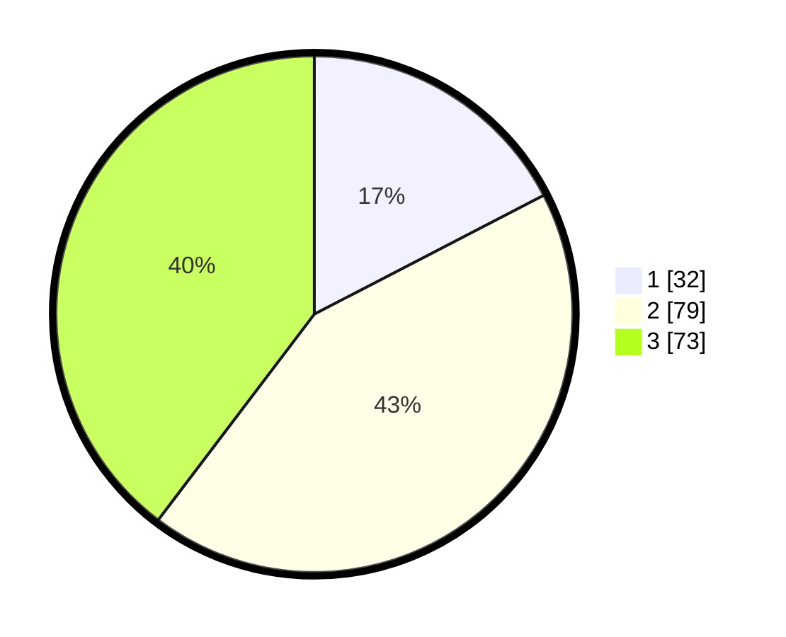

# Hasil

## Grafik

## Tabel

| No. | Nama Paslon    | Suara | Suara (raw) | Persentase |
|:--- |:-------------- | -----:| -----------:| ----------:|
| 1   | ANIES MUHAIMIN | 32    | [32][p-1]   | 17,39      |
| 2   | PRABOWO GIBRAN | 79    | [79][p-2]   | 42,93      |
| 3   | GANJAR MAHFUD  | 73    | [73][p-3]   | 39,67      |

[p-1]: https://github.com/gigit-pemilu/pemilu-2024/blob/main/pilpres/hitung-suara/sub/33-jawa-tengah/sub/01-cilacap/sub/01-kedungreja/sub/2003-ciklapa/sub/004-tps/sub/paslon-1.txt
[p-2]: https://github.com/gigit-pemilu/pemilu-2024/blob/main/pilpres/hitung-suara/sub/33-jawa-tengah/sub/01-cilacap/sub/01-kedungreja/sub/2003-ciklapa/sub/004-tps/sub/paslon-2.txt
[p-3]: https://github.com/gigit-pemilu/pemilu-2024/blob/main/pilpres/hitung-suara/sub/33-jawa-tengah/sub/01-cilacap/sub/01-kedungreja/sub/2003-ciklapa/sub/004-tps/sub/paslon-3.txt

## Foto C Plano

https://sirekap-obj-formc.kpu.go.id/cebc/pemilu/ppwp/33/01/01/20/03/3301012003004-20240214-205353--4b3910a6-109f-4967-b76c-51a56eefc856.jpg

https://sirekap-obj-formc.kpu.go.id/cebc/pemilu/ppwp/33/01/01/20/03/3301012003004-20240214-223425--54223da4-495b-4eac-b5c3-36eae2405497.jpg

https://sirekap-obj-formc.kpu.go.id/cebc/pemilu/ppwp/33/01/01/20/03/3301012003004-20240214-205438--7e8d8dfd-59ef-49c7-820c-dbbb9f40f9c4.jpg

## Metadata

| Key        | Value               |
| ---------- | ------------------- |
| Time Stamp | 2024-02-15 00:41:44 |

