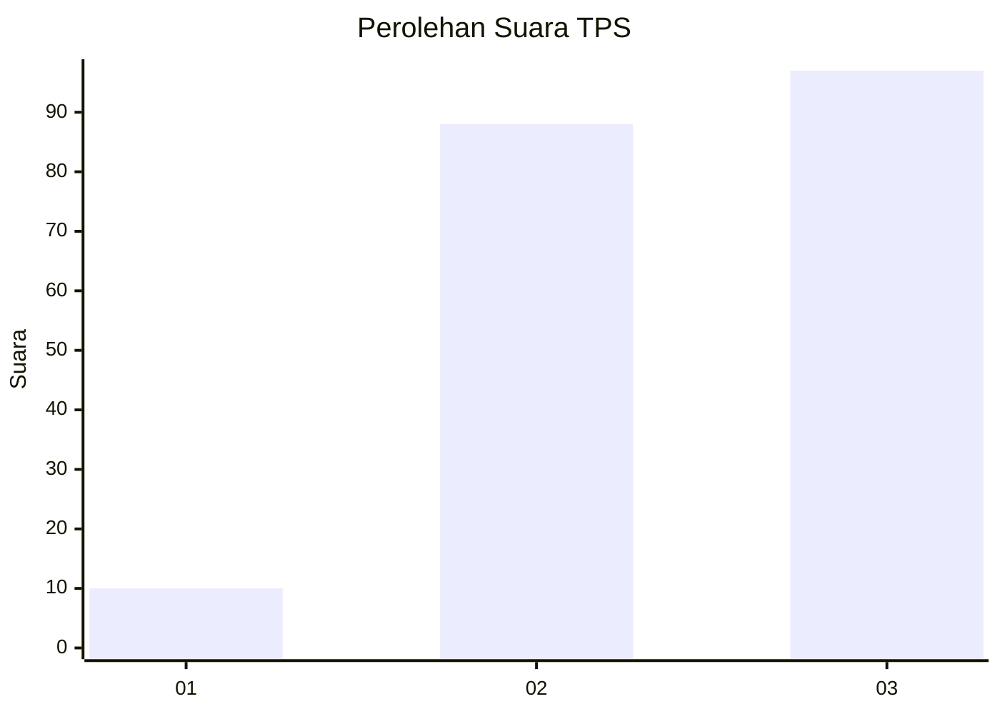
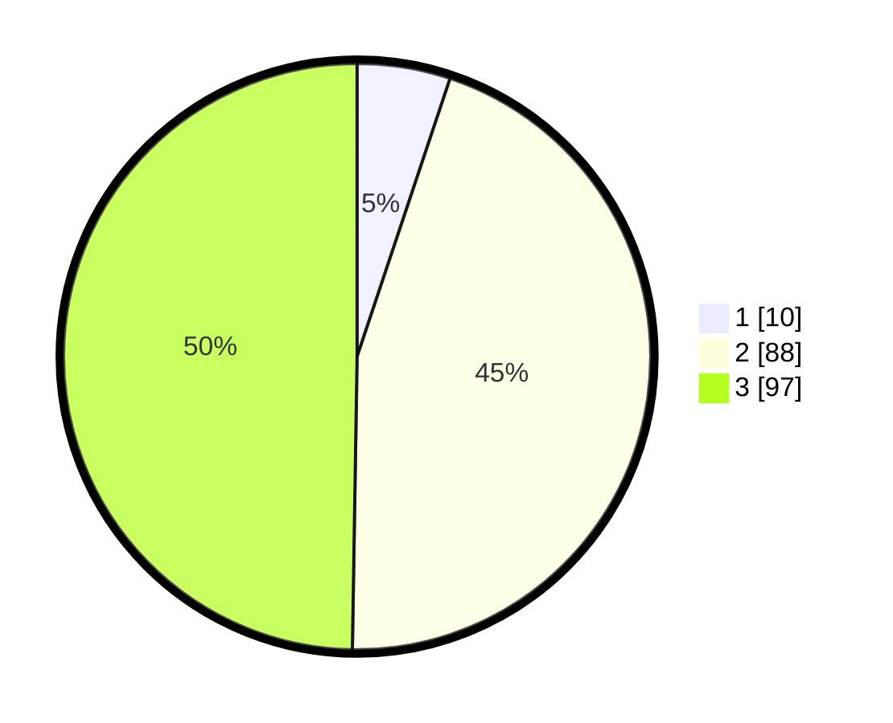

# Hasil

## Grafik

## Tabel

| No. | Nama Paslon    | Suara | Suara (raw) | Persentase |
|:--- |:-------------- | -----:| -----------:| ----------:|
| 1   | ANIES MUHAIMIN | 10    | [10][p-1]   | 5,13       |
| 2   | PRABOWO GIBRAN | 88    | [88][p-2]   | 45,13      |
| 3   | GANJAR MAHFUD  | 97    | [97][p-3]   | 49,74      |

[p-1]: https://github.com/gigit-pemilu/pemilu-2024/blob/main/pilpres/hitung-suara/sub/33-jawa-tengah/sub/01-cilacap/sub/01-kedungreja/sub/2010-bangunreja/sub/002-tps/sub/paslon-1.txt
[p-2]: https://github.com/gigit-pemilu/pemilu-2024/blob/main/pilpres/hitung-suara/sub/33-jawa-tengah/sub/01-cilacap/sub/01-kedungreja/sub/2010-bangunreja/sub/002-tps/sub/paslon-2.txt
[p-3]: https://github.com/gigit-pemilu/pemilu-2024/blob/main/pilpres/hitung-suara/sub/33-jawa-tengah/sub/01-cilacap/sub/01-kedungreja/sub/2010-bangunreja/sub/002-tps/sub/paslon-3.txt

## Foto C Plano

https://sirekap-obj-formc.kpu.go.id/7c7c/pemilu/ppwp/33/01/01/20/10/3301012010002-20240214-140952--72ab9962-3f3d-494d-9e5d-6ce8b63aa2a0.jpg

https://sirekap-obj-formc.kpu.go.id/7c7c/pemilu/ppwp/33/01/01/20/10/3301012010002-20240214-141106--4a130efe-9650-4564-9964-47b2fbd1bb07.jpg

https://sirekap-obj-formc.kpu.go.id/7c7c/pemilu/ppwp/33/01/01/20/10/3301012010002-20240214-141155--7b0ba128-84bc-497d-90bc-83558929206b.jpg

## Metadata

| Key        | Value               |
| ---------- | ------------------- |
| Time Stamp | 2024-02-14 21:46:01 |

