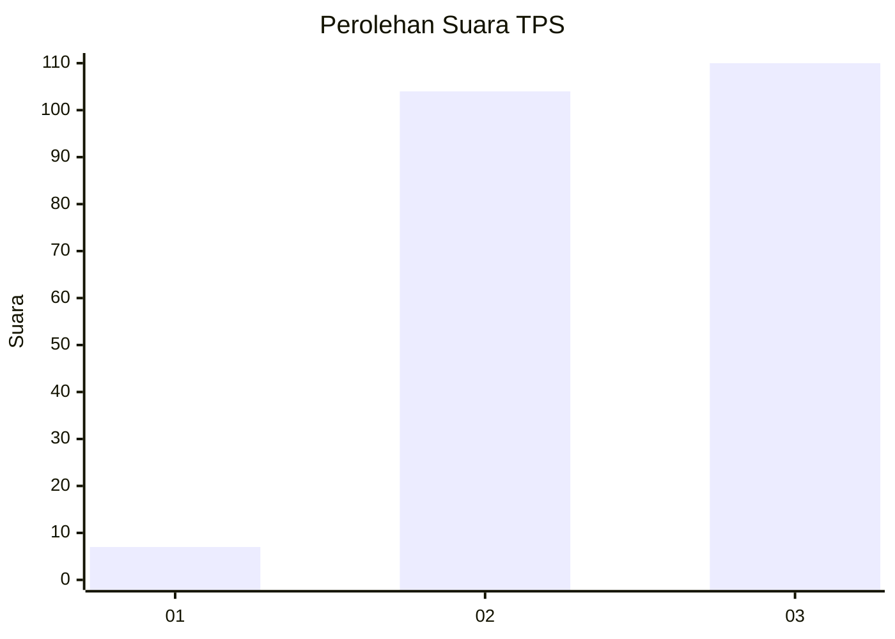
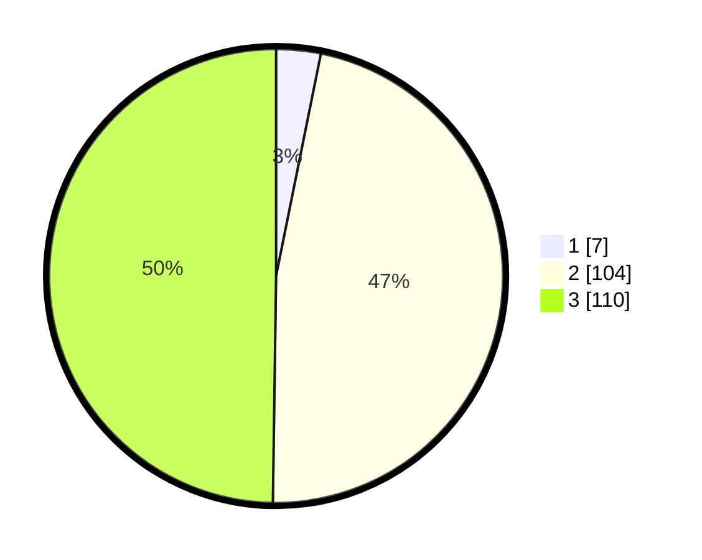

# Hasil

## Grafik

## Tabel

| No. | Nama Paslon    | Suara | Suara (raw) | Persentase |
|:--- |:-------------- | -----:| -----------:| ----------:|
| 1   | ANIES MUHAIMIN | 7     | [7][p-1]    | 3,17       |
| 2   | PRABOWO GIBRAN | 104   | [104][p-2]  | 47,06      |
| 3   | GANJAR MAHFUD  | 110   | [110][p-3]  | 49,77      |

[p-1]: https://github.com/gigit-pemilu/pemilu-2024/blob/main/pilpres/hitung-suara/sub/33-jawa-tengah/sub/01-cilacap/sub/04-binangun/sub/2008-widarapayung-wetan/sub/004-tps/sub/paslon-1.txt
[p-2]: https://github.com/gigit-pemilu/pemilu-2024/blob/main/pilpres/hitung-suara/sub/33-jawa-tengah/sub/01-cilacap/sub/04-binangun/sub/2008-widarapayung-wetan/sub/004-tps/sub/paslon-2.txt
[p-3]: https://github.com/gigit-pemilu/pemilu-2024/blob/main/pilpres/hitung-suara/sub/33-jawa-tengah/sub/01-cilacap/sub/04-binangun/sub/2008-widarapayung-wetan/sub/004-tps/sub/paslon-3.txt

## Foto C Plano

https://sirekap-obj-formc.kpu.go.id/998e/pemilu/ppwp/33/01/04/20/08/3301042008004-20240215-062537--0bf1c79a-eb01-4cf5-bde3-412428e868cb.jpg

https://sirekap-obj-formc.kpu.go.id/998e/pemilu/ppwp/33/01/04/20/08/3301042008004-20240215-062613--b5810a15-36ed-45cd-8c58-e956232a3f88.jpg

https://sirekap-obj-formc.kpu.go.id/998e/pemilu/ppwp/33/01/04/20/08/3301042008004-20240215-062643--8e1b92ac-2b0c-44b3-8572-585475c9c136.jpg

## Metadata

| Key        | Value               |
| ---------- | ------------------- |
| Time Stamp | 2024-02-16 10:30:29 |

