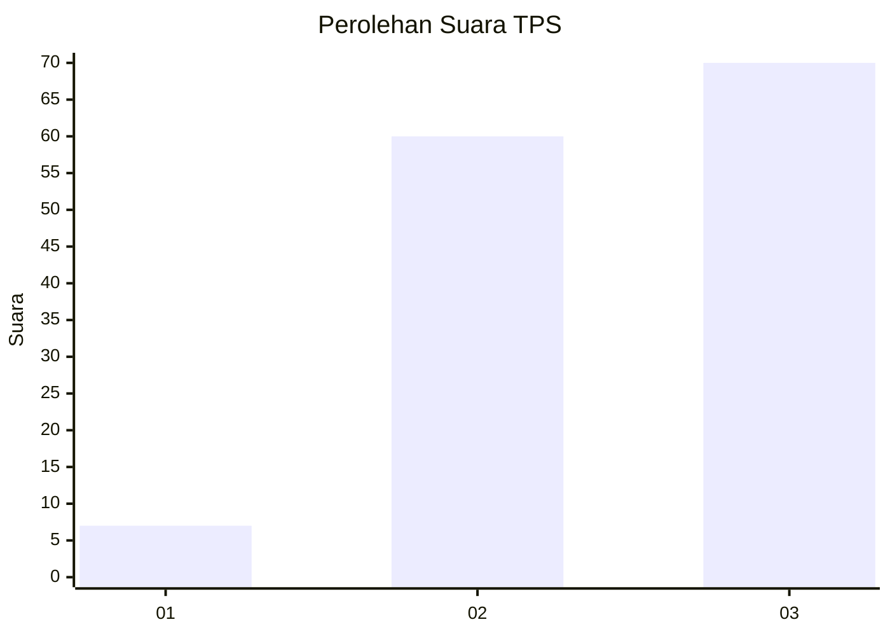
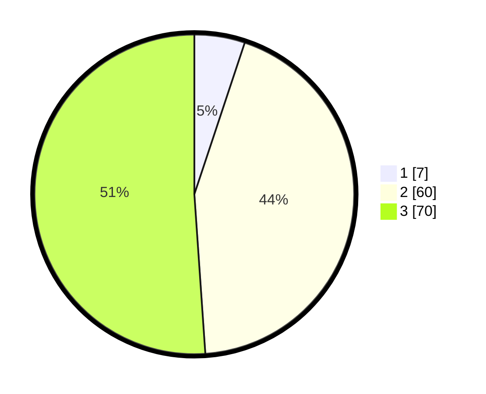

# Hasil

## Grafik

## Tabel

| No. | Nama Paslon    | Suara | Suara (raw) | Persentase |
|:--- |:-------------- | -----:| -----------:| ----------:|
| 1   | ANIES MUHAIMIN | 7     | [7][p-1]    | 5,11       |
| 2   | PRABOWO GIBRAN | 60    | [60][p-2]   | 43,80      |
| 3   | GANJAR MAHFUD  | 70    | [70][p-3]   | 51,09      |

[p-1]: https://github.com/gigit-pemilu/pemilu-2024-33-jawa-tengah/blob/main/pilpres/hitung-suara/sub/33-jawa-tengah/sub/01-cilacap/sub/08-jeruklegi/sub/2012-citepus/sub/006-tps/sub/paslon-1.txt
[p-2]: https://github.com/gigit-pemilu/pemilu-2024-33-jawa-tengah/blob/main/pilpres/hitung-suara/sub/33-jawa-tengah/sub/01-cilacap/sub/08-jeruklegi/sub/2012-citepus/sub/006-tps/sub/paslon-2.txt
[p-3]: https://github.com/gigit-pemilu/pemilu-2024-33-jawa-tengah/blob/main/pilpres/hitung-suara/sub/33-jawa-tengah/sub/01-cilacap/sub/08-jeruklegi/sub/2012-citepus/sub/006-tps/sub/paslon-3.txt

## Foto C Plano

https://sirekap-obj-formc.kpu.go.id/1dae/pemilu/ppwp/33/01/08/20/12/3301082012006-20240214-141137--9e1ca6d9-075d-4202-82d1-4b1edb4898a8.jpg

https://sirekap-obj-formc.kpu.go.id/1dae/pemilu/ppwp/33/01/08/20/12/3301082012006-20240214-141221--43fc75c8-57ce-4088-9329-2cb0f8cb8e3d.jpg

https://sirekap-obj-formc.kpu.go.id/1dae/pemilu/ppwp/33/01/08/20/12/3301082012006-20240214-141323--51f7d758-4ca8-4a47-9a24-3b3737f85bb0.jpg

## Metadata

| Key        | Value               |
| ---------- | ------------------- |
| Time Stamp | 2024-02-15 01:47:43 |

