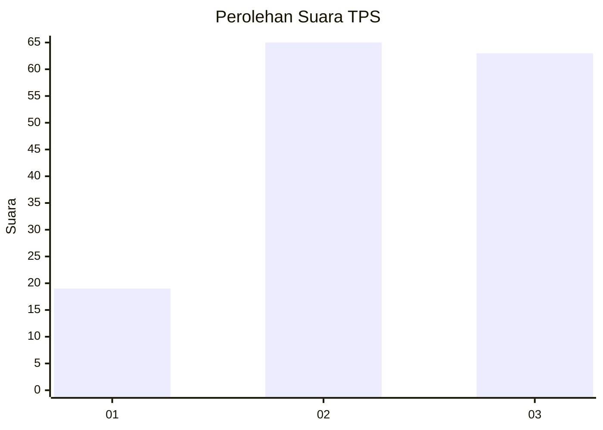
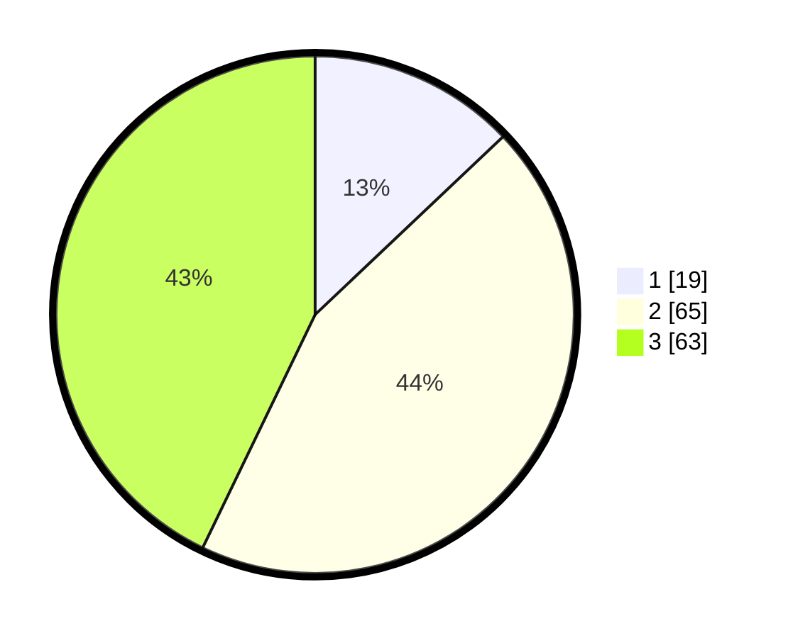

# Hasil

## Grafik

## Tabel

| No. | Nama Paslon    | Suara | Suara (raw) | Persentase |
|:--- |:-------------- | -----:| -----------:| ----------:|
| 1   | ANIES MUHAIMIN | 19    | [19][p-1]   | 12,93      |
| 2   | PRABOWO GIBRAN | 65    | [65][p-2]   | 44,22      |
| 3   | GANJAR MAHFUD  | 63    | [63][p-3]   | 42,86      |

[p-1]: https://github.com/gigit-pemilu/pemilu-2024/blob/main/pilpres/hitung-suara/sub/33-jawa-tengah/sub/01-cilacap/sub/08-jeruklegi/sub/2013-tritih-lor/sub/009-tps/sub/paslon-1.txt
[p-2]: https://github.com/gigit-pemilu/pemilu-2024/blob/main/pilpres/hitung-suara/sub/33-jawa-tengah/sub/01-cilacap/sub/08-jeruklegi/sub/2013-tritih-lor/sub/009-tps/sub/paslon-2.txt
[p-3]: https://github.com/gigit-pemilu/pemilu-2024/blob/main/pilpres/hitung-suara/sub/33-jawa-tengah/sub/01-cilacap/sub/08-jeruklegi/sub/2013-tritih-lor/sub/009-tps/sub/paslon-3.txt

## Foto C Plano

https://sirekap-obj-formc.kpu.go.id/d098/pemilu/ppwp/33/01/08/20/13/3301082013009-20240214-141414--3fe9404c-eb26-4eda-a95d-c1fecabcf592.jpg

https://sirekap-obj-formc.kpu.go.id/d098/pemilu/ppwp/33/01/08/20/13/3301082013009-20240214-141505--7f4fa17c-3c40-4f6c-b783-0a14fad77afa.jpg

https://sirekap-obj-formc.kpu.go.id/d098/pemilu/ppwp/33/01/08/20/13/3301082013009-20240215-153731--4dda91a5-9c44-4f9d-8cb6-853f9ab70580.jpg

## Metadata

| Key        | Value               |
| ---------- | ------------------- |
| Time Stamp | 2024-02-15 16:00:26 |

