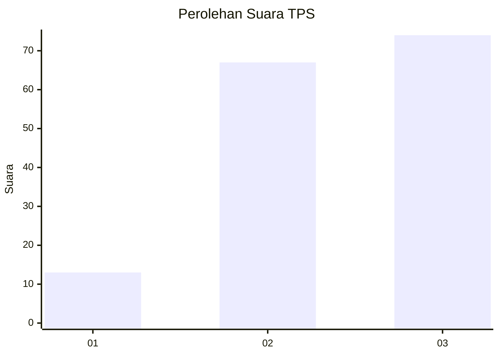
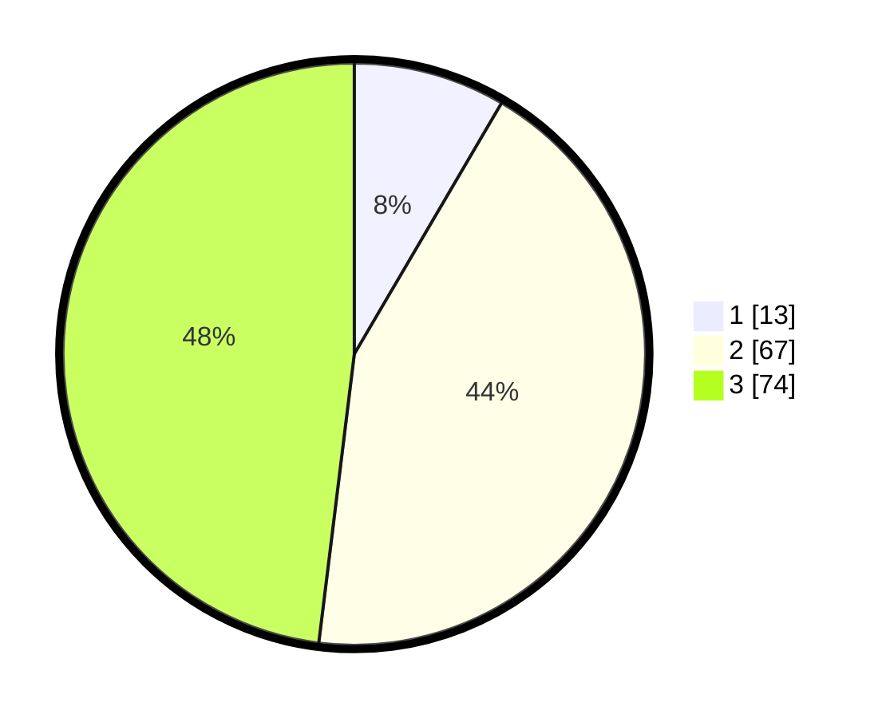

# Hasil

## Grafik

## Tabel

| No. | Nama Paslon    | Suara | Suara (raw) | Persentase |
|:--- |:-------------- | -----:| -----------:| ----------:|
| 1   | ANIES MUHAIMIN | 13    | [13][p-1]   | 8,44       |
| 2   | PRABOWO GIBRAN | 67    | [67][p-2]   | 43,51      |
| 3   | GANJAR MAHFUD  | 74    | [74][p-3]   | 48,05      |

[p-1]: https://github.com/gigit-pemilu/pemilu-2024-33-jawa-tengah/blob/main/pilpres/hitung-suara/sub/33-jawa-tengah/sub/01-cilacap/sub/12-karangpucung/sub/2001-cidadap/sub/002-tps/sub/paslon-1.txt
[p-2]: https://github.com/gigit-pemilu/pemilu-2024-33-jawa-tengah/blob/main/pilpres/hitung-suara/sub/33-jawa-tengah/sub/01-cilacap/sub/12-karangpucung/sub/2001-cidadap/sub/002-tps/sub/paslon-2.txt
[p-3]: https://github.com/gigit-pemilu/pemilu-2024-33-jawa-tengah/blob/main/pilpres/hitung-suara/sub/33-jawa-tengah/sub/01-cilacap/sub/12-karangpucung/sub/2001-cidadap/sub/002-tps/sub/paslon-3.txt

## Foto C Plano

https://sirekap-obj-formc.kpu.go.id/c584/pemilu/ppwp/33/01/12/20/01/3301122001002-20240214-230434--35241154-4214-432f-8b01-0173ef75f72d.jpg

https://sirekap-obj-formc.kpu.go.id/c584/pemilu/ppwp/33/01/12/20/01/3301122001002-20240214-230540--1a75aeb0-a908-4338-aed7-bb63b0f4ae16.jpg

https://sirekap-obj-formc.kpu.go.id/c584/pemilu/ppwp/33/01/12/20/01/3301122001002-20240214-230640--ff6fc9d7-dba5-40a0-ae43-ca2068c0b2f2.jpg

## Metadata

| Key        | Value               |
| ---------- | ------------------- |
| Time Stamp | 2024-02-15 23:29:50 |

