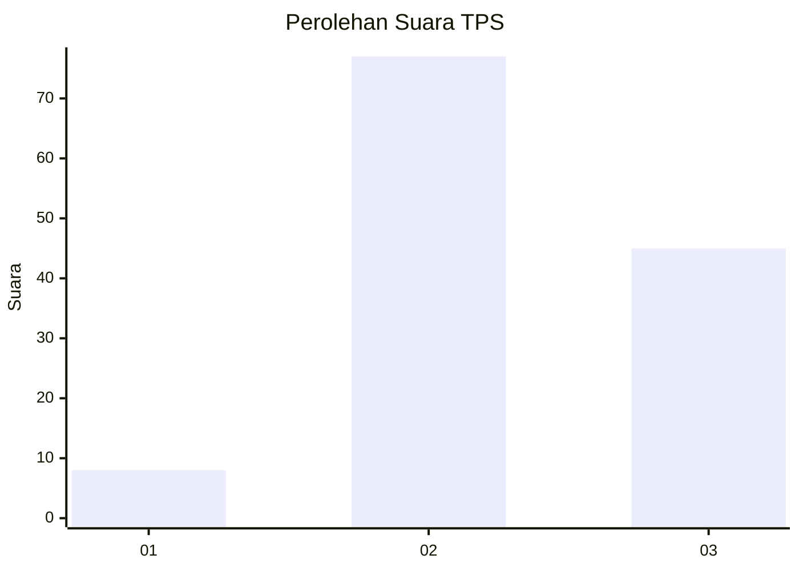
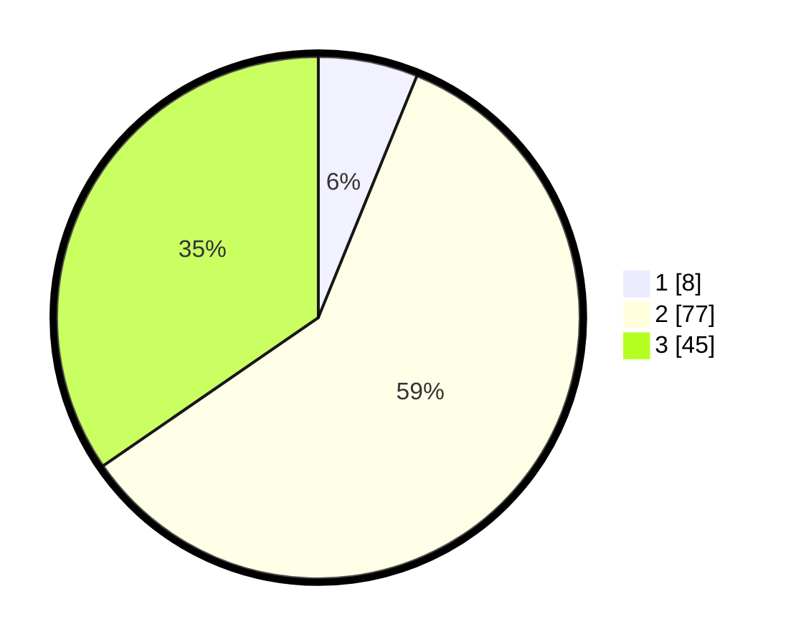

# Hasil

## Grafik

## Tabel

| No. | Nama Paslon    | Suara | Suara (raw) | Persentase |
|:--- |:-------------- | -----:| -----------:| ----------:|
| 1   | ANIES MUHAIMIN | 8     | [8][p-1]    | 6,15       |
| 2   | PRABOWO GIBRAN | 77    | [77][p-2]   | 59,23      |
| 3   | GANJAR MAHFUD  | 45    | [45][p-3]   | 34,62      |

[p-1]: https://github.com/gigit-pemilu/pemilu-2024-33-jawa-tengah/blob/main/pilpres/hitung-suara/sub/33-jawa-tengah/sub/01-cilacap/sub/13-cimanggu/sub/2013-karangreja/sub/020-tps/sub/paslon-1.txt
[p-2]: https://github.com/gigit-pemilu/pemilu-2024-33-jawa-tengah/blob/main/pilpres/hitung-suara/sub/33-jawa-tengah/sub/01-cilacap/sub/13-cimanggu/sub/2013-karangreja/sub/020-tps/sub/paslon-2.txt
[p-3]: https://github.com/gigit-pemilu/pemilu-2024-33-jawa-tengah/blob/main/pilpres/hitung-suara/sub/33-jawa-tengah/sub/01-cilacap/sub/13-cimanggu/sub/2013-karangreja/sub/020-tps/sub/paslon-3.txt

## Foto C Plano

https://sirekap-obj-formc.kpu.go.id/0977/pemilu/ppwp/33/01/13/20/13/3301132013020-20240214-220402--2def8a3f-3f5f-45be-8061-f15bc738c25c.jpg

https://sirekap-obj-formc.kpu.go.id/0977/pemilu/ppwp/33/01/13/20/13/3301132013020-20240214-221209--8e87c0d3-c842-4345-912d-93326ba5c572.jpg

https://sirekap-obj-formc.kpu.go.id/0977/pemilu/ppwp/33/01/13/20/13/3301132013020-20240214-221915--16d63cd1-cb14-4750-934a-78ff5da3f7aa.jpg

## Metadata

| Key        | Value               |
| ---------- | ------------------- |
| Time Stamp | 2024-02-15 15:00:29 |

