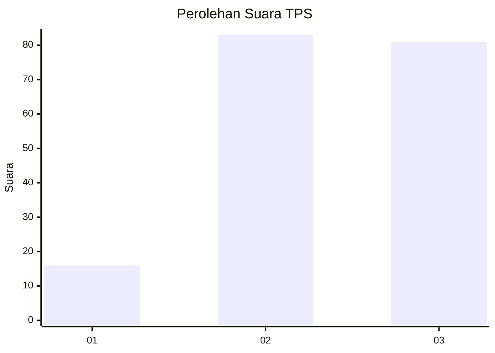
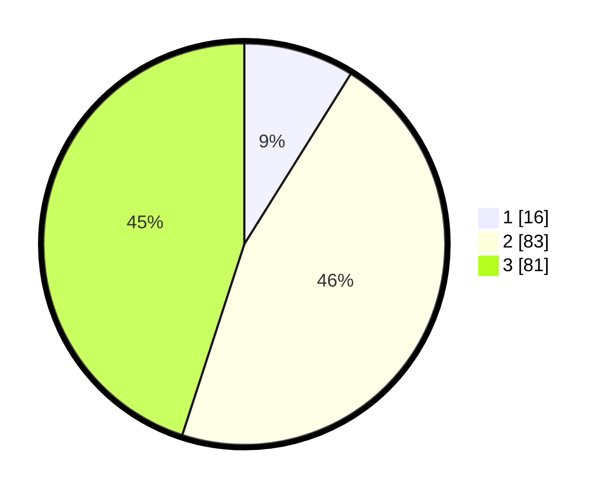

# Hasil

## Grafik

## Tabel

| No. | Nama Paslon    | Suara | Suara (raw) | Persentase |
|:--- |:-------------- | -----:| -----------:| ----------:|
| 1   | ANIES MUHAIMIN | 16    | [16][p-1]   | 8,89       |
| 2   | PRABOWO GIBRAN | 83    | [83][p-2]   | 46,11      |
| 3   | GANJAR MAHFUD  | 81    | [81][p-3]   | 45,00      |

[p-1]: https://github.com/gigit-pemilu/pemilu-2024-33-jawa-tengah/blob/main/pilpres/hitung-suara/sub/33-jawa-tengah/sub/01-cilacap/sub/14-majenang/sub/2002-salebu/sub/009-tps/sub/paslon-1.txt
[p-2]: https://github.com/gigit-pemilu/pemilu-2024-33-jawa-tengah/blob/main/pilpres/hitung-suara/sub/33-jawa-tengah/sub/01-cilacap/sub/14-majenang/sub/2002-salebu/sub/009-tps/sub/paslon-2.txt
[p-3]: https://github.com/gigit-pemilu/pemilu-2024-33-jawa-tengah/blob/main/pilpres/hitung-suara/sub/33-jawa-tengah/sub/01-cilacap/sub/14-majenang/sub/2002-salebu/sub/009-tps/sub/paslon-3.txt

## Foto C Plano

https://sirekap-obj-formc.kpu.go.id/f435/pemilu/ppwp/33/01/14/20/02/3301142002009-20240215-093231--0db43a68-8cc9-4573-8de1-536c790b62df.jpg

https://sirekap-obj-formc.kpu.go.id/f435/pemilu/ppwp/33/01/14/20/02/3301142002009-20240215-093234--df288c56-69bb-4528-bdd1-f804001e13cd.jpg

https://sirekap-obj-formc.kpu.go.id/f435/pemilu/ppwp/33/01/14/20/02/3301142002009-20240216-201356--a92aafba-441f-48b5-96a5-812f816069d3.jpg

## Metadata

| Key        | Value               |
| ---------- | ------------------- |
| Time Stamp | 2024-02-16 21:01:00 |

