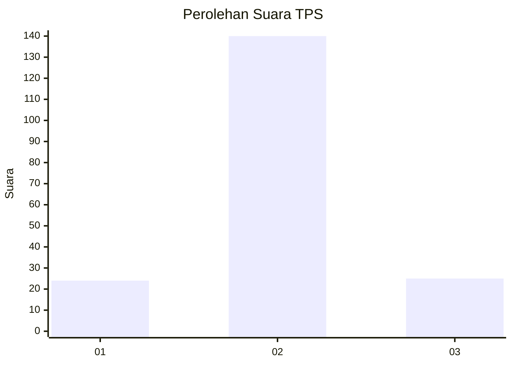
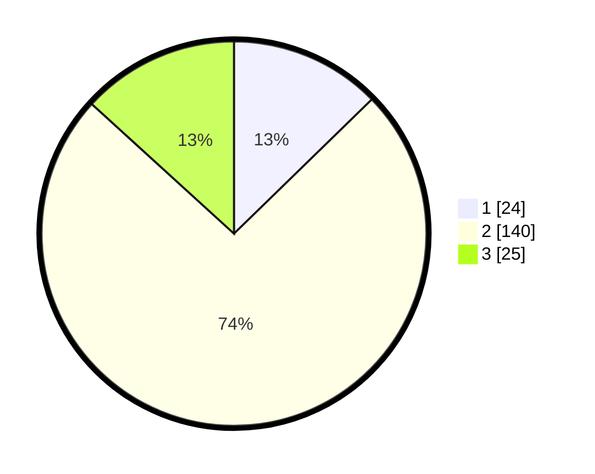

# Hasil

## Grafik

## Tabel

| No. | Nama Paslon    | Suara | Suara (raw) | Persentase |
|:--- |:-------------- | -----:| -----------:| ----------:|
| 1   | ANIES MUHAIMIN | 24    | [24][p-1]   | 12,70      |
| 2   | PRABOWO GIBRAN | 140   | [140][p-2]  | 74,07      |
| 3   | GANJAR MAHFUD  | 25    | [25][p-3]   | 13,23      |

[p-1]: https://github.com/gigit-pemilu/pemilu-2024/blob/main/pilpres/hitung-suara/sub/33-jawa-tengah/sub/01-cilacap/sub/14-majenang/sub/2008-boja/sub/004-tps/sub/paslon-1.txt
[p-2]: https://github.com/gigit-pemilu/pemilu-2024/blob/main/pilpres/hitung-suara/sub/33-jawa-tengah/sub/01-cilacap/sub/14-majenang/sub/2008-boja/sub/004-tps/sub/paslon-2.txt
[p-3]: https://github.com/gigit-pemilu/pemilu-2024/blob/main/pilpres/hitung-suara/sub/33-jawa-tengah/sub/01-cilacap/sub/14-majenang/sub/2008-boja/sub/004-tps/sub/paslon-3.txt

## Foto C Plano

https://sirekap-obj-formc.kpu.go.id/b5d7/pemilu/ppwp/33/01/14/20/08/3301142008004-20240215-020518--b16c3a1b-475a-4748-85b6-0c325d764908.jpg

https://sirekap-obj-formc.kpu.go.id/b5d7/pemilu/ppwp/33/01/14/20/08/3301142008004-20240220-121633--fee6fb64-0b7f-4dd3-b864-69863156385f.jpg

https://sirekap-obj-formc.kpu.go.id/b5d7/pemilu/ppwp/33/01/14/20/08/3301142008004-20240220-121632--d29f6c97-5504-4b68-968f-7e18d17c3810.jpg

## Metadata

| Key        | Value               |
| ---------- | ------------------- |
| Time Stamp | 2024-02-20 16:00:00 |

## DATA PEMILIH TETAP

Jumlah pemilih dalam DPT: **0**.
 * L: **500**.
 * P: **20**.

## DATA PENGGUNA HAK PILIH

Jumlah pengguna hak pilih dalam DPT: **451**.
 * L: **556**.
 * P: **441**.

Jumlah pengguna hak pilih dalam DPTb: **444**.
 * L: **664**.
 * P: **414**.

Jumlah pengguna hak pilih dalam DPK: **5**.
 * L: **250**.
 * P: **100**.

Jumlah pengguna hak pilih: **0**.
 * L: **5**.
 * P: **60**.

## JUMLAH SUARA SAH DAN TIDAK SAH

JUMLAH SELURUH SUARA SAH: **189**.

JUMLAH SUARA TIDAK SAH: **1**.

JUMLAH SELURUH SUARA SAH DAN SUARA TIDAK SAH: **190**.

