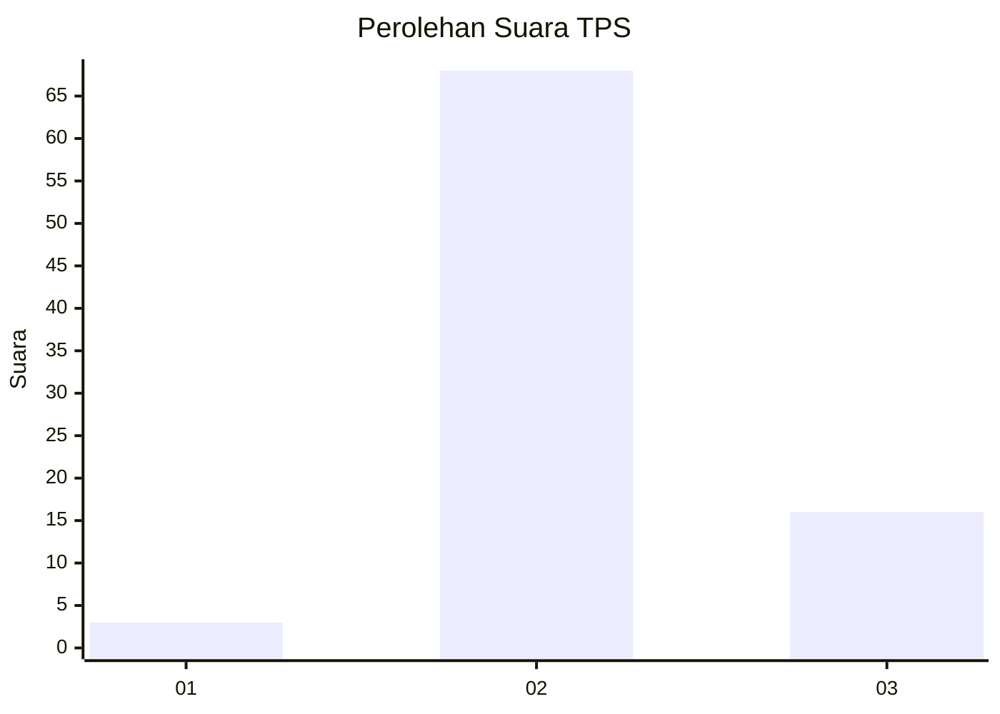
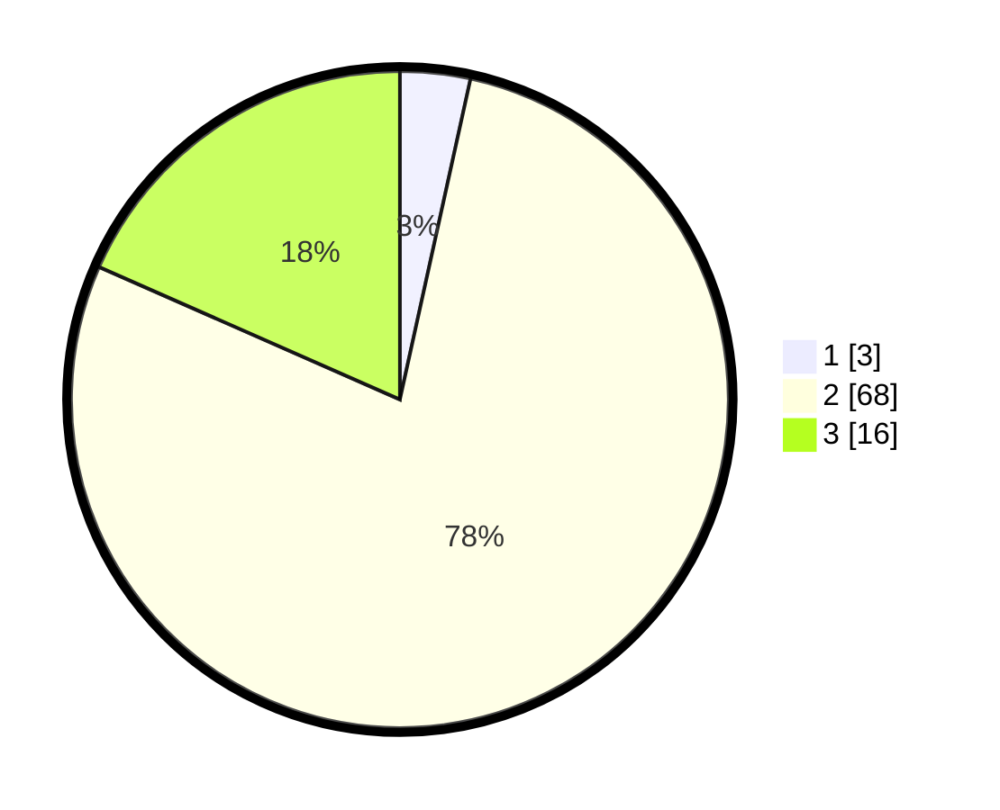

# Hasil

## Grafik

## Tabel

| No. | Nama Paslon    | Suara | Suara (raw) | Persentase |
|:--- |:-------------- | -----:| -----------:| ----------:|
| 1   | ANIES MUHAIMIN | 3     | [3][p-1]    | 3,45       |
| 2   | PRABOWO GIBRAN | 68    | [68][p-2]   | 78,16      |
| 3   | GANJAR MAHFUD  | 16    | [16][p-3]   | 18,39      |

[p-1]: https://github.com/gigit-pemilu/pemilu-2024/blob/main/pilpres/hitung-suara/sub/33-jawa-tengah/sub/01-cilacap/sub/14-majenang/sub/2016-padangsari/sub/026-tps/sub/paslon-1.txt
[p-2]: https://github.com/gigit-pemilu/pemilu-2024/blob/main/pilpres/hitung-suara/sub/33-jawa-tengah/sub/01-cilacap/sub/14-majenang/sub/2016-padangsari/sub/026-tps/sub/paslon-2.txt
[p-3]: https://github.com/gigit-pemilu/pemilu-2024/blob/main/pilpres/hitung-suara/sub/33-jawa-tengah/sub/01-cilacap/sub/14-majenang/sub/2016-padangsari/sub/026-tps/sub/paslon-3.txt

## Foto C Plano

https://sirekap-obj-formc.kpu.go.id/0ca0/pemilu/ppwp/33/01/14/20/16/3301142016026-20240216-210404--837d16fe-5a4a-47f6-84cf-c492c1579a93.jpg

https://sirekap-obj-formc.kpu.go.id/0ca0/pemilu/ppwp/33/01/14/20/16/3301142016026-20240215-001059--277243e5-9a4c-4e05-81fb-a38535982d84.jpg

https://sirekap-obj-formc.kpu.go.id/0ca0/pemilu/ppwp/33/01/14/20/16/3301142016026-20240214-200617--8bee19fa-c4e7-40f4-9fd2-8b17cc2fc888.jpg

## Metadata

| Key        | Value               |
| ---------- | ------------------- |
| Time Stamp | 2024-02-16 22:01:00 |

