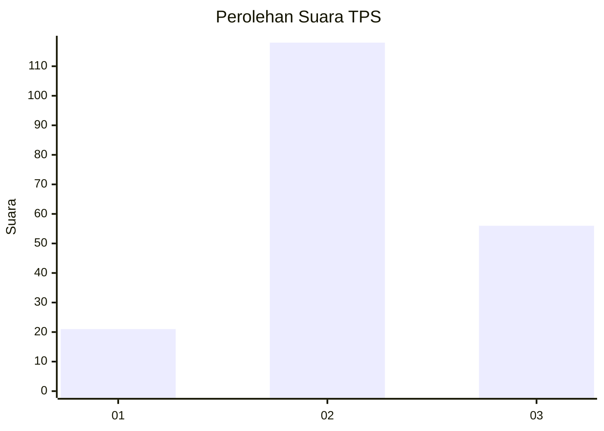
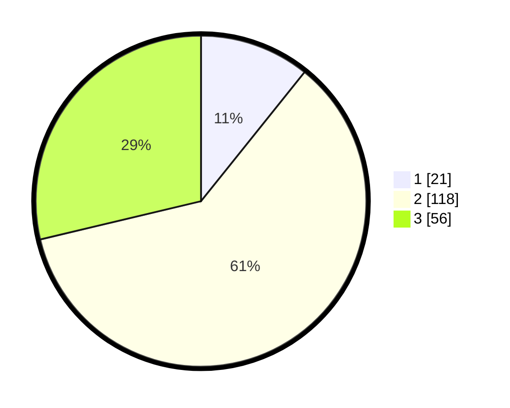

# Hasil

## Grafik

## Tabel

| No. | Nama Paslon    | Suara | Suara (raw) | Persentase |
|:--- |:-------------- | -----:| -----------:| ----------:|
| 1   | ANIES MUHAIMIN | 21    | [21][p-1]   | 10,77      |
| 2   | PRABOWO GIBRAN | 118   | [118][p-2]  | 60,51      |
| 3   | GANJAR MAHFUD  | 56    | [56][p-3]   | 28,72      |

[p-1]: https://github.com/gigit-pemilu/pemilu-2024/blob/main/pilpres/hitung-suara/sub/33-jawa-tengah/sub/01-cilacap/sub/15-wanareja/sub/2001-tarisi/sub/003-tps/sub/paslon-1.txt
[p-2]: https://github.com/gigit-pemilu/pemilu-2024/blob/main/pilpres/hitung-suara/sub/33-jawa-tengah/sub/01-cilacap/sub/15-wanareja/sub/2001-tarisi/sub/003-tps/sub/paslon-2.txt
[p-3]: https://github.com/gigit-pemilu/pemilu-2024/blob/main/pilpres/hitung-suara/sub/33-jawa-tengah/sub/01-cilacap/sub/15-wanareja/sub/2001-tarisi/sub/003-tps/sub/paslon-3.txt

## Foto C Plano

https://sirekap-obj-formc.kpu.go.id/4279/pemilu/ppwp/33/01/15/20/01/3301152001003-20240214-203258--cb8af52a-b0c7-4b82-ab04-4a0d71c69282.jpg

https://sirekap-obj-formc.kpu.go.id/4279/pemilu/ppwp/33/01/15/20/01/3301152001003-20240214-213851--4e3f98d7-aac9-4edd-8811-7bf9caf70199.jpg

https://sirekap-obj-formc.kpu.go.id/4279/pemilu/ppwp/33/01/15/20/01/3301152001003-20240214-225750--eb79d9e1-42da-446a-94d4-cab4eb0c4865.jpg

## Metadata

| Key        | Value               |
| ---------- | ------------------- |
| Time Stamp | 2024-02-15 20:00:44 |

