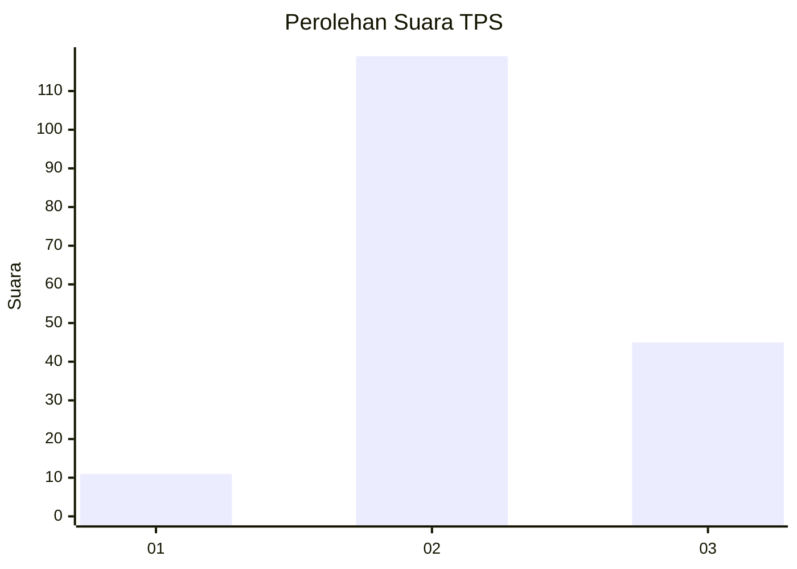

# Hasil

## Grafik

## Tabel

| No. | Nama Paslon    | Suara | Suara (raw) | Persentase |
|:--- |:-------------- | -----:| -----------:| ----------:|
| 1   | ANIES MUHAIMIN | 11    | [11][p-1]   | 6,29       |
| 2   | PRABOWO GIBRAN | 119   | [119][p-2]  | 68,00      |
| 3   | GANJAR MAHFUD  | 45    | [45][p-3]   | 25,71      |

[p-1]: https://github.com/gigit-pemilu/pemilu-2024-33-jawa-tengah/blob/main/pilpres/hitung-suara/sub/33-jawa-tengah/sub/01-cilacap/sub/15-wanareja/sub/2014-cilongkrang/sub/005-tps/sub/paslon-1.txt
[p-2]: https://github.com/gigit-pemilu/pemilu-2024-33-jawa-tengah/blob/main/pilpres/hitung-suara/sub/33-jawa-tengah/sub/01-cilacap/sub/15-wanareja/sub/2014-cilongkrang/sub/005-tps/sub/paslon-2.txt
[p-3]: https://github.com/gigit-pemilu/pemilu-2024-33-jawa-tengah/blob/main/pilpres/hitung-suara/sub/33-jawa-tengah/sub/01-cilacap/sub/15-wanareja/sub/2014-cilongkrang/sub/005-tps/sub/paslon-3.txt

## Foto C Plano

https://sirekap-obj-formc.kpu.go.id/477d/pemilu/ppwp/33/01/15/20/14/3301152014005-20240215-001145--dc1fc03e-003a-4c22-8e87-06964681f94e.jpg

https://sirekap-obj-formc.kpu.go.id/477d/pemilu/ppwp/33/01/15/20/14/3301152014005-20240215-001307--a221899a-18d6-435d-9d2d-234305a2c0e5.jpg

https://sirekap-obj-formc.kpu.go.id/477d/pemilu/ppwp/33/01/15/20/14/3301152014005-20240215-001438--d050434b-73b3-4e12-8925-8e121435fdd2.jpg

## Metadata

| Key        | Value               |
| ---------- | ------------------- |
| Time Stamp | 2024-02-15 15:00:29 |

