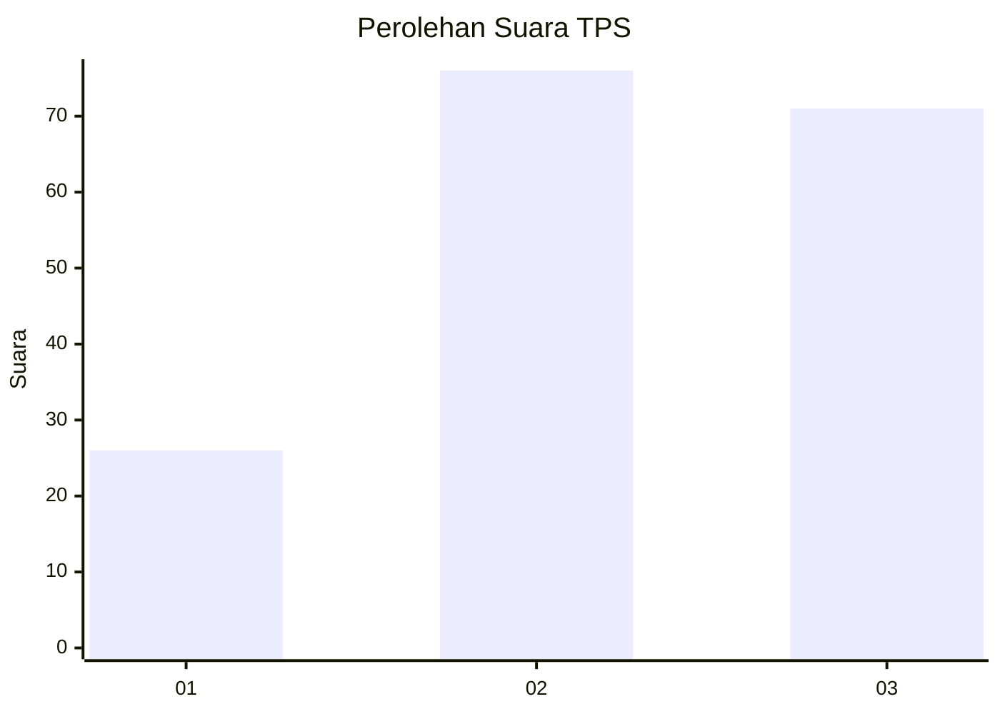
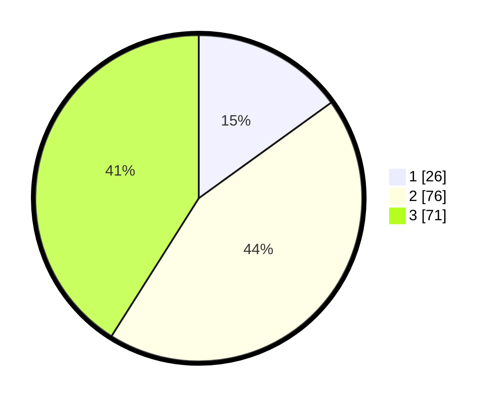

# Hasil

## Grafik

## Tabel

| No. | Nama Paslon    | Suara | Suara (raw) | Persentase |
|:--- |:-------------- | -----:| -----------:| ----------:|
| 1   | ANIES MUHAIMIN | 26    | [26][p-1]   | 15,03      |
| 2   | PRABOWO GIBRAN | 76    | [76][p-2]   | 43,93      |
| 3   | GANJAR MAHFUD  | 71    | [71][p-3]   | 41,04      |

[p-1]: https://github.com/gigit-pemilu/pemilu-2024-33-jawa-tengah/blob/main/pilpres/hitung-suara/sub/33-jawa-tengah/sub/01-cilacap/sub/15-wanareja/sub/2014-cilongkrang/sub/007-tps/sub/paslon-1.txt
[p-2]: https://github.com/gigit-pemilu/pemilu-2024-33-jawa-tengah/blob/main/pilpres/hitung-suara/sub/33-jawa-tengah/sub/01-cilacap/sub/15-wanareja/sub/2014-cilongkrang/sub/007-tps/sub/paslon-2.txt
[p-3]: https://github.com/gigit-pemilu/pemilu-2024-33-jawa-tengah/blob/main/pilpres/hitung-suara/sub/33-jawa-tengah/sub/01-cilacap/sub/15-wanareja/sub/2014-cilongkrang/sub/007-tps/sub/paslon-3.txt

## Foto C Plano

https://sirekap-obj-formc.kpu.go.id/0a4f/pemilu/ppwp/33/01/15/20/14/3301152014007-20240214-221230--5080773b-f8f0-4acb-a47c-6bde3e7db555.jpg

https://sirekap-obj-formc.kpu.go.id/0a4f/pemilu/ppwp/33/01/15/20/14/3301152014007-20240214-221455--cb6e39ff-781b-4de9-ac15-12be2c9f97da.jpg

https://sirekap-obj-formc.kpu.go.id/0a4f/pemilu/ppwp/33/01/15/20/14/3301152014007-20240214-223318--bf6616e7-4a2f-4656-b915-f4a0123579c6.jpg

## Metadata

| Key        | Value               |
| ---------- | ------------------- |
| Time Stamp | 2024-02-17 14:45:18 |

