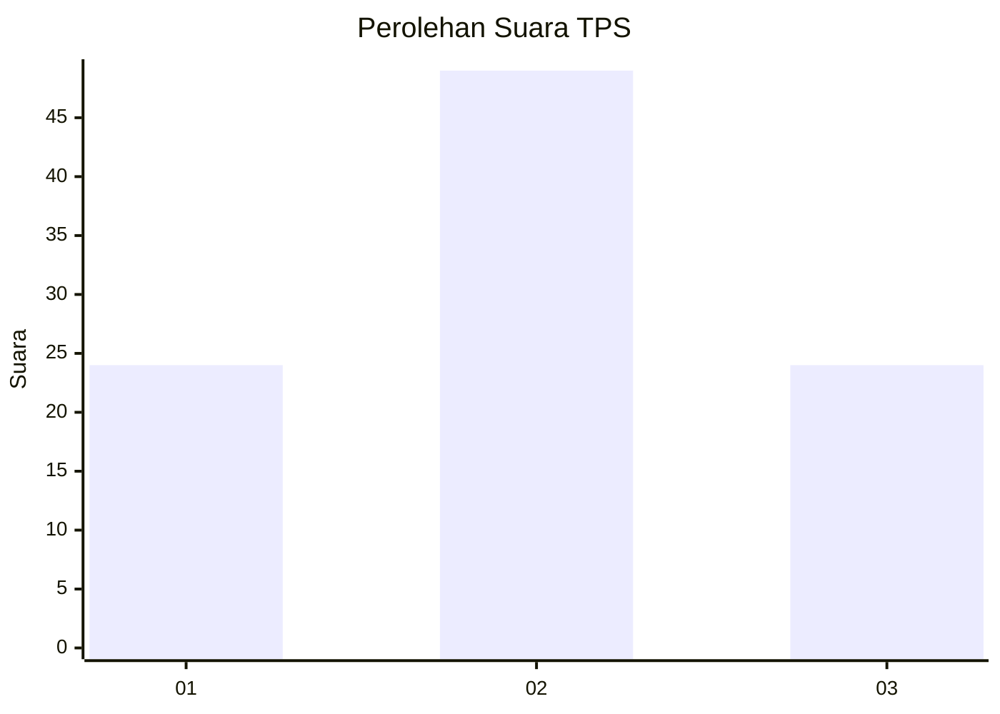
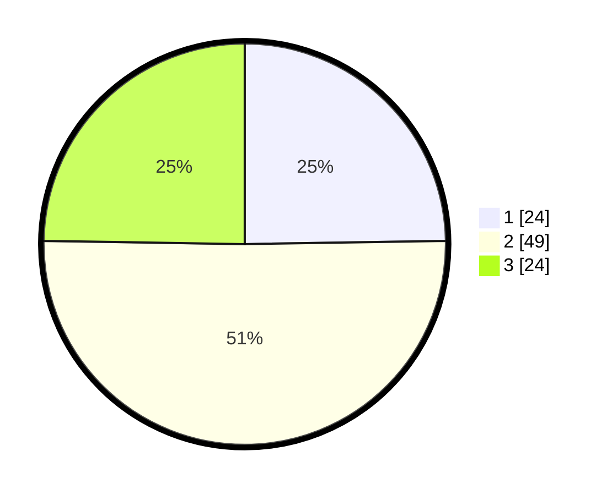

# Hasil

## Grafik

## Tabel

| No. | Nama Paslon    | Suara | Suara (raw) | Persentase |
|:--- |:-------------- | -----:| -----------:| ----------:|
| 1   | ANIES MUHAIMIN | 24    | [24][p-1]   | 24,74      |
| 2   | PRABOWO GIBRAN | 49    | [49][p-2]   | 50,52      |
| 3   | GANJAR MAHFUD  | 24    | [24][p-3]   | 24,74      |

[p-1]: https://github.com/gigit-pemilu/pemilu-2024/blob/main/pilpres/hitung-suara/sub/33-jawa-tengah/sub/01-cilacap/sub/16-dayeuhluhur/sub/2001-panulisan/sub/003-tps/sub/paslon-1.txt
[p-2]: https://github.com/gigit-pemilu/pemilu-2024/blob/main/pilpres/hitung-suara/sub/33-jawa-tengah/sub/01-cilacap/sub/16-dayeuhluhur/sub/2001-panulisan/sub/003-tps/sub/paslon-2.txt
[p-3]: https://github.com/gigit-pemilu/pemilu-2024/blob/main/pilpres/hitung-suara/sub/33-jawa-tengah/sub/01-cilacap/sub/16-dayeuhluhur/sub/2001-panulisan/sub/003-tps/sub/paslon-3.txt

## Foto C Plano

https://sirekap-obj-formc.kpu.go.id/0514/pemilu/ppwp/33/01/16/20/01/3301162001003-20240216-053705--5e954b0d-eb30-4a02-92cd-87656e0e3135.jpg

https://sirekap-obj-formc.kpu.go.id/0514/pemilu/ppwp/33/01/16/20/01/3301162001003-20240216-053711--58453480-7db4-4c38-835b-53ba92c738eb.jpg

https://sirekap-obj-formc.kpu.go.id/0514/pemilu/ppwp/33/01/16/20/01/3301162001003-20240216-043435--c12e0cf0-5543-4aaf-b78e-a95399fea4ab.jpg

## Metadata

| Key        | Value               |
| ---------- | ------------------- |
| Time Stamp | 2024-02-16 11:00:29 |

## DATA PEMILIH TETAP

Jumlah pemilih dalam DPT: **112**.
 * L: **55**.
 * P: **57**.

## DATA PENGGUNA HAK PILIH

Jumlah pengguna hak pilih dalam DPT: **98**.
 * L: **44**.
 * P: **54**.

Jumlah pengguna hak pilih dalam DPTb: **0**.
 * L: **0**.
 * P: **0**.

Jumlah pengguna hak pilih dalam DPK: **0**.
 * L: **0**.
 * P: **0**.

Jumlah pengguna hak pilih: **98**.
 * L: **44**.
 * P: **54**.

## JUMLAH SUARA SAH DAN TIDAK SAH

JUMLAH SELURUH SUARA SAH: **97**.

JUMLAH SUARA TIDAK SAH: **1**.

JUMLAH SELURUH SUARA SAH DAN SUARA TIDAK SAH: **98**.

