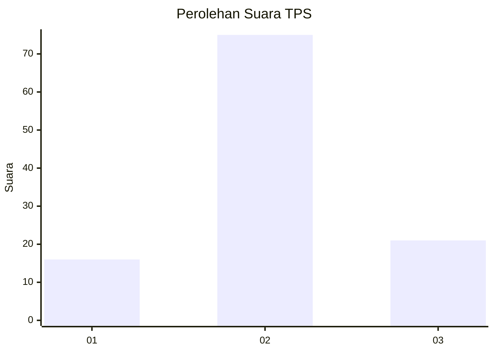
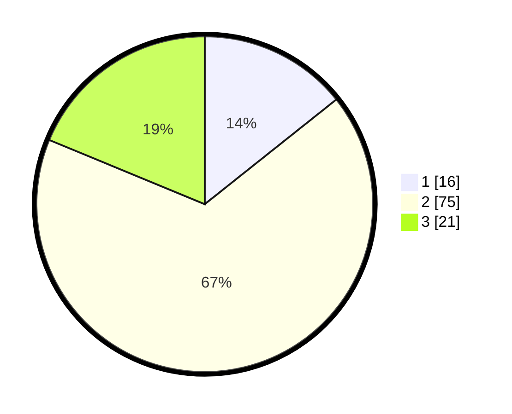

# Hasil

## Grafik

## Tabel

| No. | Nama Paslon    | Suara | Suara (raw) | Persentase |
|:--- |:-------------- | -----:| -----------:| ----------:|
| 1   | ANIES MUHAIMIN | 16    | [16][p-1]   | 14,29      |
| 2   | PRABOWO GIBRAN | 75    | [75][p-2]   | 66,96      |
| 3   | GANJAR MAHFUD  | 21    | [21][p-3]   | 18,75      |

[p-1]: https://github.com/gigit-pemilu/pemilu-2024/blob/main/pilpres/hitung-suara/sub/33-jawa-tengah/sub/01-cilacap/sub/16-dayeuhluhur/sub/2001-panulisan/sub/005-tps/sub/paslon-1.txt
[p-2]: https://github.com/gigit-pemilu/pemilu-2024/blob/main/pilpres/hitung-suara/sub/33-jawa-tengah/sub/01-cilacap/sub/16-dayeuhluhur/sub/2001-panulisan/sub/005-tps/sub/paslon-2.txt
[p-3]: https://github.com/gigit-pemilu/pemilu-2024/blob/main/pilpres/hitung-suara/sub/33-jawa-tengah/sub/01-cilacap/sub/16-dayeuhluhur/sub/2001-panulisan/sub/005-tps/sub/paslon-3.txt

## Foto C Plano

https://sirekap-obj-formc.kpu.go.id/0aad/pemilu/ppwp/33/01/16/20/01/3301162001005-20240216-025343--8a2771db-31a6-4d6e-8a3f-b643b2d9755d.jpg

https://sirekap-obj-formc.kpu.go.id/0aad/pemilu/ppwp/33/01/16/20/01/3301162001005-20240216-025345--f46be0f3-d932-4a4a-be40-5da0a20c953b.jpg

https://sirekap-obj-formc.kpu.go.id/0aad/pemilu/ppwp/33/01/16/20/01/3301162001005-20240216-025344--0472041f-fa98-4002-8bc6-c5b931d2a026.jpg

## Metadata

| Key        | Value               |
| ---------- | ------------------- |
| Time Stamp | 2024-02-16 03:00:26 |

## DATA PEMILIH TETAP

Jumlah pemilih dalam DPT: **159**.
 * L: **76**.
 * P: **83**.

## DATA PENGGUNA HAK PILIH

Jumlah pengguna hak pilih dalam DPT: **119**.
 * L: **52**.
 * P: **67**.

Jumlah pengguna hak pilih dalam DPTb: **0**.
 * L: **0**.
 * P: **0**.

Jumlah pengguna hak pilih dalam DPK: **0**.
 * L: **0**.
 * P: **0**.

Jumlah pengguna hak pilih: **119**.
 * L: **52**.
 * P: **67**.

## JUMLAH SUARA SAH DAN TIDAK SAH

JUMLAH SELURUH SUARA SAH: **112**.

JUMLAH SUARA TIDAK SAH: **7**.

JUMLAH SELURUH SUARA SAH DAN SUARA TIDAK SAH: **119**.

