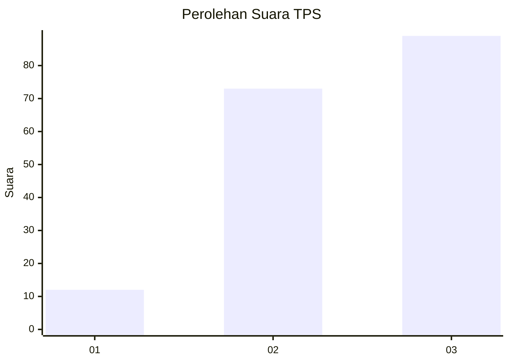
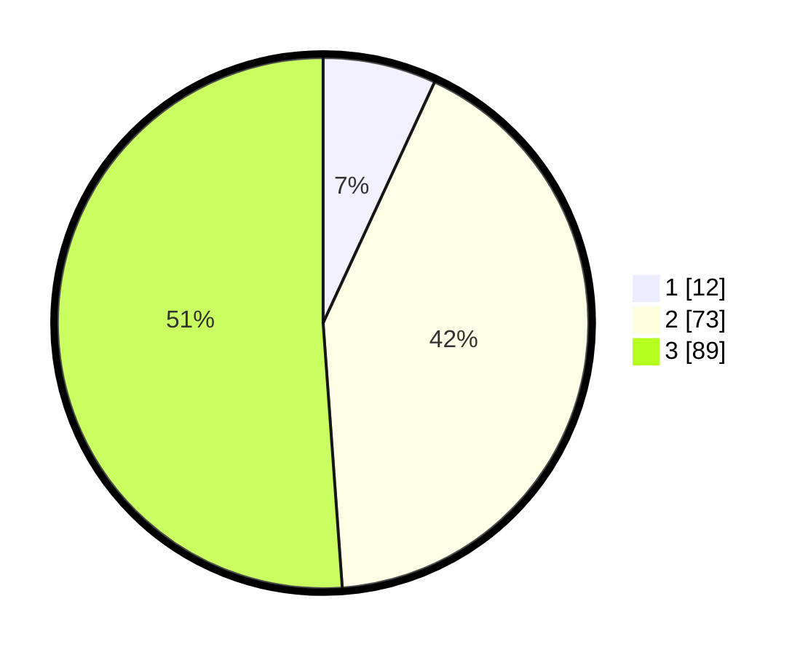

# Hasil

## Grafik

## Tabel

| No. | Nama Paslon    | Suara | Suara (raw) | Persentase |
|:--- |:-------------- | -----:| -----------:| ----------:|
| 1   | ANIES MUHAIMIN | 12    | [12][p-1]   | 6,90       |
| 2   | PRABOWO GIBRAN | 73    | [73][p-2]   | 41,95      |
| 3   | GANJAR MAHFUD  | 89    | [89][p-3]   | 51,15      |

[p-1]: https://github.com/gigit-pemilu/pemilu-2024/blob/main/pilpres/hitung-suara/sub/33-jawa-tengah/sub/01-cilacap/sub/20-bantarsari/sub/2006-kamulyan/sub/020-tps/sub/paslon-1.txt
[p-2]: https://github.com/gigit-pemilu/pemilu-2024/blob/main/pilpres/hitung-suara/sub/33-jawa-tengah/sub/01-cilacap/sub/20-bantarsari/sub/2006-kamulyan/sub/020-tps/sub/paslon-2.txt
[p-3]: https://github.com/gigit-pemilu/pemilu-2024/blob/main/pilpres/hitung-suara/sub/33-jawa-tengah/sub/01-cilacap/sub/20-bantarsari/sub/2006-kamulyan/sub/020-tps/sub/paslon-3.txt

## Foto C Plano

https://sirekap-obj-formc.kpu.go.id/133a/pemilu/ppwp/33/01/20/20/06/3301202006020-20240215-031618--b9eaf9a6-8932-4be8-aba8-8f008c087bf0.jpg

https://sirekap-obj-formc.kpu.go.id/133a/pemilu/ppwp/33/01/20/20/06/3301202006020-20240215-031001--8e24a4c5-46eb-4766-970c-6acc42acbf8e.jpg

https://sirekap-obj-formc.kpu.go.id/133a/pemilu/ppwp/33/01/20/20/06/3301202006020-20240215-031041--37bff642-5d3b-48a5-93fb-3ae9397aab05.jpg

## Metadata

| Key        | Value               |
| ---------- | ------------------- |
| Time Stamp | 2024-02-16 21:01:00 |

