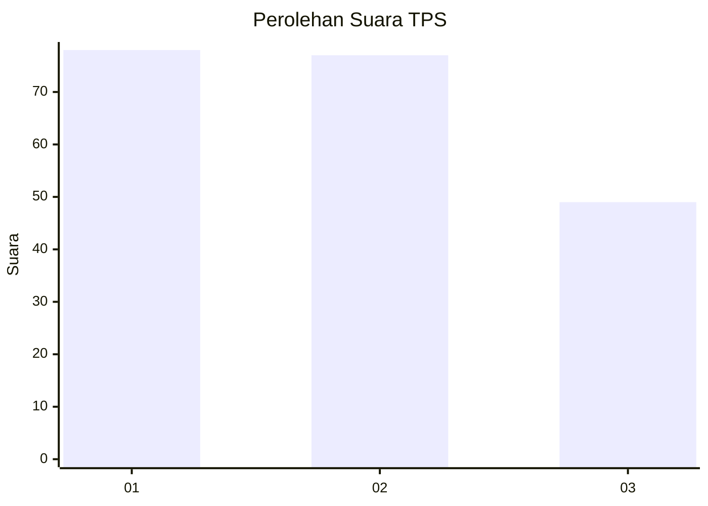
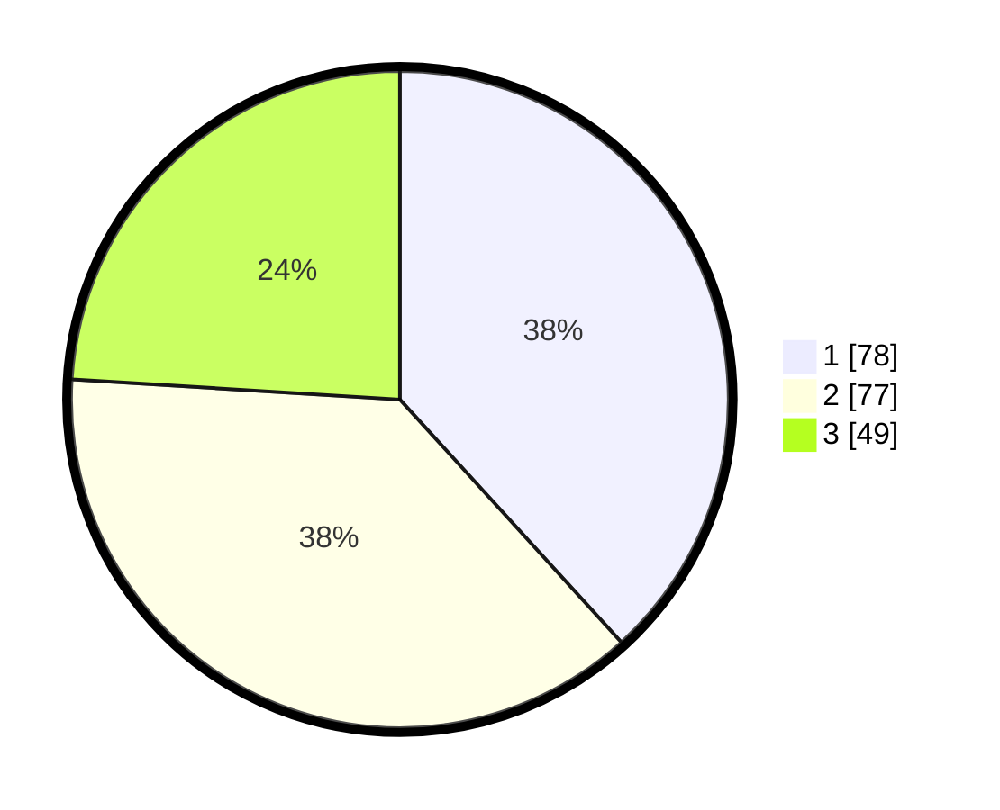

# Hasil

## Grafik

## Tabel

| No. | Nama Paslon    | Suara | Suara (raw) | Persentase |
|:--- |:-------------- | -----:| -----------:| ----------:|
| 1   | ANIES MUHAIMIN | 78    | [78][p-1]   | 38,24      |
| 2   | PRABOWO GIBRAN | 77    | [77][p-2]   | 37,75      |
| 3   | GANJAR MAHFUD  | 49    | [49][p-3]   | 24,02      |

[p-1]: https://github.com/gigit-pemilu/pemilu-2024/blob/main/pilpres/hitung-suara/sub/33-jawa-tengah/sub/01-cilacap/sub/20-bantarsari/sub/2008-bulaksari/sub/004-tps/sub/paslon-1.txt
[p-2]: https://github.com/gigit-pemilu/pemilu-2024/blob/main/pilpres/hitung-suara/sub/33-jawa-tengah/sub/01-cilacap/sub/20-bantarsari/sub/2008-bulaksari/sub/004-tps/sub/paslon-2.txt
[p-3]: https://github.com/gigit-pemilu/pemilu-2024/blob/main/pilpres/hitung-suara/sub/33-jawa-tengah/sub/01-cilacap/sub/20-bantarsari/sub/2008-bulaksari/sub/004-tps/sub/paslon-3.txt

## Foto C Plano

https://sirekap-obj-formc.kpu.go.id/6d70/pemilu/ppwp/33/01/20/20/08/3301202008004-20240214-200639--8323b7d9-d76e-4dc0-abaf-8cc1ae9346ff.jpg

https://sirekap-obj-formc.kpu.go.id/6d70/pemilu/ppwp/33/01/20/20/08/3301202008004-20240214-200915--a539ab71-a2b0-491d-9d8d-f023ce44186f.jpg

https://sirekap-obj-formc.kpu.go.id/6d70/pemilu/ppwp/33/01/20/20/08/3301202008004-20240214-200738--919b0a22-7323-44ed-94ca-dfdde1ca4eb6.jpg

## Metadata

| Key        | Value               |
| ---------- | ------------------- |
| Time Stamp | 2024-02-16 17:30:00 |

