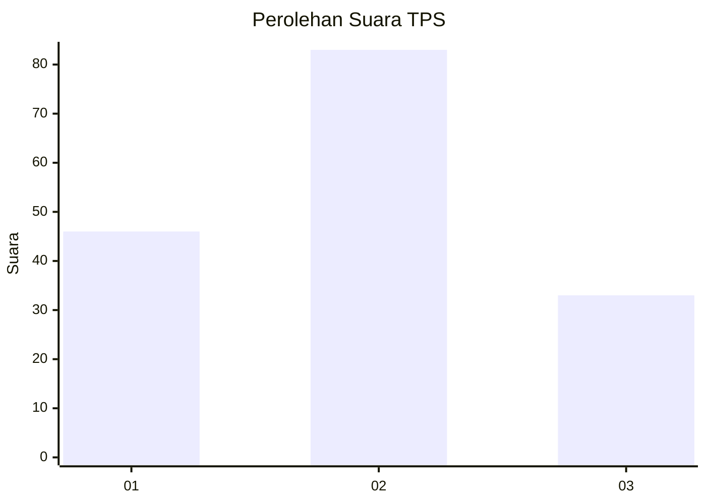
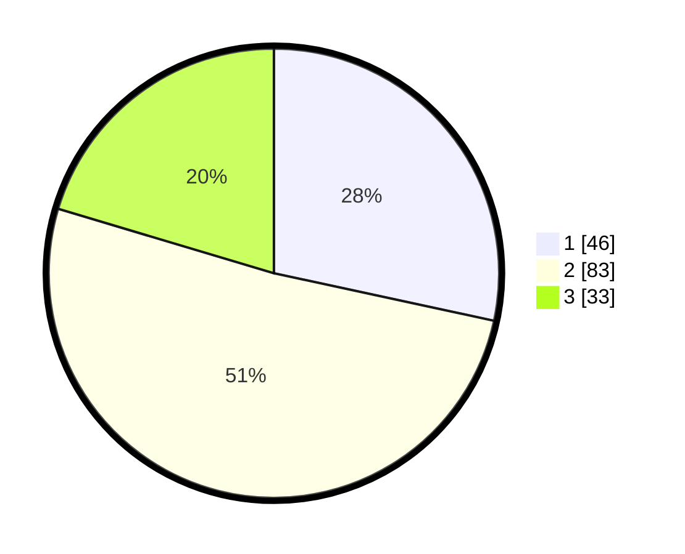

# Hasil

## Grafik

## Tabel

| No. | Nama Paslon    | Suara | Suara (raw) | Persentase |
|:--- |:-------------- | -----:| -----------:| ----------:|
| 1   | ANIES MUHAIMIN | 46    | [46][p-1]   | 28,40      |
| 2   | PRABOWO GIBRAN | 83    | [83][p-2]   | 51,23      |
| 3   | GANJAR MAHFUD  | 33    | [33][p-3]   | 20,37      |

[p-1]: https://github.com/gigit-pemilu/pemilu-2024-33-jawa-tengah/blob/main/pilpres/hitung-suara/sub/33-jawa-tengah/sub/01-cilacap/sub/20-bantarsari/sub/2008-bulaksari/sub/020-tps/sub/paslon-1.txt
[p-2]: https://github.com/gigit-pemilu/pemilu-2024-33-jawa-tengah/blob/main/pilpres/hitung-suara/sub/33-jawa-tengah/sub/01-cilacap/sub/20-bantarsari/sub/2008-bulaksari/sub/020-tps/sub/paslon-2.txt
[p-3]: https://github.com/gigit-pemilu/pemilu-2024-33-jawa-tengah/blob/main/pilpres/hitung-suara/sub/33-jawa-tengah/sub/01-cilacap/sub/20-bantarsari/sub/2008-bulaksari/sub/020-tps/sub/paslon-3.txt

## Foto C Plano

https://sirekap-obj-formc.kpu.go.id/2983/pemilu/ppwp/33/01/20/20/08/3301202008020-20240214-205104--8e3b2236-15d9-404a-86f2-9868410db1be.jpg

https://sirekap-obj-formc.kpu.go.id/2983/pemilu/ppwp/33/01/20/20/08/3301202008020-20240214-210049--62f34a6d-1e71-4fb7-9a03-bdd113e3a4b7.jpg

https://sirekap-obj-formc.kpu.go.id/2983/pemilu/ppwp/33/01/20/20/08/3301202008020-20240214-212410--01c6efd6-a94f-42cf-8d45-5689f96a73d1.jpg

## Metadata

| Key        | Value               |
| ---------- | ------------------- |
| Time Stamp | 2024-02-16 21:01:00 |

