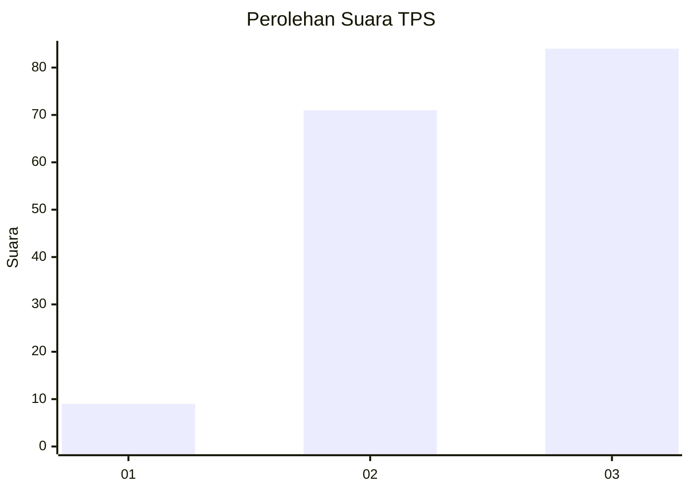
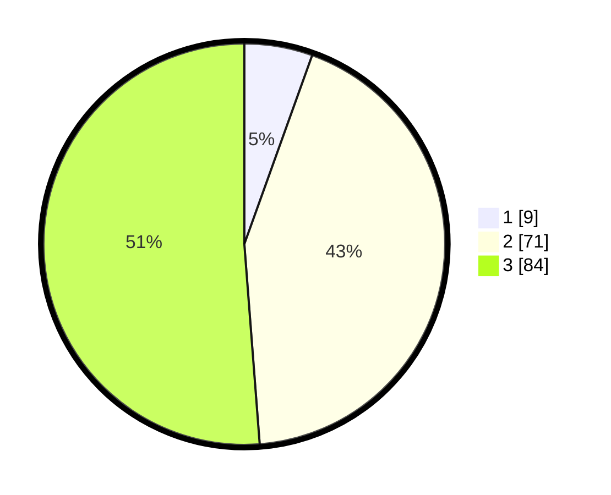

# Hasil

## Grafik

## Tabel

| No. | Nama Paslon    | Suara | Suara (raw) | Persentase |
|:--- |:-------------- | -----:| -----------:| ----------:|
| 1   | ANIES MUHAIMIN | 9     | [9][p-1]    | 5,49       |
| 2   | PRABOWO GIBRAN | 71    | [71][p-2]   | 43,29      |
| 3   | GANJAR MAHFUD  | 84    | [84][p-3]   | 51,22      |

[p-1]: https://github.com/gigit-pemilu/pemilu-2024-33-jawa-tengah/blob/main/pilpres/hitung-suara/sub/33-jawa-tengah/sub/01-cilacap/sub/21-cilacap-selatan/sub/1002-cilacap/sub/042-tps/sub/paslon-1.txt
[p-2]: https://github.com/gigit-pemilu/pemilu-2024-33-jawa-tengah/blob/main/pilpres/hitung-suara/sub/33-jawa-tengah/sub/01-cilacap/sub/21-cilacap-selatan/sub/1002-cilacap/sub/042-tps/sub/paslon-2.txt
[p-3]: https://github.com/gigit-pemilu/pemilu-2024-33-jawa-tengah/blob/main/pilpres/hitung-suara/sub/33-jawa-tengah/sub/01-cilacap/sub/21-cilacap-selatan/sub/1002-cilacap/sub/042-tps/sub/paslon-3.txt

## Foto C Plano

https://sirekap-obj-formc.kpu.go.id/bed3/pemilu/ppwp/33/01/21/10/02/3301211002042-20240215-022233--5a23e35c-c7d2-4f44-90c4-68891456e513.jpg

https://sirekap-obj-formc.kpu.go.id/bed3/pemilu/ppwp/33/01/21/10/02/3301211002042-20240215-022239--3b1d8754-dbee-46fb-930c-5a13e880923b.jpg

https://sirekap-obj-formc.kpu.go.id/bed3/pemilu/ppwp/33/01/21/10/02/3301211002042-20240215-022246--3e15fa16-2e30-488f-ad76-18a3d801da35.jpg

## Metadata

| Key        | Value               |
| ---------- | ------------------- |
| Time Stamp | 2024-02-15 12:00:28 |

