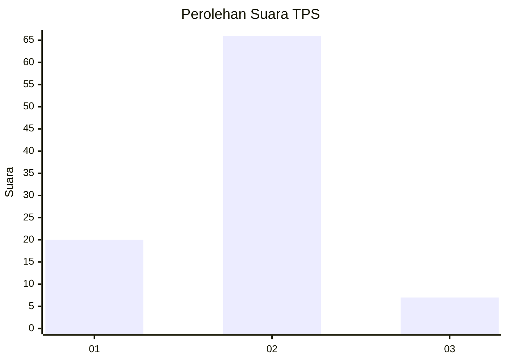

# Hasil

## Grafik

## Tabel

| No. | Nama Paslon    | Suara | Suara (raw) | Persentase |
|:--- |:-------------- | -----:| -----------:| ----------:|
| 1   | ANIES MUHAIMIN | 20    | [20][p-1]   | 21,51      |
| 2   | PRABOWO GIBRAN | 66    | [66][p-2]   | 70,97      |
| 3   | GANJAR MAHFUD  | 7     | [7][p-3]    | 7,53       |

[p-1]: https://github.com/gigit-pemilu/pemilu-2024-33-jawa-tengah/blob/main/pilpres/hitung-suara/sub/33-jawa-tengah/sub/01-cilacap/sub/21-cilacap-selatan/sub/1003-tambakreja/sub/065-tps/sub/paslon-1.txt
[p-2]: https://github.com/gigit-pemilu/pemilu-2024-33-jawa-tengah/blob/main/pilpres/hitung-suara/sub/33-jawa-tengah/sub/01-cilacap/sub/21-cilacap-selatan/sub/1003-tambakreja/sub/065-tps/sub/paslon-2.txt
[p-3]: https://github.com/gigit-pemilu/pemilu-2024-33-jawa-tengah/blob/main/pilpres/hitung-suara/sub/33-jawa-tengah/sub/01-cilacap/sub/21-cilacap-selatan/sub/1003-tambakreja/sub/065-tps/sub/paslon-3.txt

## Foto C Plano

https://sirekap-obj-formc.kpu.go.id/ba7e/pemilu/ppwp/33/01/21/10/03/3301211003065-20240215-234637--e6ef6545-81fb-46a0-88bb-6a16e1d7906a.jpg

https://sirekap-obj-formc.kpu.go.id/ba7e/pemilu/ppwp/33/01/21/10/03/3301211003065-20240215-234639--d27957cc-2099-4745-bcfd-351ece971206.jpg

https://sirekap-obj-formc.kpu.go.id/ba7e/pemilu/ppwp/33/01/21/10/03/3301211003065-20240215-234638--26272184-8edf-458a-b611-f45ee99128b7.jpg

## Metadata

| Key        | Value               |
| ---------- | ------------------- |
| Time Stamp | 2024-02-16 00:00:26 |

## DATA PEMILIH TETAP

Jumlah pemilih dalam DPT: **113**.
 * L: **57**.
 * P: **56**.

## DATA PENGGUNA HAK PILIH

Jumlah pengguna hak pilih dalam DPT: **40**.
 * L: **13**.
 * P: **27**.

Jumlah pengguna hak pilih dalam DPTb: **48**.
 * L: **45**.
 * P: **3**.

Jumlah pengguna hak pilih dalam DPK: **7**.
 * L: **5**.
 * P: **2**.

Jumlah pengguna hak pilih: **95**.
 * L: **63**.
 * P: **32**.

## JUMLAH SUARA SAH DAN TIDAK SAH

JUMLAH SELURUH SUARA SAH: **93**.

JUMLAH SUARA TIDAK SAH: **2**.

JUMLAH SELURUH SUARA SAH DAN SUARA TIDAK SAH: **95**.

