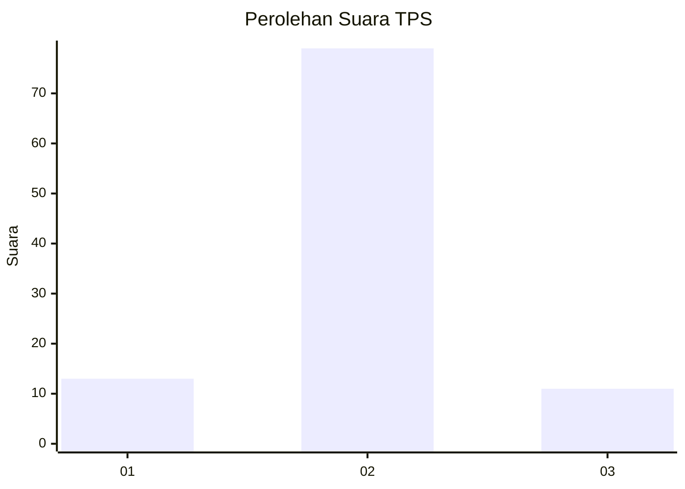
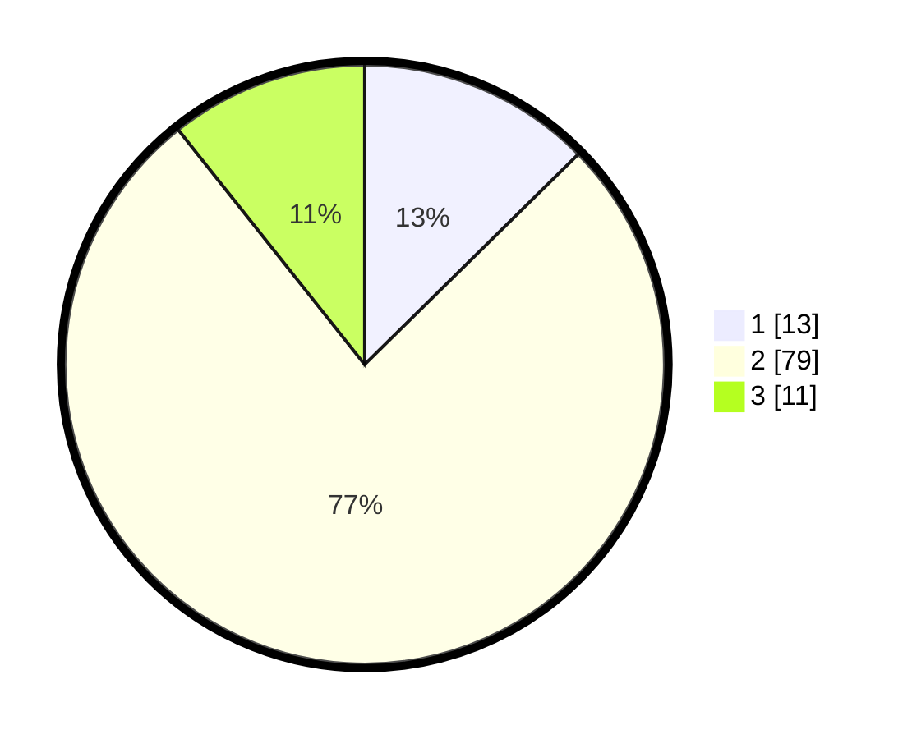

# Hasil

## Grafik

## Tabel

| No. | Nama Paslon    | Suara | Suara (raw) | Persentase |
|:--- |:-------------- | -----:| -----------:| ----------:|
| 1   | ANIES MUHAIMIN | 13    | [13][p-1]   | 12,62      |
| 2   | PRABOWO GIBRAN | 79    | [79][p-2]   | 76,70      |
| 3   | GANJAR MAHFUD  | 11    | [11][p-3]   | 10,68      |

[p-1]: https://github.com/gigit-pemilu/pemilu-2024/blob/main/pilpres/hitung-suara/sub/33-jawa-tengah/sub/01-cilacap/sub/21-cilacap-selatan/sub/1003-tambakreja/sub/901-tps/sub/paslon-1.txt
[p-2]: https://github.com/gigit-pemilu/pemilu-2024/blob/main/pilpres/hitung-suara/sub/33-jawa-tengah/sub/01-cilacap/sub/21-cilacap-selatan/sub/1003-tambakreja/sub/901-tps/sub/paslon-2.txt
[p-3]: https://github.com/gigit-pemilu/pemilu-2024/blob/main/pilpres/hitung-suara/sub/33-jawa-tengah/sub/01-cilacap/sub/21-cilacap-selatan/sub/1003-tambakreja/sub/901-tps/sub/paslon-3.txt

## Foto C Plano

https://sirekap-obj-formc.kpu.go.id/4d7f/pemilu/ppwp/33/01/21/10/03/3301211003901-20240216-021852--3a478b12-f80d-430e-8fc3-3cd24c12c815.jpg

https://sirekap-obj-formc.kpu.go.id/4d7f/pemilu/ppwp/33/01/21/10/03/3301211003901-20240214-141702--7e9d492d-068f-41b2-b1c6-aec1f85f1ba1.jpg

https://sirekap-obj-formc.kpu.go.id/4d7f/pemilu/ppwp/33/01/21/10/03/3301211003901-20240214-205740--8140b0eb-2f33-4ece-bf5a-4a3baa4ebff4.jpg

## Metadata

| Key        | Value               |
| ---------- | ------------------- |
| Time Stamp | 2024-02-16 02:30:27 |

## DATA PEMILIH TETAP

Jumlah pemilih dalam DPT: **111**.
 * L: **106**.
 * P: **5**.

## DATA PENGGUNA HAK PILIH

Jumlah pengguna hak pilih dalam DPT: **66**.
 * L: **61**.
 * P: **5**.

Jumlah pengguna hak pilih dalam DPTb: **36**.
 * L: **35**.
 * P: **1**.

Jumlah pengguna hak pilih dalam DPK: **2**.
 * L: **2**.
 * P: **0**.

Jumlah pengguna hak pilih: **104**.
 * L: **98**.
 * P: **6**.

## JUMLAH SUARA SAH DAN TIDAK SAH

JUMLAH SELURUH SUARA SAH: **103**.

JUMLAH SUARA TIDAK SAH: **1**.

JUMLAH SELURUH SUARA SAH DAN SUARA TIDAK SAH: **104**.

