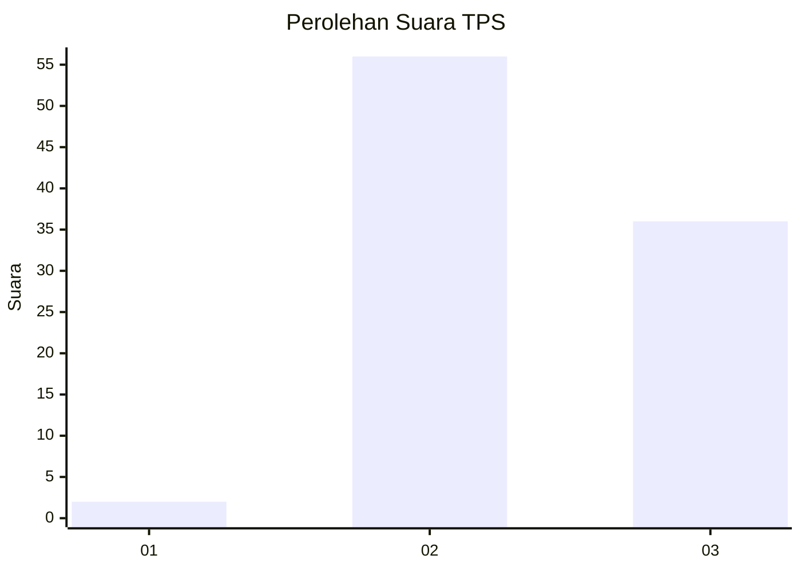
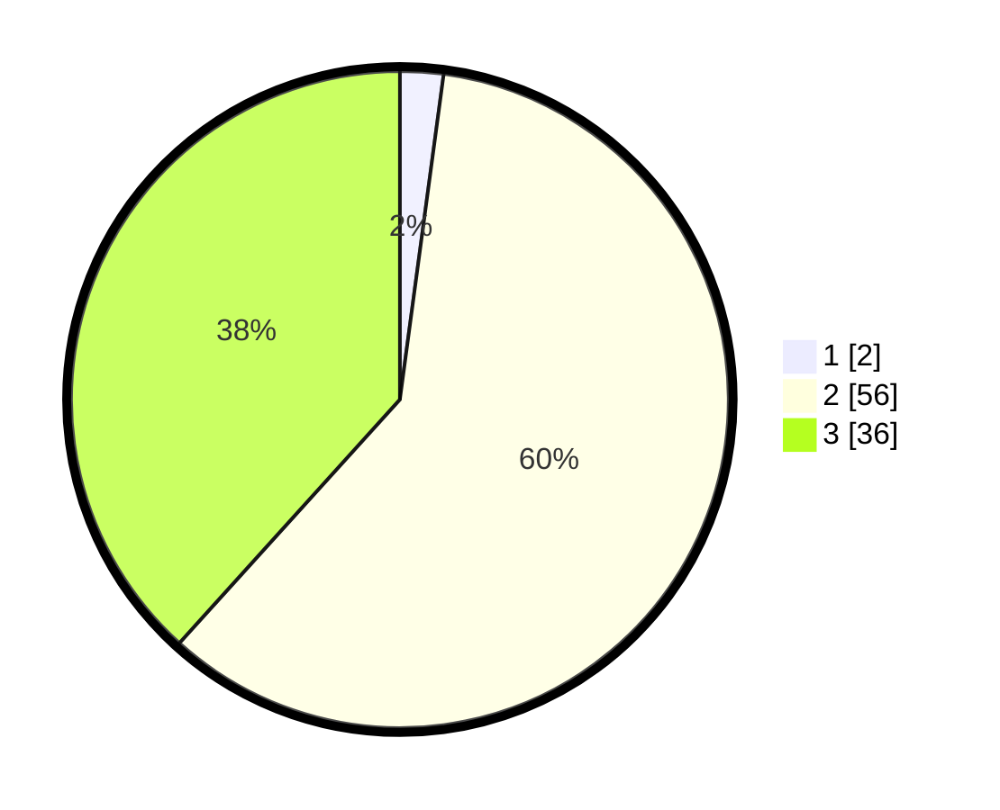

# Hasil

## Grafik

## Tabel

| No. | Nama Paslon    | Suara | Suara (raw) | Persentase |
|:--- |:-------------- | -----:| -----------:| ----------:|
| 1   | ANIES MUHAIMIN | 2     | [2][p-1]    | 2,13       |
| 2   | PRABOWO GIBRAN | 56    | [56][p-2]   | 59,57      |
| 3   | GANJAR MAHFUD  | 36    | [36][p-3]   | 38,30      |

[p-1]: https://github.com/gigit-pemilu/pemilu-2024-33-jawa-tengah/blob/main/pilpres/hitung-suara/sub/33-jawa-tengah/sub/01-cilacap/sub/21-cilacap-selatan/sub/1003-tambakreja/sub/909-tps/sub/paslon-1.txt
[p-2]: https://github.com/gigit-pemilu/pemilu-2024-33-jawa-tengah/blob/main/pilpres/hitung-suara/sub/33-jawa-tengah/sub/01-cilacap/sub/21-cilacap-selatan/sub/1003-tambakreja/sub/909-tps/sub/paslon-2.txt
[p-3]: https://github.com/gigit-pemilu/pemilu-2024-33-jawa-tengah/blob/main/pilpres/hitung-suara/sub/33-jawa-tengah/sub/01-cilacap/sub/21-cilacap-selatan/sub/1003-tambakreja/sub/909-tps/sub/paslon-3.txt

## Foto C Plano

https://sirekap-obj-formc.kpu.go.id/71a0/pemilu/ppwp/33/01/21/10/03/3301211003909-20240214-232142--3f2707b6-4841-4eb7-bd42-048f8eae6535.jpg

https://sirekap-obj-formc.kpu.go.id/71a0/pemilu/ppwp/33/01/21/10/03/3301211003909-20240214-233448--85382900-3d88-4e59-a552-fa5001b10971.jpg

https://sirekap-obj-formc.kpu.go.id/71a0/pemilu/ppwp/33/01/21/10/03/3301211003909-20240214-233626--7dcb5003-9696-401a-9e05-e9df6c17ccc8.jpg

## Metadata

| Key        | Value               |
| ---------- | ------------------- |
| Time Stamp | 2024-02-15 15:30:25 |

