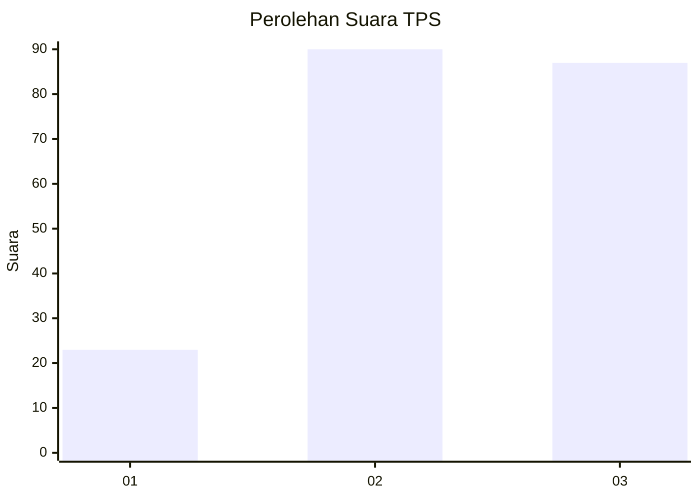
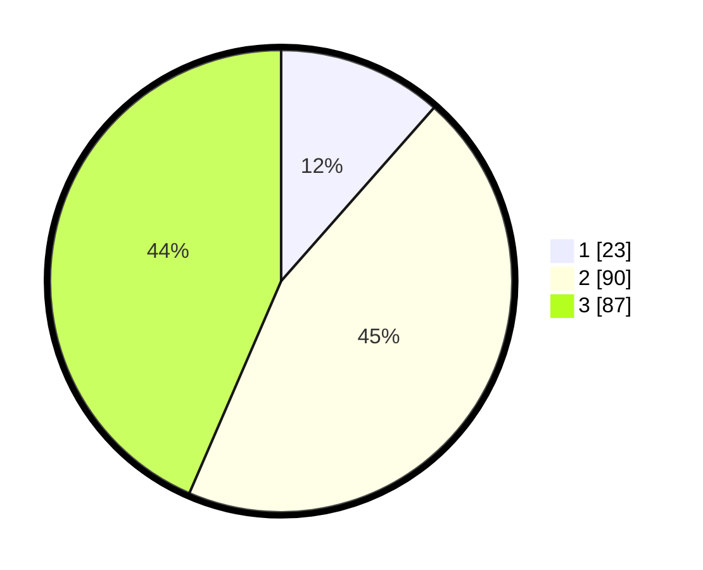

# Hasil

## Grafik

## Tabel

| No. | Nama Paslon    | Suara | Suara (raw) | Persentase |
|:--- |:-------------- | -----:| -----------:| ----------:|
| 1   | ANIES MUHAIMIN | 23    | [23][p-1]   | 11,50      |
| 2   | PRABOWO GIBRAN | 90    | [90][p-2]   | 45,00      |
| 3   | GANJAR MAHFUD  | 87    | [87][p-3]   | 43,50      |

[p-1]: https://github.com/gigit-pemilu/pemilu-2024/blob/main/pilpres/hitung-suara/sub/33-jawa-tengah/sub/01-cilacap/sub/21-cilacap-selatan/sub/1004-tegalkamulyan/sub/005-tps/sub/paslon-1.txt
[p-2]: https://github.com/gigit-pemilu/pemilu-2024/blob/main/pilpres/hitung-suara/sub/33-jawa-tengah/sub/01-cilacap/sub/21-cilacap-selatan/sub/1004-tegalkamulyan/sub/005-tps/sub/paslon-2.txt
[p-3]: https://github.com/gigit-pemilu/pemilu-2024/blob/main/pilpres/hitung-suara/sub/33-jawa-tengah/sub/01-cilacap/sub/21-cilacap-selatan/sub/1004-tegalkamulyan/sub/005-tps/sub/paslon-3.txt

## Foto C Plano

https://sirekap-obj-formc.kpu.go.id/1ffb/pemilu/ppwp/33/01/21/10/04/3301211004005-20240220-001901--af1cc741-3e3b-48e7-be10-bc181005c189.jpg

https://sirekap-obj-formc.kpu.go.id/1ffb/pemilu/ppwp/33/01/21/10/04/3301211004005-20240220-085207--0ce2b355-eaf4-4389-a172-e1dc37cddc6c.jpg

https://sirekap-obj-formc.kpu.go.id/1ffb/pemilu/ppwp/33/01/21/10/04/3301211004005-20240219-141857--34592694-02c5-45cb-8646-3b9a6c731f76.jpg

## Metadata

| Key        | Value               |
| ---------- | ------------------- |
| Time Stamp | 2024-02-20 10:00:00 |

