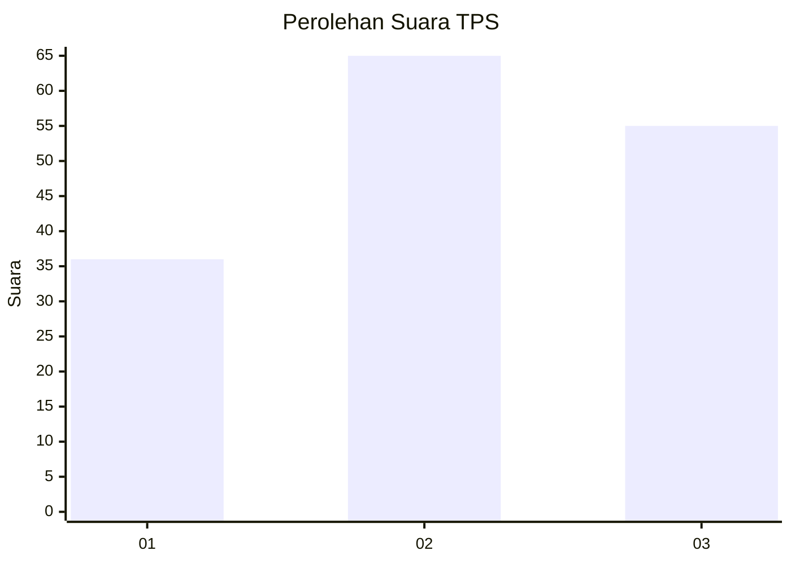
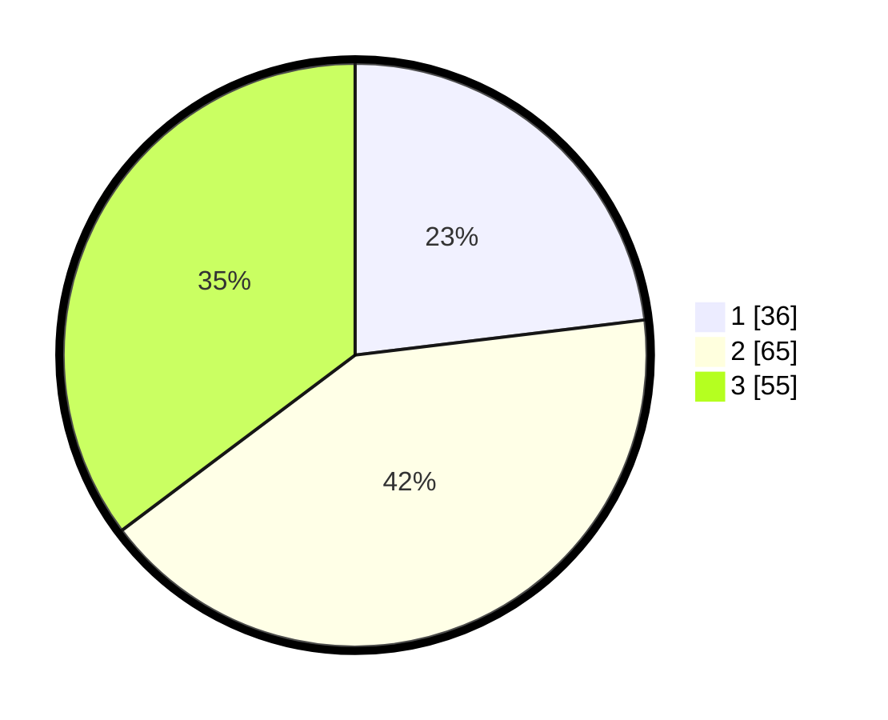

# Hasil

## Grafik

## Tabel

| No. | Nama Paslon    | Suara | Suara (raw) | Persentase |
|:--- |:-------------- | -----:| -----------:| ----------:|
| 1   | ANIES MUHAIMIN | 36    | [36][p-1]   | 23,08      |
| 2   | PRABOWO GIBRAN | 65    | [65][p-2]   | 41,67      |
| 3   | GANJAR MAHFUD  | 55    | [55][p-3]   | 35,26      |

[p-1]: https://github.com/gigit-pemilu/pemilu-2024/blob/main/pilpres/hitung-suara/sub/33-jawa-tengah/sub/01-cilacap/sub/22-cilacap-tengah/sub/1002-gunungsimping/sub/002-tps/sub/paslon-1.txt
[p-2]: https://github.com/gigit-pemilu/pemilu-2024/blob/main/pilpres/hitung-suara/sub/33-jawa-tengah/sub/01-cilacap/sub/22-cilacap-tengah/sub/1002-gunungsimping/sub/002-tps/sub/paslon-2.txt
[p-3]: https://github.com/gigit-pemilu/pemilu-2024/blob/main/pilpres/hitung-suara/sub/33-jawa-tengah/sub/01-cilacap/sub/22-cilacap-tengah/sub/1002-gunungsimping/sub/002-tps/sub/paslon-3.txt

## Foto C Plano

https://sirekap-obj-formc.kpu.go.id/25fe/pemilu/ppwp/33/01/22/10/02/3301221002002-20240214-190457--3a118b1e-d886-4a08-9e8b-eb4e60587e98.jpg

https://sirekap-obj-formc.kpu.go.id/25fe/pemilu/ppwp/33/01/22/10/02/3301221002002-20240214-190508--e6a5eecc-c44a-495a-a366-9e0ade49386e.jpg

https://sirekap-obj-formc.kpu.go.id/25fe/pemilu/ppwp/33/01/22/10/02/3301221002002-20240214-190520--f0dbec7e-c9c2-474a-be82-adc1d7a276a9.jpg

## Metadata

| Key        | Value               |
| ---------- | ------------------- |
| Time Stamp | 2024-02-15 12:00:28 |

