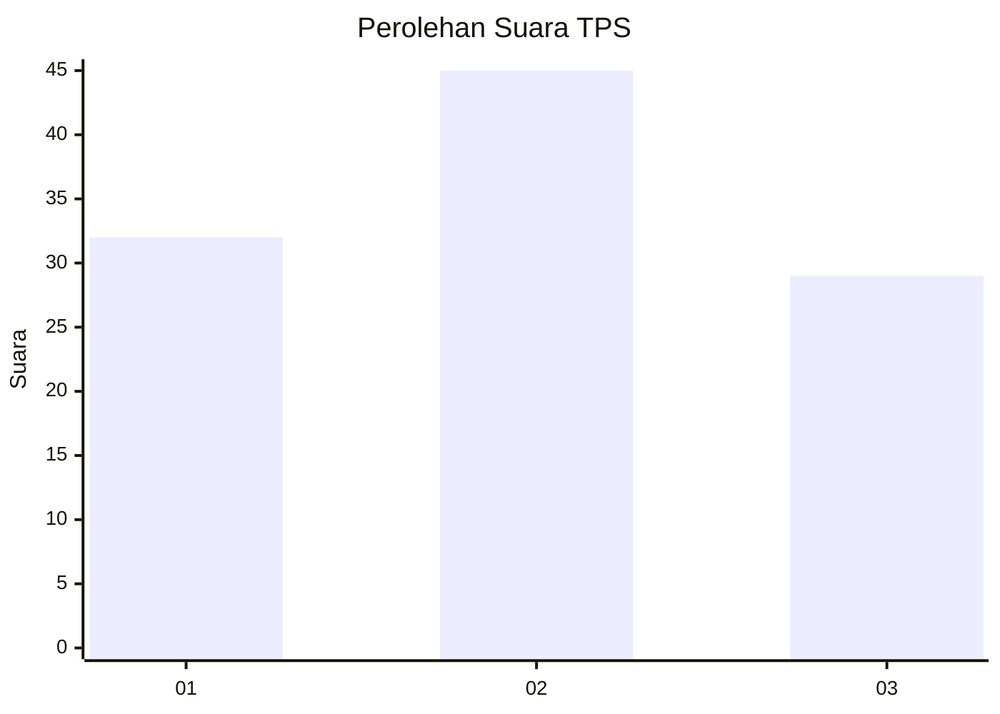
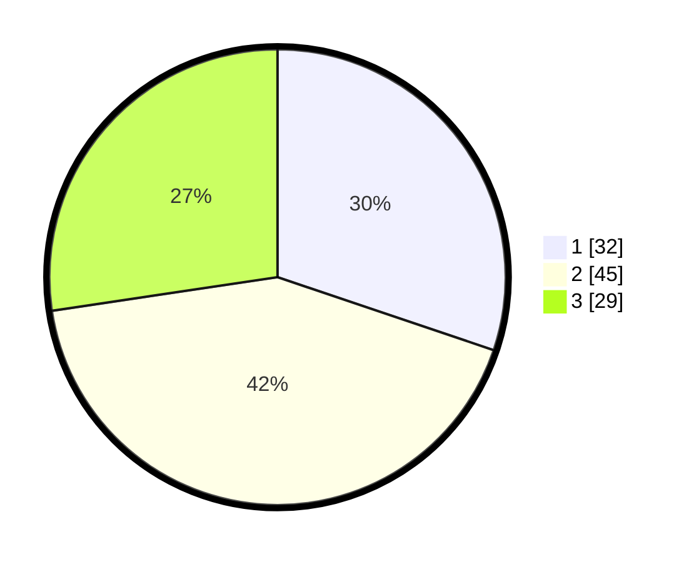

# Hasil

## Grafik

## Tabel

| No. | Nama Paslon    | Suara | Suara (raw) | Persentase |
|:--- |:-------------- | -----:| -----------:| ----------:|
| 1   | ANIES MUHAIMIN | 32    | [32][p-1]   | 30,19      |
| 2   | PRABOWO GIBRAN | 45    | [45][p-2]   | 42,45      |
| 3   | GANJAR MAHFUD  | 29    | [29][p-3]   | 27,36      |

[p-1]: https://github.com/gigit-pemilu/pemilu-2024/blob/main/pilpres/hitung-suara/sub/33-jawa-tengah/sub/01-cilacap/sub/22-cilacap-tengah/sub/1003-sidanegara/sub/015-tps/sub/paslon-1.txt
[p-2]: https://github.com/gigit-pemilu/pemilu-2024/blob/main/pilpres/hitung-suara/sub/33-jawa-tengah/sub/01-cilacap/sub/22-cilacap-tengah/sub/1003-sidanegara/sub/015-tps/sub/paslon-2.txt
[p-3]: https://github.com/gigit-pemilu/pemilu-2024/blob/main/pilpres/hitung-suara/sub/33-jawa-tengah/sub/01-cilacap/sub/22-cilacap-tengah/sub/1003-sidanegara/sub/015-tps/sub/paslon-3.txt

## Foto C Plano

https://sirekap-obj-formc.kpu.go.id/c4cd/pemilu/ppwp/33/01/22/10/03/3301221003015-20240219-191642--748daa0a-92a5-4e0c-ac9c-dbd5497f60d5.jpg

https://sirekap-obj-formc.kpu.go.id/c4cd/pemilu/ppwp/33/01/22/10/03/3301221003015-20240217-202048--a9769794-bbb9-43b3-a0d0-b833143fe4c6.jpg

https://sirekap-obj-formc.kpu.go.id/c4cd/pemilu/ppwp/33/01/22/10/03/3301221003015-20240217-202311--9f081cdb-c747-49bd-88f1-d8a33326005c.jpg

## Metadata

| Key        | Value               |
| ---------- | ------------------- |
| Time Stamp | 2024-02-19 20:00:00 |

