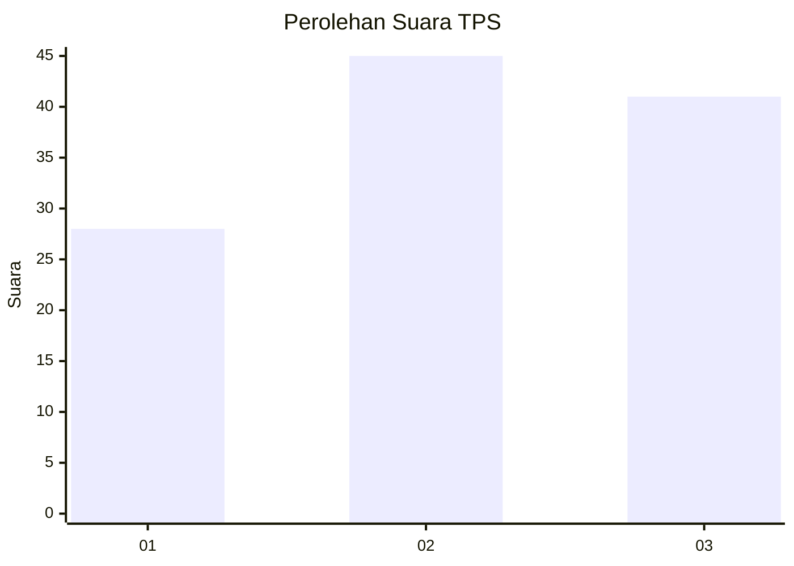
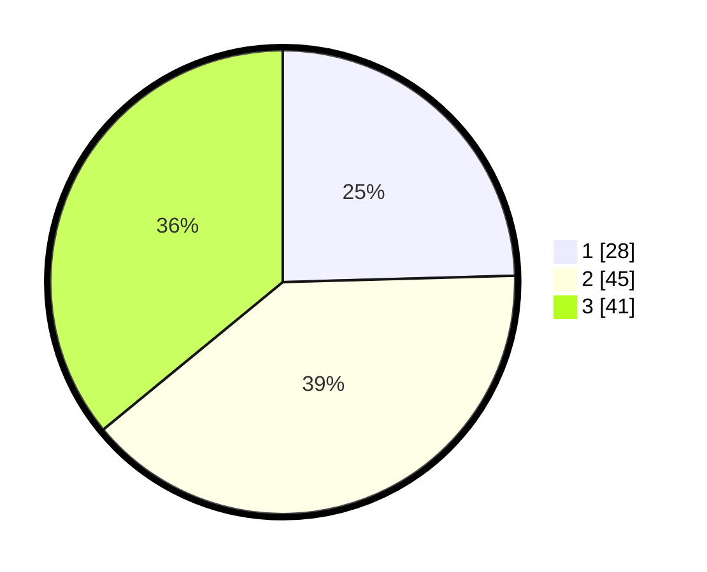

# Hasil

## Grafik

## Tabel

| No. | Nama Paslon    | Suara | Suara (raw) | Persentase |
|:--- |:-------------- | -----:| -----------:| ----------:|
| 1   | ANIES MUHAIMIN | 28    | [28][p-1]   | 24,56      |
| 2   | PRABOWO GIBRAN | 45    | [45][p-2]   | 39,47      |
| 3   | GANJAR MAHFUD  | 41    | [41][p-3]   | 35,96      |

[p-1]: https://github.com/gigit-pemilu/pemilu-2024/blob/main/pilpres/hitung-suara/sub/33-jawa-tengah/sub/01-cilacap/sub/22-cilacap-tengah/sub/1003-sidanegara/sub/019-tps/sub/paslon-1.txt
[p-2]: https://github.com/gigit-pemilu/pemilu-2024/blob/main/pilpres/hitung-suara/sub/33-jawa-tengah/sub/01-cilacap/sub/22-cilacap-tengah/sub/1003-sidanegara/sub/019-tps/sub/paslon-2.txt
[p-3]: https://github.com/gigit-pemilu/pemilu-2024/blob/main/pilpres/hitung-suara/sub/33-jawa-tengah/sub/01-cilacap/sub/22-cilacap-tengah/sub/1003-sidanegara/sub/019-tps/sub/paslon-3.txt

## Foto C Plano

https://sirekap-obj-formc.kpu.go.id/b48c/pemilu/ppwp/33/01/22/10/03/3301221003019-20240214-211929--8e62832f-ec84-457c-bb9b-14f81a1734c4.jpg

https://sirekap-obj-formc.kpu.go.id/b48c/pemilu/ppwp/33/01/22/10/03/3301221003019-20240214-211956--decbc15a-7c30-4ade-9d05-611efe268f62.jpg

https://sirekap-obj-formc.kpu.go.id/b48c/pemilu/ppwp/33/01/22/10/03/3301221003019-20240214-212012--9747cecf-7d85-4dc3-b6bb-ddbf87d79645.jpg

## Metadata

| Key        | Value               |
| ---------- | ------------------- |
| Time Stamp | 2024-02-15 00:41:44 |

