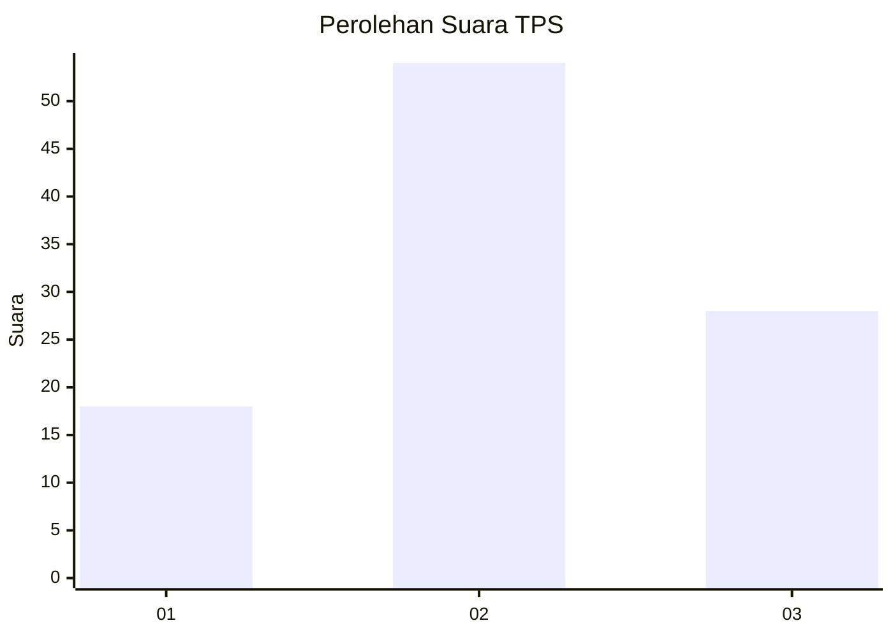
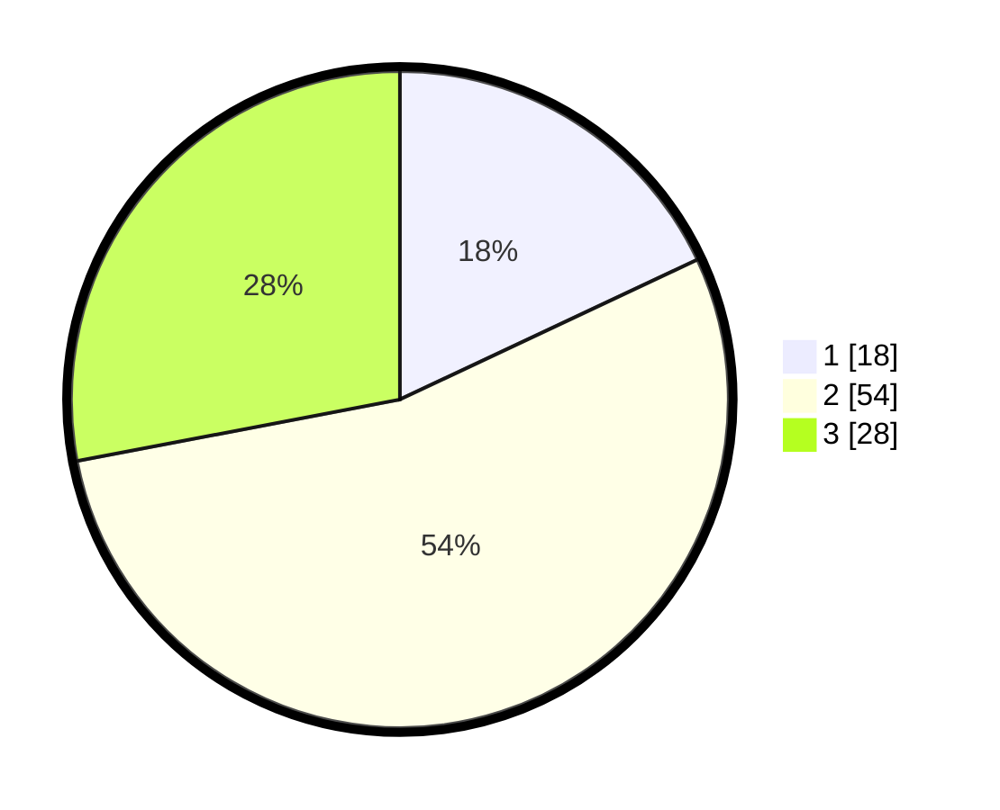

# Hasil

## Grafik

## Tabel

| No. | Nama Paslon    | Suara | Suara (raw) | Persentase |
|:--- |:-------------- | -----:| -----------:| ----------:|
| 1   | ANIES MUHAIMIN | 18    | [18][p-1]   | 18,00      |
| 2   | PRABOWO GIBRAN | 54    | [54][p-2]   | 54,00      |
| 3   | GANJAR MAHFUD  | 28    | [28][p-3]   | 28,00      |

[p-1]: https://github.com/gigit-pemilu/pemilu-2024-33-jawa-tengah/blob/main/pilpres/hitung-suara/sub/33-jawa-tengah/sub/01-cilacap/sub/22-cilacap-tengah/sub/1003-sidanegara/sub/045-tps/sub/paslon-1.txt
[p-2]: https://github.com/gigit-pemilu/pemilu-2024-33-jawa-tengah/blob/main/pilpres/hitung-suara/sub/33-jawa-tengah/sub/01-cilacap/sub/22-cilacap-tengah/sub/1003-sidanegara/sub/045-tps/sub/paslon-2.txt
[p-3]: https://github.com/gigit-pemilu/pemilu-2024-33-jawa-tengah/blob/main/pilpres/hitung-suara/sub/33-jawa-tengah/sub/01-cilacap/sub/22-cilacap-tengah/sub/1003-sidanegara/sub/045-tps/sub/paslon-3.txt

## Foto C Plano

https://sirekap-obj-formc.kpu.go.id/dedf/pemilu/ppwp/33/01/22/10/03/3301221003045-20240216-145945--584a72c1-4209-4f9a-bcef-5151a623b9e0.jpg

https://sirekap-obj-formc.kpu.go.id/dedf/pemilu/ppwp/33/01/22/10/03/3301221003045-20240216-145954--b738a6cf-a0ea-4645-964e-01547af50311.jpg

https://sirekap-obj-formc.kpu.go.id/dedf/pemilu/ppwp/33/01/22/10/03/3301221003045-20240216-150000--69c28878-0d51-47fe-8835-8d1d96fb61d6.jpg

## Metadata

| Key        | Value               |
| ---------- | ------------------- |
| Time Stamp | 2024-02-16 23:45:47 |

