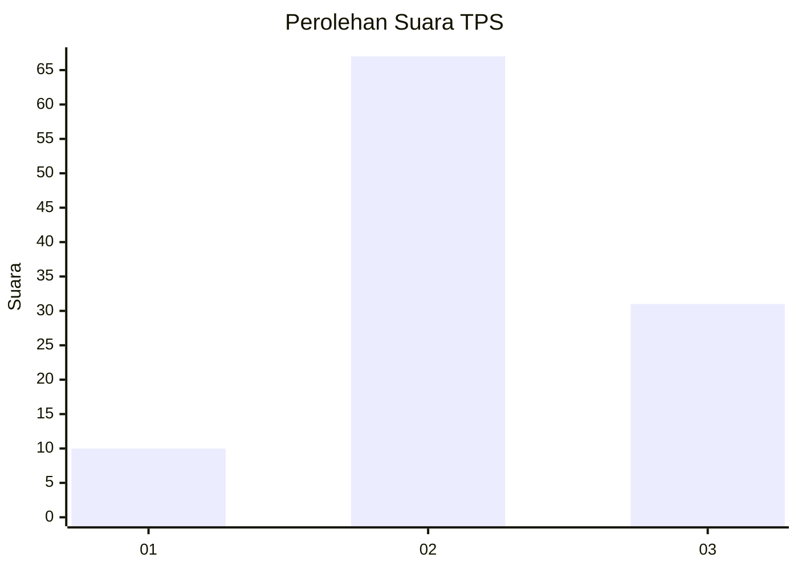
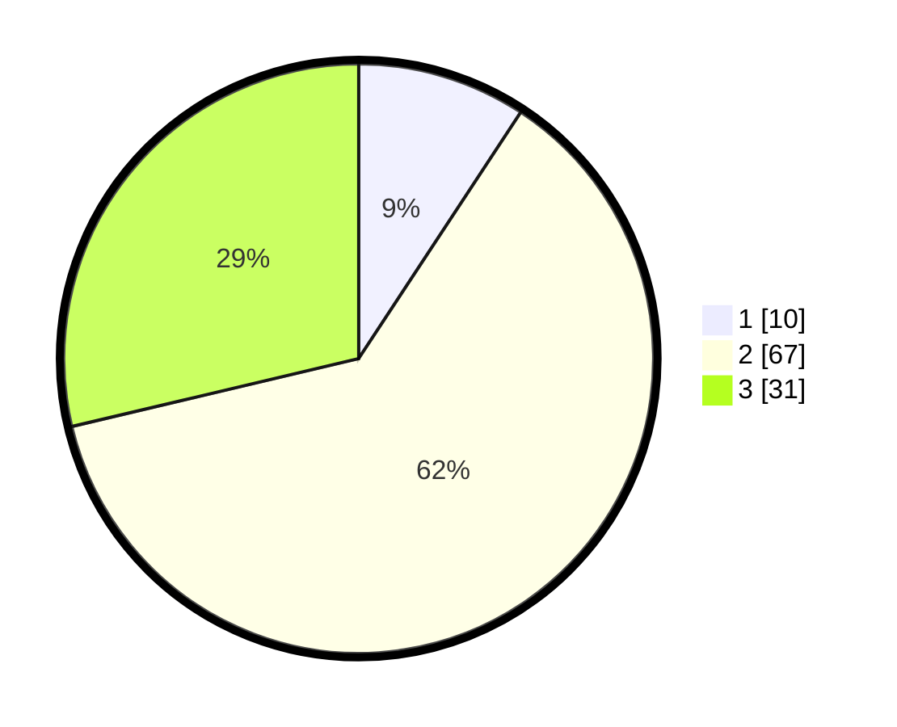

# Hasil

## Grafik

## Tabel

| No. | Nama Paslon    | Suara | Suara (raw) | Persentase |
|:--- |:-------------- | -----:| -----------:| ----------:|
| 1   | ANIES MUHAIMIN | 10    | [10][p-1]   | 9,26       |
| 2   | PRABOWO GIBRAN | 67    | [67][p-2]   | 62,04      |
| 3   | GANJAR MAHFUD  | 31    | [31][p-3]   | 28,70      |

[p-1]: https://github.com/gigit-pemilu/pemilu-2024-33-jawa-tengah/blob/main/pilpres/hitung-suara/sub/33-jawa-tengah/sub/01-cilacap/sub/22-cilacap-tengah/sub/1003-sidanegara/sub/901-tps/sub/paslon-1.txt
[p-2]: https://github.com/gigit-pemilu/pemilu-2024-33-jawa-tengah/blob/main/pilpres/hitung-suara/sub/33-jawa-tengah/sub/01-cilacap/sub/22-cilacap-tengah/sub/1003-sidanegara/sub/901-tps/sub/paslon-2.txt
[p-3]: https://github.com/gigit-pemilu/pemilu-2024-33-jawa-tengah/blob/main/pilpres/hitung-suara/sub/33-jawa-tengah/sub/01-cilacap/sub/22-cilacap-tengah/sub/1003-sidanegara/sub/901-tps/sub/paslon-3.txt

## Foto C Plano

https://sirekap-obj-formc.kpu.go.id/d35c/pemilu/ppwp/33/01/22/10/03/3301221003901-20240214-220236--157d78c8-d480-4dec-bfff-9921d0370833.jpg

https://sirekap-obj-formc.kpu.go.id/d35c/pemilu/ppwp/33/01/22/10/03/3301221003901-20240214-192518--a4d902e9-3350-4d22-a63e-3478f3ff45e9.jpg

https://sirekap-obj-formc.kpu.go.id/d35c/pemilu/ppwp/33/01/22/10/03/3301221003901-20240214-220345--d61e6737-b552-4726-9cd4-57cfa6a840bd.jpg

## Metadata

| Key        | Value               |
| ---------- | ------------------- |
| Time Stamp | 2024-02-20 16:00:00 |

