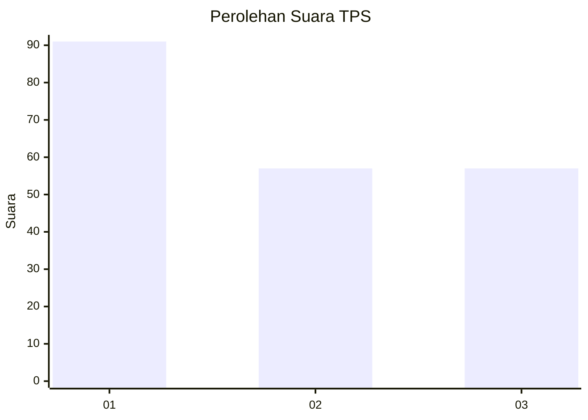
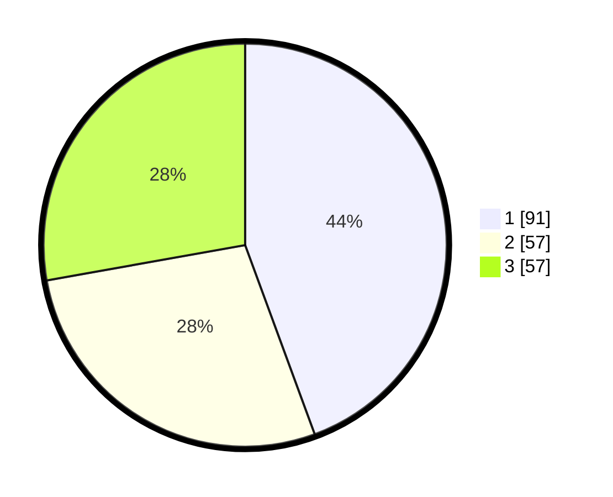

# Hasil

## Grafik

## Tabel

| No. | Nama Paslon    | Suara | Suara (raw) | Persentase |
|:--- |:-------------- | -----:| -----------:| ----------:|
| 1   | ANIES MUHAIMIN | 91    | [91][p-1]   | 44,39      |
| 2   | PRABOWO GIBRAN | 57    | [57][p-2]   | 27,80      |
| 3   | GANJAR MAHFUD  | 57    | [57][p-3]   | 27,80      |

[p-1]: https://github.com/gigit-pemilu/pemilu-2024-33-jawa-tengah/blob/main/pilpres/hitung-suara/sub/33-jawa-tengah/sub/01-cilacap/sub/22-cilacap-tengah/sub/1004-donan/sub/058-tps/sub/paslon-1.txt
[p-2]: https://github.com/gigit-pemilu/pemilu-2024-33-jawa-tengah/blob/main/pilpres/hitung-suara/sub/33-jawa-tengah/sub/01-cilacap/sub/22-cilacap-tengah/sub/1004-donan/sub/058-tps/sub/paslon-2.txt
[p-3]: https://github.com/gigit-pemilu/pemilu-2024-33-jawa-tengah/blob/main/pilpres/hitung-suara/sub/33-jawa-tengah/sub/01-cilacap/sub/22-cilacap-tengah/sub/1004-donan/sub/058-tps/sub/paslon-3.txt

## Foto C Plano

https://sirekap-obj-formc.kpu.go.id/c2cd/pemilu/ppwp/33/01/22/10/04/3301221004058-20240215-013750--33f48d4d-6539-41db-8c60-fde977b2046e.jpg

https://sirekap-obj-formc.kpu.go.id/c2cd/pemilu/ppwp/33/01/22/10/04/3301221004058-20240215-014057--d188fccb-b1d7-4d23-868a-84b840b5e300.jpg

https://sirekap-obj-formc.kpu.go.id/c2cd/pemilu/ppwp/33/01/22/10/04/3301221004058-20240215-014247--a79a8b32-a317-44ba-afa2-35eb72dfda70.jpg

## Metadata

| Key        | Value               |
| ---------- | ------------------- |
| Time Stamp | 2024-02-15 12:00:28 |

