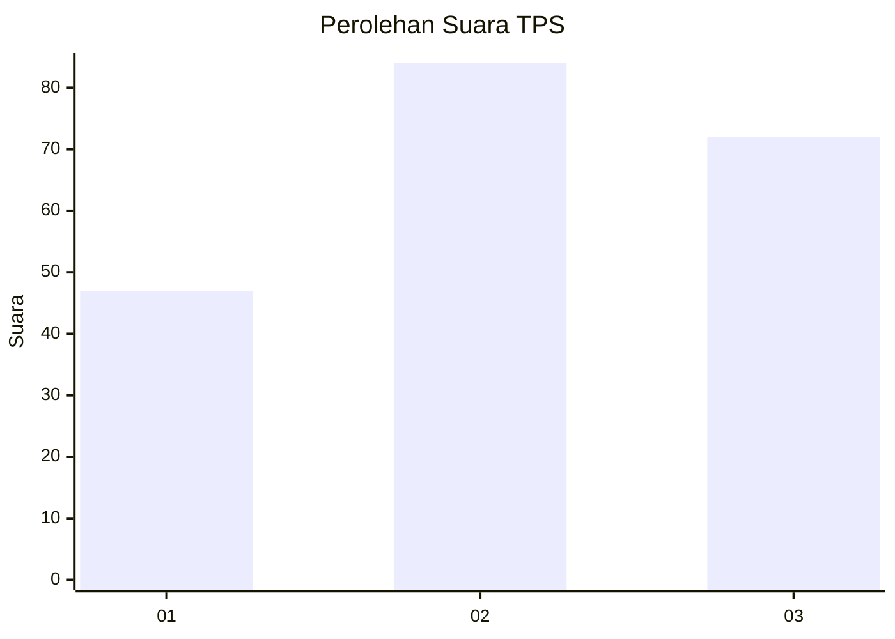
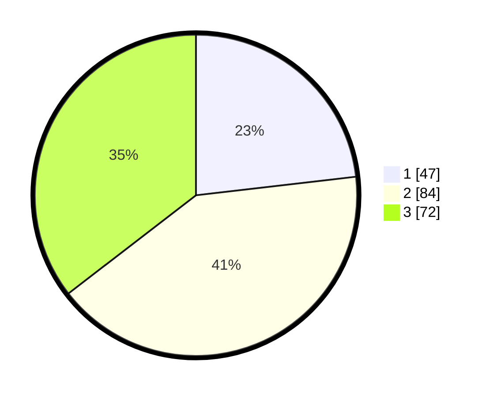

# Hasil

## Grafik

## Tabel

| No. | Nama Paslon    | Suara | Suara (raw) | Persentase |
|:--- |:-------------- | -----:| -----------:| ----------:|
| 1   | ANIES MUHAIMIN | 47    | [47][p-1]   | 23,15      |
| 2   | PRABOWO GIBRAN | 84    | [84][p-2]   | 41,38      |
| 3   | GANJAR MAHFUD  | 72    | [72][p-3]   | 35,47      |

[p-1]: https://github.com/gigit-pemilu/pemilu-2024/blob/main/pilpres/hitung-suara/sub/33-jawa-tengah/sub/01-cilacap/sub/23-cilacap-utara/sub/1001-mertasinga/sub/007-tps/sub/paslon-1.txt
[p-2]: https://github.com/gigit-pemilu/pemilu-2024/blob/main/pilpres/hitung-suara/sub/33-jawa-tengah/sub/01-cilacap/sub/23-cilacap-utara/sub/1001-mertasinga/sub/007-tps/sub/paslon-2.txt
[p-3]: https://github.com/gigit-pemilu/pemilu-2024/blob/main/pilpres/hitung-suara/sub/33-jawa-tengah/sub/01-cilacap/sub/23-cilacap-utara/sub/1001-mertasinga/sub/007-tps/sub/paslon-3.txt

## Foto C Plano

https://sirekap-obj-formc.kpu.go.id/8e50/pemilu/ppwp/33/01/23/10/01/3301231001007-20240214-201211--fd7bf03c-a822-4ec7-8579-0977e97839a9.jpg

https://sirekap-obj-formc.kpu.go.id/8e50/pemilu/ppwp/33/01/23/10/01/3301231001007-20240214-203715--b8278e59-cf42-4a1d-bdc7-f2ef773075f7.jpg

https://sirekap-obj-formc.kpu.go.id/8e50/pemilu/ppwp/33/01/23/10/01/3301231001007-20240214-201011--cf3669fa-764e-458e-a5c0-444fb691293e.jpg

## Metadata

| Key        | Value               |
| ---------- | ------------------- |
| Time Stamp | 2024-02-15 17:00:25 |

