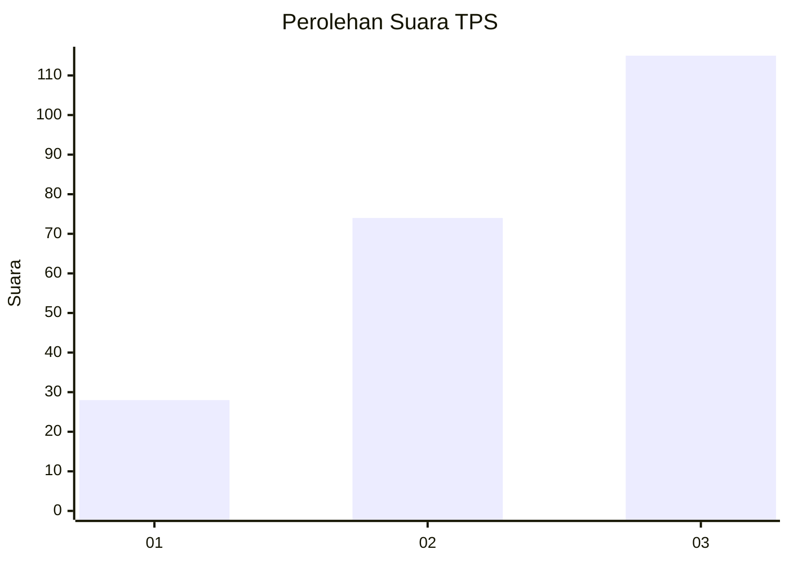
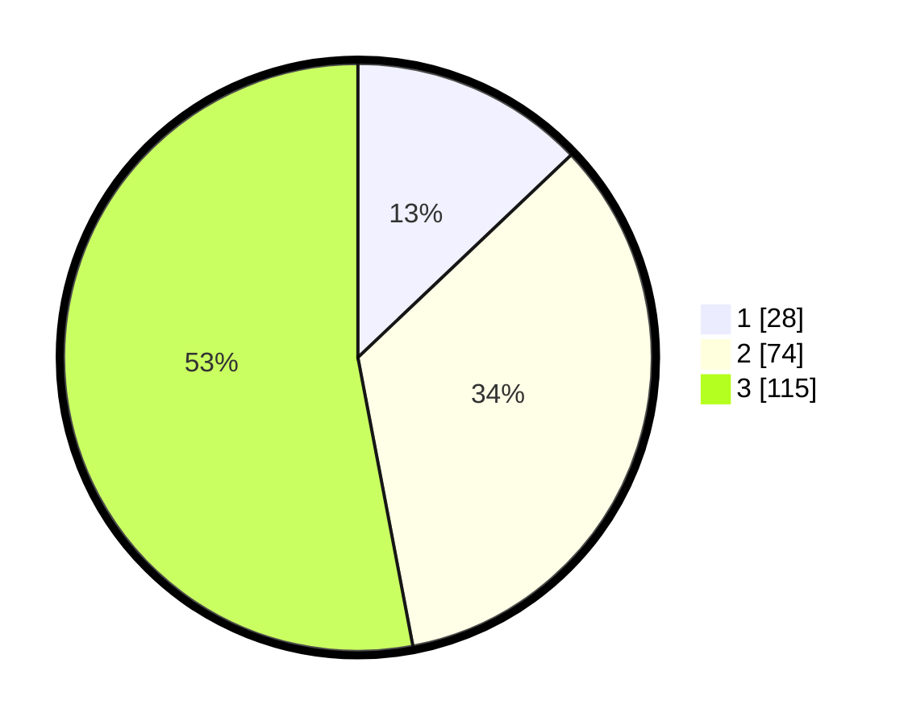

# Hasil

## Grafik

## Tabel

| No. | Nama Paslon    | Suara | Suara (raw) | Persentase |
|:--- |:-------------- | -----:| -----------:| ----------:|
| 1   | ANIES MUHAIMIN | 28    | [28][p-1]   | 12,90      |
| 2   | PRABOWO GIBRAN | 74    | [74][p-2]   | 34,10      |
| 3   | GANJAR MAHFUD  | 115   | [115][p-3]  | 53,00      |

[p-1]: https://github.com/gigit-pemilu/pemilu-2024-33-jawa-tengah/blob/main/pilpres/hitung-suara/sub/33-jawa-tengah/sub/01-cilacap/sub/23-cilacap-utara/sub/1001-mertasinga/sub/015-tps/sub/paslon-1.txt
[p-2]: https://github.com/gigit-pemilu/pemilu-2024-33-jawa-tengah/blob/main/pilpres/hitung-suara/sub/33-jawa-tengah/sub/01-cilacap/sub/23-cilacap-utara/sub/1001-mertasinga/sub/015-tps/sub/paslon-2.txt
[p-3]: https://github.com/gigit-pemilu/pemilu-2024-33-jawa-tengah/blob/main/pilpres/hitung-suara/sub/33-jawa-tengah/sub/01-cilacap/sub/23-cilacap-utara/sub/1001-mertasinga/sub/015-tps/sub/paslon-3.txt

## Foto C Plano

https://sirekap-obj-formc.kpu.go.id/67b2/pemilu/ppwp/33/01/23/10/01/3301231001015-20240215-011612--39103a86-6b9e-4d5f-ae16-97b29bf7dcda.jpg

https://sirekap-obj-formc.kpu.go.id/67b2/pemilu/ppwp/33/01/23/10/01/3301231001015-20240215-012040--2a756f0e-3ffd-4c58-b615-fa3aaac4e495.jpg

https://sirekap-obj-formc.kpu.go.id/67b2/pemilu/ppwp/33/01/23/10/01/3301231001015-20240215-012215--45142baa-8358-43ea-a235-9d91b8677d2a.jpg

## Metadata

| Key        | Value               |
| ---------- | ------------------- |
| Time Stamp | 2024-02-15 15:00:29 |

