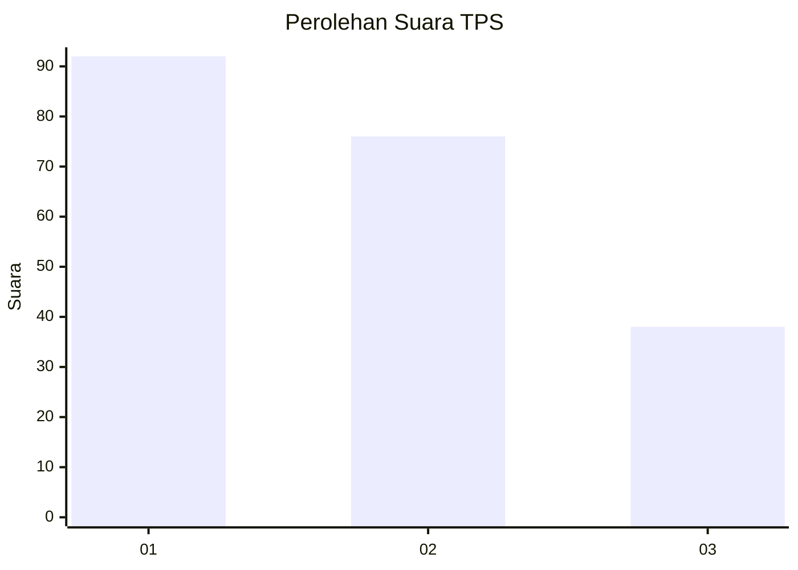
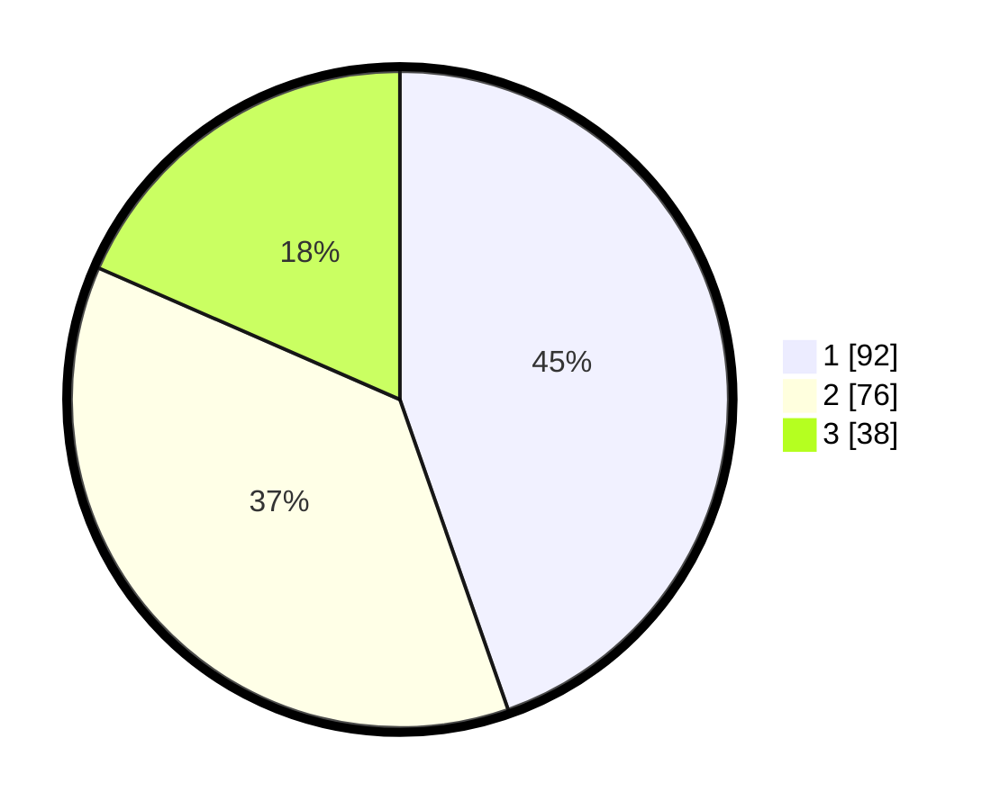

# Hasil

## Grafik

## Tabel

| No. | Nama Paslon    | Suara | Suara (raw) | Persentase |
|:--- |:-------------- | -----:| -----------:| ----------:|
| 1   | ANIES MUHAIMIN | 92    | [92][p-1]   | 44,66      |
| 2   | PRABOWO GIBRAN | 76    | [76][p-2]   | 36,89      |
| 3   | GANJAR MAHFUD  | 38    | [38][p-3]   | 18,45      |

[p-1]: https://github.com/gigit-pemilu/pemilu-2024-33-jawa-tengah/blob/main/pilpres/hitung-suara/sub/33-jawa-tengah/sub/01-cilacap/sub/23-cilacap-utara/sub/1005-kebonmanis/sub/006-tps/sub/paslon-1.txt
[p-2]: https://github.com/gigit-pemilu/pemilu-2024-33-jawa-tengah/blob/main/pilpres/hitung-suara/sub/33-jawa-tengah/sub/01-cilacap/sub/23-cilacap-utara/sub/1005-kebonmanis/sub/006-tps/sub/paslon-2.txt
[p-3]: https://github.com/gigit-pemilu/pemilu-2024-33-jawa-tengah/blob/main/pilpres/hitung-suara/sub/33-jawa-tengah/sub/01-cilacap/sub/23-cilacap-utara/sub/1005-kebonmanis/sub/006-tps/sub/paslon-3.txt

## Foto C Plano

https://sirekap-obj-formc.kpu.go.id/251e/pemilu/ppwp/33/01/23/10/05/3301231005006-20240215-014812--013144e2-62e7-4d3f-87d9-4ab4eca60f5c.jpg

https://sirekap-obj-formc.kpu.go.id/251e/pemilu/ppwp/33/01/23/10/05/3301231005006-20240215-014900--06ac0819-c67e-465b-8e6c-3a5866b0b289.jpg

https://sirekap-obj-formc.kpu.go.id/251e/pemilu/ppwp/33/01/23/10/05/3301231005006-20240215-014922--67759ec8-169d-4b2e-bb3b-ad18dae76e81.jpg

## Metadata

| Key        | Value               |
| ---------- | ------------------- |
| Time Stamp | 2024-02-15 17:00:25 |

