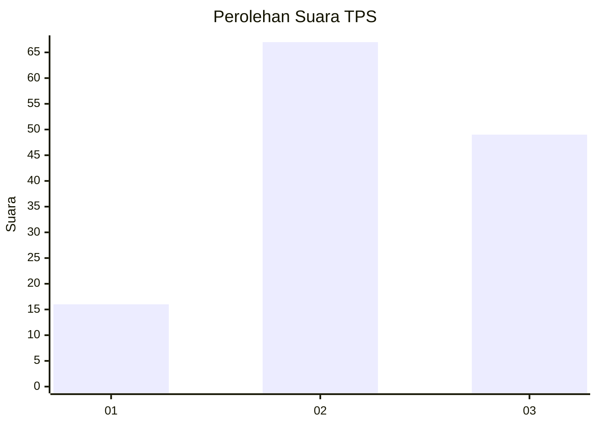
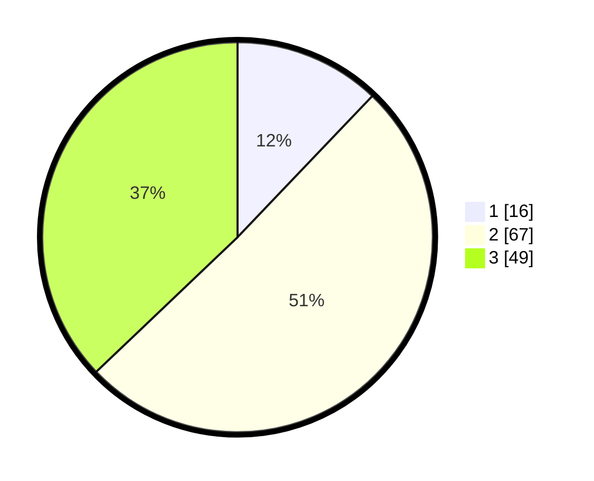

# Hasil

## Grafik

## Tabel

| No. | Nama Paslon    | Suara | Suara (raw) | Persentase |
|:--- |:-------------- | -----:| -----------:| ----------:|
| 1   | ANIES MUHAIMIN | 16    | [16][p-1]   | 12,12      |
| 2   | PRABOWO GIBRAN | 67    | [67][p-2]   | 50,76      |
| 3   | GANJAR MAHFUD  | 49    | [49][p-3]   | 37,12      |

[p-1]: https://github.com/gigit-pemilu/pemilu-2024/blob/main/pilpres/hitung-suara/sub/33-jawa-tengah/sub/01-cilacap/sub/24-kampung-laut/sub/2001-ujunggagak/sub/002-tps/sub/paslon-1.txt
[p-2]: https://github.com/gigit-pemilu/pemilu-2024/blob/main/pilpres/hitung-suara/sub/33-jawa-tengah/sub/01-cilacap/sub/24-kampung-laut/sub/2001-ujunggagak/sub/002-tps/sub/paslon-2.txt
[p-3]: https://github.com/gigit-pemilu/pemilu-2024/blob/main/pilpres/hitung-suara/sub/33-jawa-tengah/sub/01-cilacap/sub/24-kampung-laut/sub/2001-ujunggagak/sub/002-tps/sub/paslon-3.txt

## Foto C Plano

https://sirekap-obj-formc.kpu.go.id/25f9/pemilu/ppwp/33/01/24/20/01/3301242001002-20240214-215154--740c3ef6-c808-42a9-830d-cca5e06ca535.jpg

https://sirekap-obj-formc.kpu.go.id/25f9/pemilu/ppwp/33/01/24/20/01/3301242001002-20240214-215248--11e32a53-c034-4af6-a291-8f2f27c90cc6.jpg

https://sirekap-obj-formc.kpu.go.id/25f9/pemilu/ppwp/33/01/24/20/01/3301242001002-20240214-215329--8a54a054-eb22-4f9a-83ff-3b22b800dfe3.jpg

## Metadata

| Key        | Value               |
| ---------- | ------------------- |
| Time Stamp | 2024-02-15 15:30:25 |

## DATA PEMILIH TETAP

Jumlah pemilih dalam DPT: **179**.
 * L: **95**.
 * P: **84**.

## DATA PENGGUNA HAK PILIH

Jumlah pengguna hak pilih dalam DPT: **131**.
 * L: **62**.
 * P: **69**.

Jumlah pengguna hak pilih dalam DPTb: **0**.
 * L: **0**.
 * P: **0**.

Jumlah pengguna hak pilih dalam DPK: **5**.
 * L: **4**.
 * P: **1**.

Jumlah pengguna hak pilih: **136**.
 * L: **6**.
 * P: **70**.

## JUMLAH SUARA SAH DAN TIDAK SAH

JUMLAH SELURUH SUARA SAH: **132**.

JUMLAH SUARA TIDAK SAH: **4**.

JUMLAH SELURUH SUARA SAH DAN SUARA TIDAK SAH: **136**.

