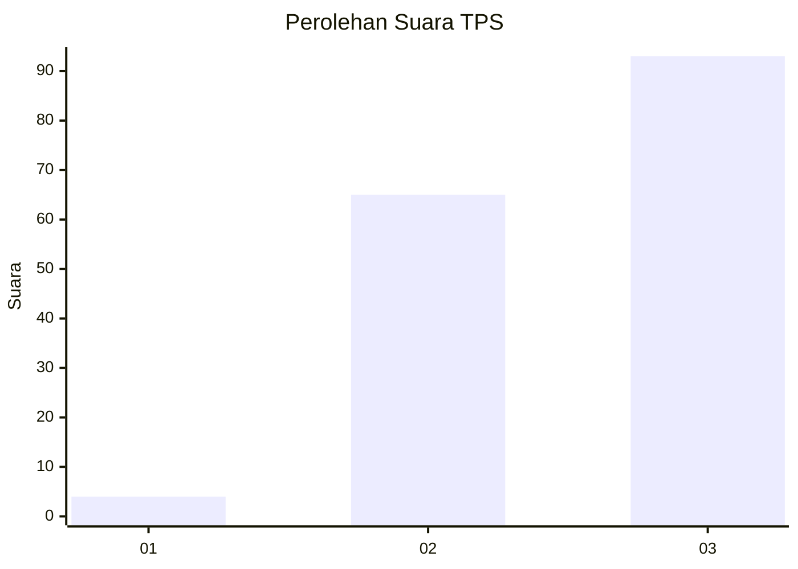
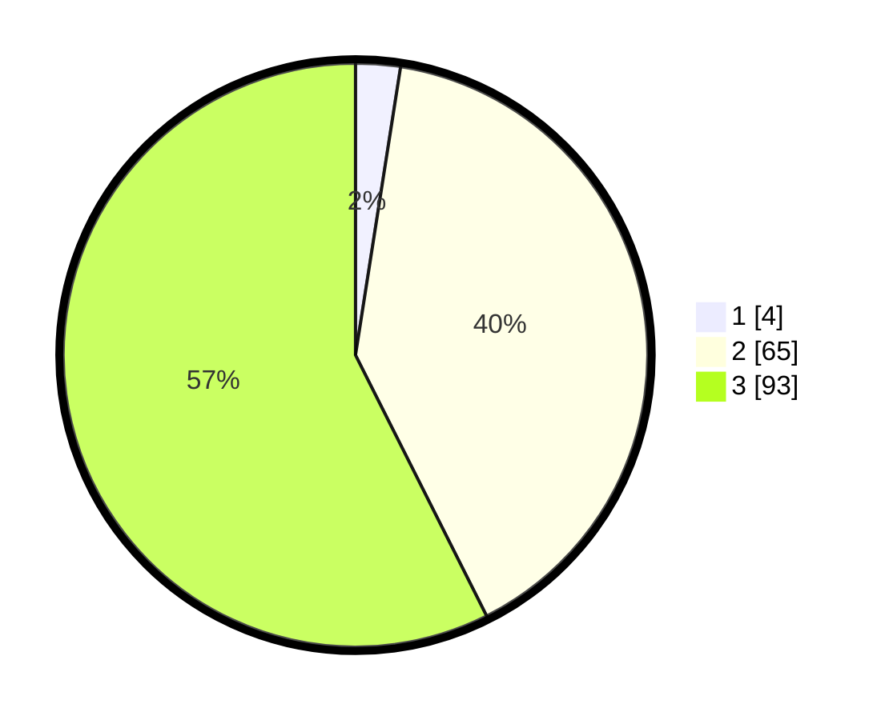

# Hasil

## Grafik

## Tabel

| No. | Nama Paslon    | Suara | Suara (raw) | Persentase |
|:--- |:-------------- | -----:| -----------:| ----------:|
| 1   | ANIES MUHAIMIN | 4     | [4][p-1]    | 2,47       |
| 2   | PRABOWO GIBRAN | 65    | [65][p-2]   | 40,12      |
| 3   | GANJAR MAHFUD  | 93    | [93][p-3]   | 57,41      |

[p-1]: https://github.com/gigit-pemilu/pemilu-2024/blob/main/pilpres/hitung-suara/sub/33-jawa-tengah/sub/01-cilacap/sub/24-kampung-laut/sub/2001-ujunggagak/sub/007-tps/sub/paslon-1.txt
[p-2]: https://github.com/gigit-pemilu/pemilu-2024/blob/main/pilpres/hitung-suara/sub/33-jawa-tengah/sub/01-cilacap/sub/24-kampung-laut/sub/2001-ujunggagak/sub/007-tps/sub/paslon-2.txt
[p-3]: https://github.com/gigit-pemilu/pemilu-2024/blob/main/pilpres/hitung-suara/sub/33-jawa-tengah/sub/01-cilacap/sub/24-kampung-laut/sub/2001-ujunggagak/sub/007-tps/sub/paslon-3.txt

## Foto C Plano

https://sirekap-obj-formc.kpu.go.id/13b5/pemilu/ppwp/33/01/24/20/01/3301242001007-20240216-132259--f9d1e9ea-4cd8-4e3c-9c2a-03af317b0679.jpg

https://sirekap-obj-formc.kpu.go.id/13b5/pemilu/ppwp/33/01/24/20/01/3301242001007-20240216-115025--259e6a97-a58c-4daf-8f83-b49df7cdf15e.jpg

## Metadata

| Key        | Value               |
| ---------- | ------------------- |
| Time Stamp | 2024-02-16 23:45:47 |

