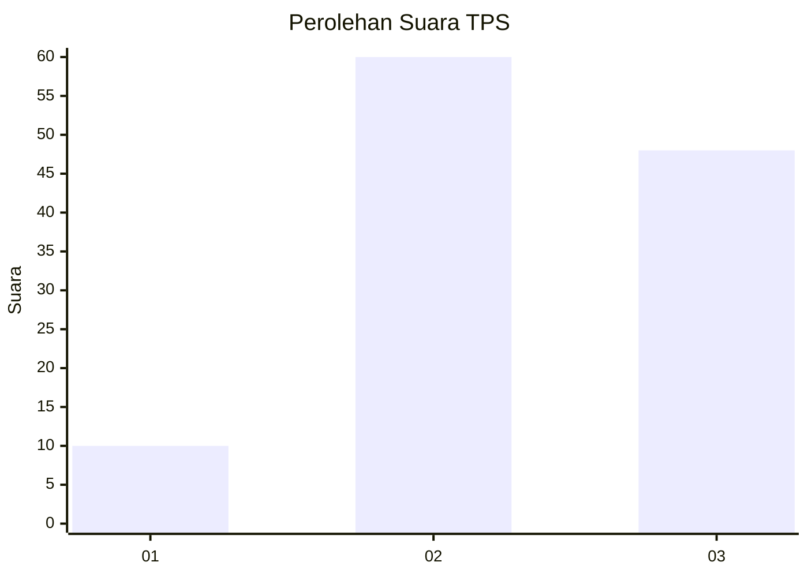
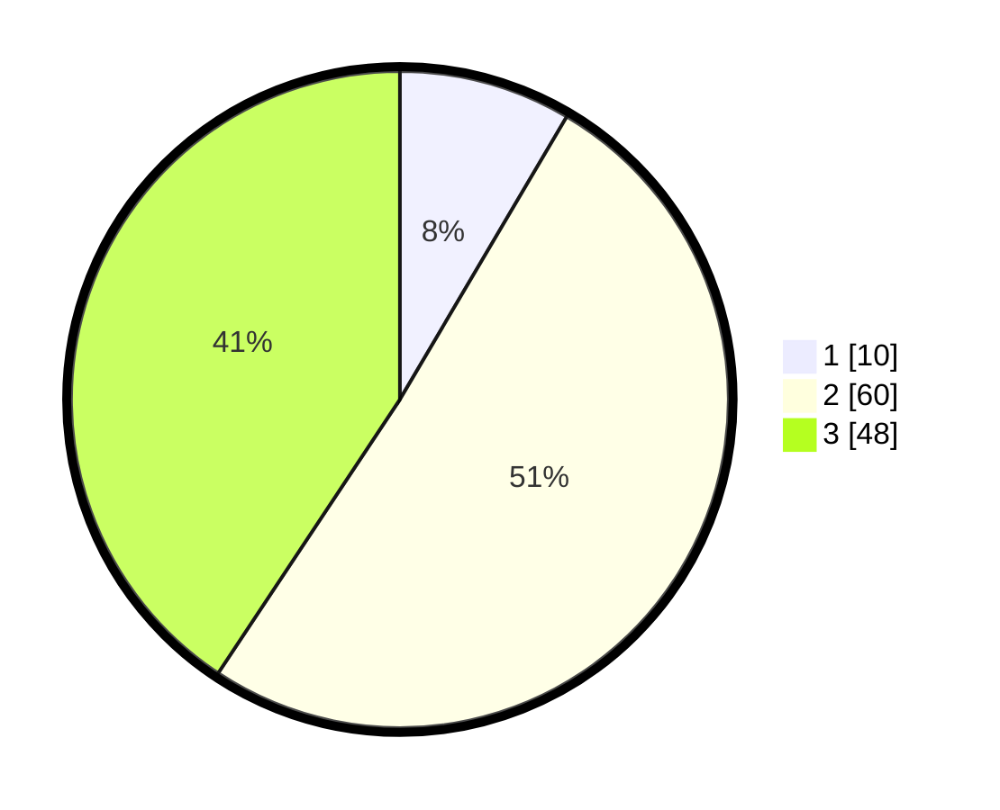

# Hasil

## Grafik

## Tabel

| No. | Nama Paslon    | Suara | Suara (raw) | Persentase |
|:--- |:-------------- | -----:| -----------:| ----------:|
| 1   | ANIES MUHAIMIN | 10    | [10][p-1]   | 8,47       |
| 2   | PRABOWO GIBRAN | 60    | [60][p-2]   | 50,85      |
| 3   | GANJAR MAHFUD  | 48    | [48][p-3]   | 40,68      |

[p-1]: https://github.com/gigit-pemilu/pemilu-2024-33-jawa-tengah/blob/main/pilpres/hitung-suara/sub/33-jawa-tengah/sub/01-cilacap/sub/24-kampung-laut/sub/2001-ujunggagak/sub/010-tps/sub/paslon-1.txt
[p-2]: https://github.com/gigit-pemilu/pemilu-2024-33-jawa-tengah/blob/main/pilpres/hitung-suara/sub/33-jawa-tengah/sub/01-cilacap/sub/24-kampung-laut/sub/2001-ujunggagak/sub/010-tps/sub/paslon-2.txt
[p-3]: https://github.com/gigit-pemilu/pemilu-2024-33-jawa-tengah/blob/main/pilpres/hitung-suara/sub/33-jawa-tengah/sub/01-cilacap/sub/24-kampung-laut/sub/2001-ujunggagak/sub/010-tps/sub/paslon-3.txt

## Foto C Plano

https://sirekap-obj-formc.kpu.go.id/5955/pemilu/ppwp/33/01/24/20/01/3301242001010-20240214-221347--ee2b31da-0c76-4384-ad27-e2e51fe5b845.jpg

https://sirekap-obj-formc.kpu.go.id/5955/pemilu/ppwp/33/01/24/20/01/3301242001010-20240214-221516--c42f0070-a7ee-4dcf-a3d4-bbc5d373b10a.jpg

https://sirekap-obj-formc.kpu.go.id/5955/pemilu/ppwp/33/01/24/20/01/3301242001010-20240214-222001--efba5257-e190-4441-bc15-436116cc2796.jpg

## Metadata

| Key        | Value               |
| ---------- | ------------------- |
| Time Stamp | 2024-02-15 15:30:25 |

