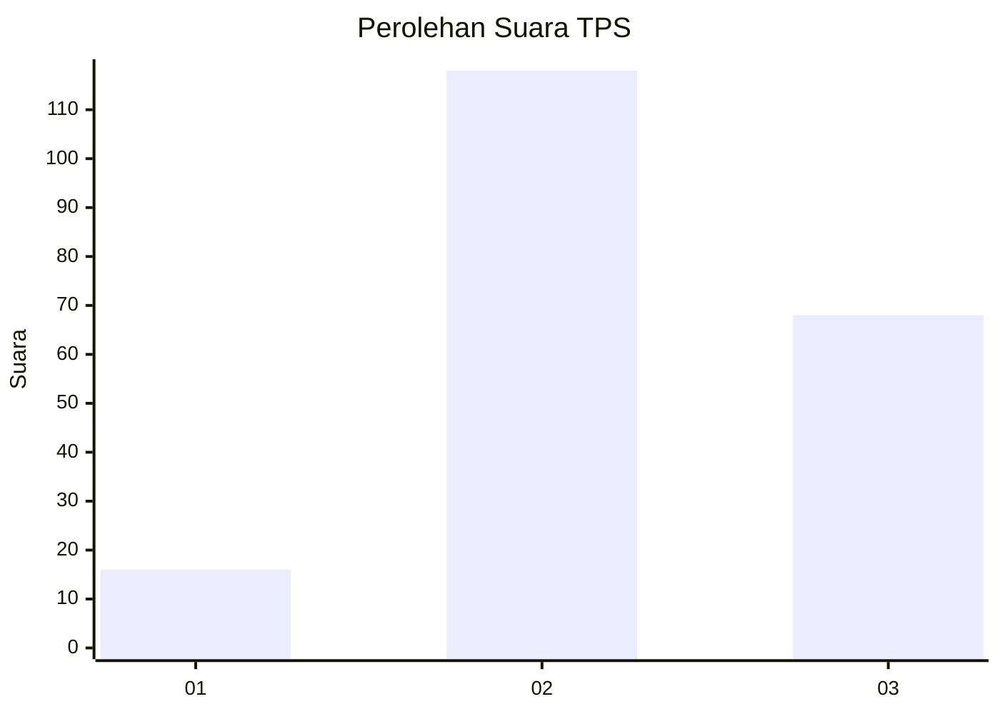
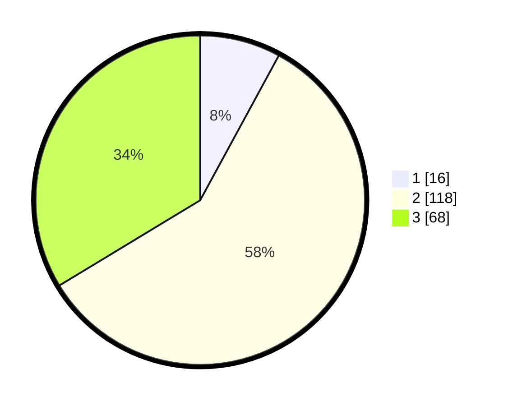

# Hasil

## Grafik

## Tabel

| No. | Nama Paslon    | Suara | Suara (raw) | Persentase |
|:--- |:-------------- | -----:| -----------:| ----------:|
| 1   | ANIES MUHAIMIN | 16    | [16][p-1]   | 7,92       |
| 2   | PRABOWO GIBRAN | 118   | [118][p-2]  | 58,42      |
| 3   | GANJAR MAHFUD  | 68    | [68][p-3]   | 33,66      |

[p-1]: https://github.com/gigit-pemilu/pemilu-2024-33-jawa-tengah/blob/main/pilpres/hitung-suara/sub/33-jawa-tengah/sub/02-banyumas/sub/01-lumbir/sub/2001-cirahab/sub/001-tps/sub/paslon-1.txt
[p-2]: https://github.com/gigit-pemilu/pemilu-2024-33-jawa-tengah/blob/main/pilpres/hitung-suara/sub/33-jawa-tengah/sub/02-banyumas/sub/01-lumbir/sub/2001-cirahab/sub/001-tps/sub/paslon-2.txt
[p-3]: https://github.com/gigit-pemilu/pemilu-2024-33-jawa-tengah/blob/main/pilpres/hitung-suara/sub/33-jawa-tengah/sub/02-banyumas/sub/01-lumbir/sub/2001-cirahab/sub/001-tps/sub/paslon-3.txt

## Foto C Plano

https://sirekap-obj-formc.kpu.go.id/7fae/pemilu/ppwp/33/02/01/20/01/3302012001001-20240215-013941--fadc5287-4cf2-47be-9991-c035bf49eb89.jpg

https://sirekap-obj-formc.kpu.go.id/7fae/pemilu/ppwp/33/02/01/20/01/3302012001001-20240215-014018--e83550e2-ae45-447d-b7f7-6c08297d2100.jpg

https://sirekap-obj-formc.kpu.go.id/7fae/pemilu/ppwp/33/02/01/20/01/3302012001001-20240215-014039--d98dabb5-4eb1-41f2-93c2-cb3f7dac59d2.jpg

## Metadata

| Key        | Value               |
| ---------- | ------------------- |
| Time Stamp | 2024-02-16 12:51:22 |

