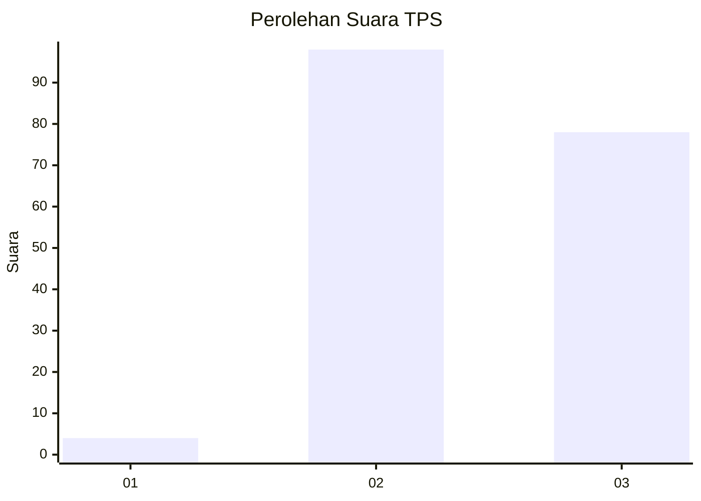
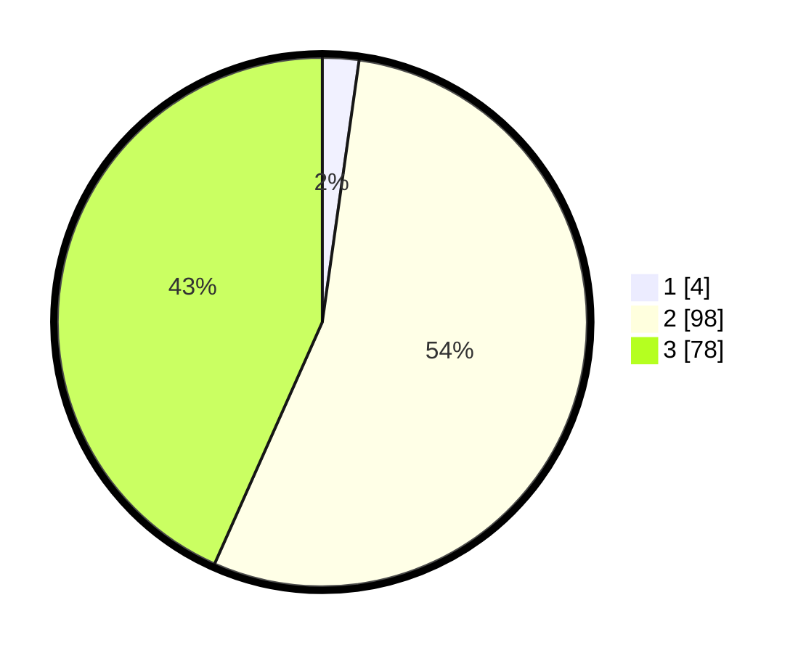

# Hasil

## Grafik

## Tabel

| No. | Nama Paslon    | Suara | Suara (raw) | Persentase |
|:--- |:-------------- | -----:| -----------:| ----------:|
| 1   | ANIES MUHAIMIN | 4     | [4][p-1]    | 2,22       |
| 2   | PRABOWO GIBRAN | 98    | [98][p-2]   | 54,44      |
| 3   | GANJAR MAHFUD  | 78    | [78][p-3]   | 43,33      |

[p-1]: https://github.com/gigit-pemilu/pemilu-2024-33-jawa-tengah/blob/main/pilpres/hitung-suara/sub/33-jawa-tengah/sub/02-banyumas/sub/01-lumbir/sub/2001-cirahab/sub/005-tps/sub/paslon-1.txt
[p-2]: https://github.com/gigit-pemilu/pemilu-2024-33-jawa-tengah/blob/main/pilpres/hitung-suara/sub/33-jawa-tengah/sub/02-banyumas/sub/01-lumbir/sub/2001-cirahab/sub/005-tps/sub/paslon-2.txt
[p-3]: https://github.com/gigit-pemilu/pemilu-2024-33-jawa-tengah/blob/main/pilpres/hitung-suara/sub/33-jawa-tengah/sub/02-banyumas/sub/01-lumbir/sub/2001-cirahab/sub/005-tps/sub/paslon-3.txt

## Foto C Plano

https://sirekap-obj-formc.kpu.go.id/c49b/pemilu/ppwp/33/02/01/20/01/3302012001005-20240214-155201--e05faca0-3945-4ab9-a396-cf5857f8fd30.jpg

https://sirekap-obj-formc.kpu.go.id/c49b/pemilu/ppwp/33/02/01/20/01/3302012001005-20240214-232053--c19da8ec-a27a-49e1-8553-5fdff4e35c4c.jpg

https://sirekap-obj-formc.kpu.go.id/c49b/pemilu/ppwp/33/02/01/20/01/3302012001005-20240214-235825--edef2e7c-a940-402e-9d21-4c618cc8c759.jpg

## Metadata

| Key        | Value               |
| ---------- | ------------------- |
| Time Stamp | 2024-02-16 23:00:00 |

