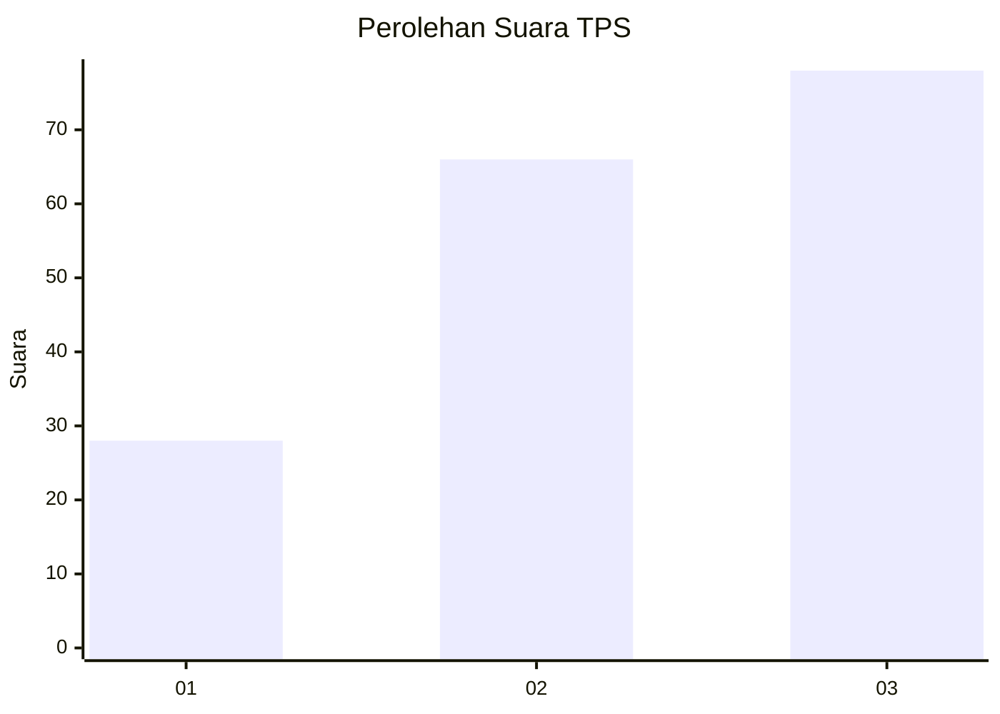
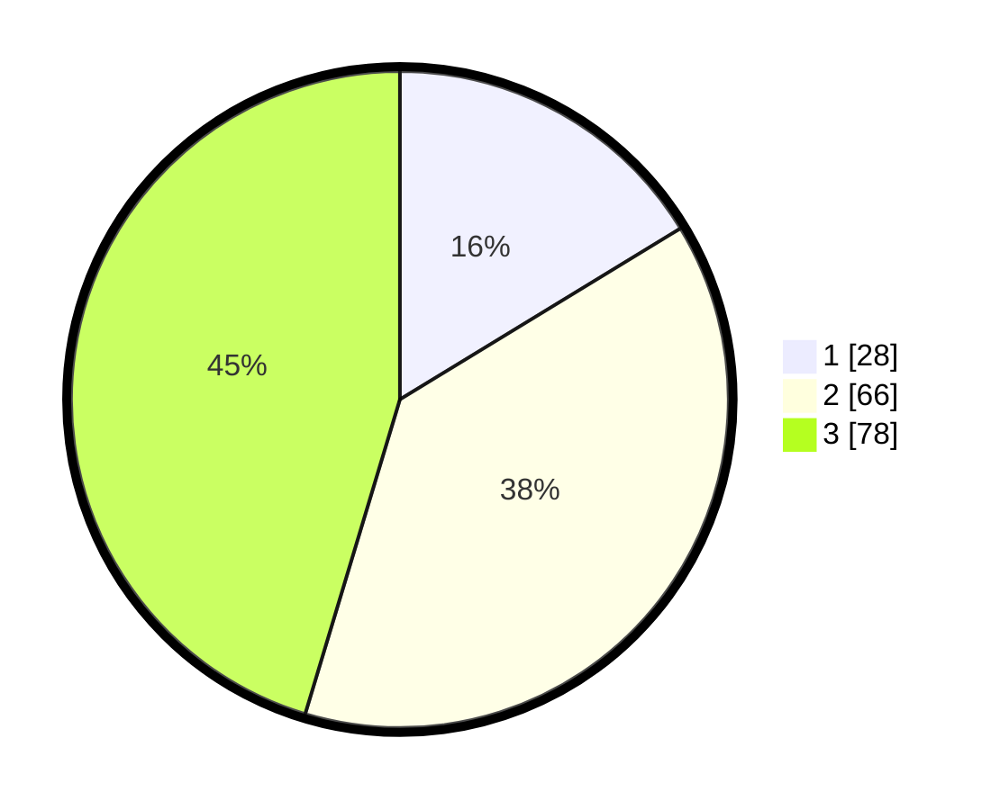

# Hasil

## Grafik

## Tabel

| No. | Nama Paslon    | Suara | Suara (raw) | Persentase |
|:--- |:-------------- | -----:| -----------:| ----------:|
| 1   | ANIES MUHAIMIN | 28    | [28][p-1]   | 16,28      |
| 2   | PRABOWO GIBRAN | 66    | [66][p-2]   | 38,37      |
| 3   | GANJAR MAHFUD  | 78    | [78][p-3]   | 45,35      |

[p-1]: https://github.com/gigit-pemilu/pemilu-2024-33-jawa-tengah/blob/main/pilpres/hitung-suara/sub/33-jawa-tengah/sub/02-banyumas/sub/01-lumbir/sub/2001-cirahab/sub/015-tps/sub/paslon-1.txt
[p-2]: https://github.com/gigit-pemilu/pemilu-2024-33-jawa-tengah/blob/main/pilpres/hitung-suara/sub/33-jawa-tengah/sub/02-banyumas/sub/01-lumbir/sub/2001-cirahab/sub/015-tps/sub/paslon-2.txt
[p-3]: https://github.com/gigit-pemilu/pemilu-2024-33-jawa-tengah/blob/main/pilpres/hitung-suara/sub/33-jawa-tengah/sub/02-banyumas/sub/01-lumbir/sub/2001-cirahab/sub/015-tps/sub/paslon-3.txt

## Foto C Plano

https://sirekap-obj-formc.kpu.go.id/de2b/pemilu/ppwp/33/02/01/20/01/3302012001015-20240215-040928--75249207-0356-4a62-90fb-908fcbdf91e7.jpg

https://sirekap-obj-formc.kpu.go.id/de2b/pemilu/ppwp/33/02/01/20/01/3302012001015-20240215-041057--91a90203-4b93-43a5-994e-5347e2f037e8.jpg

https://sirekap-obj-formc.kpu.go.id/de2b/pemilu/ppwp/33/02/01/20/01/3302012001015-20240215-041234--2717d292-f7a4-489b-a296-e87efac97ffe.jpg

## Metadata

| Key        | Value               |
| ---------- | ------------------- |
| Time Stamp | 2024-02-24 22:31:28 |

