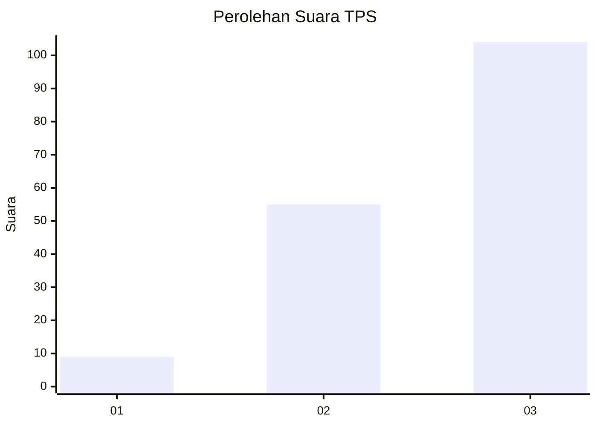
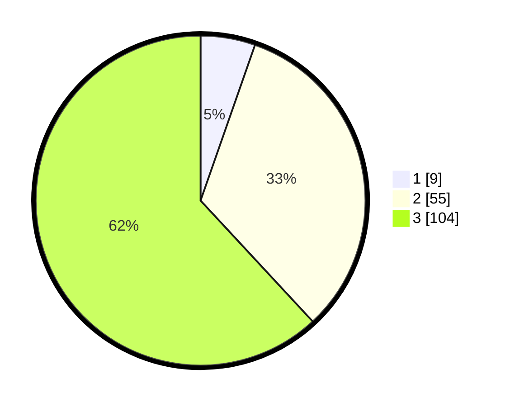

# Hasil

## Grafik

## Tabel

| No. | Nama Paslon    | Suara | Suara (raw) | Persentase |
|:--- |:-------------- | -----:| -----------:| ----------:|
| 1   | ANIES MUHAIMIN | 9     | [9][p-1]    | 5,36       |
| 2   | PRABOWO GIBRAN | 55    | [55][p-2]   | 32,74      |
| 3   | GANJAR MAHFUD  | 104   | [104][p-3]  | 61,90      |

[p-1]: https://github.com/gigit-pemilu/pemilu-2024-33-jawa-tengah/blob/main/pilpres/hitung-suara/sub/33-jawa-tengah/sub/02-banyumas/sub/01-lumbir/sub/2003-parungkamal/sub/006-tps/sub/paslon-1.txt
[p-2]: https://github.com/gigit-pemilu/pemilu-2024-33-jawa-tengah/blob/main/pilpres/hitung-suara/sub/33-jawa-tengah/sub/02-banyumas/sub/01-lumbir/sub/2003-parungkamal/sub/006-tps/sub/paslon-2.txt
[p-3]: https://github.com/gigit-pemilu/pemilu-2024-33-jawa-tengah/blob/main/pilpres/hitung-suara/sub/33-jawa-tengah/sub/02-banyumas/sub/01-lumbir/sub/2003-parungkamal/sub/006-tps/sub/paslon-3.txt

## Foto C Plano

https://sirekap-obj-formc.kpu.go.id/a46d/pemilu/ppwp/33/02/01/20/03/3302012003006-20240214-200245--f12d0621-a84a-4e27-9486-c797513f6d11.jpg

https://sirekap-obj-formc.kpu.go.id/a46d/pemilu/ppwp/33/02/01/20/03/3302012003006-20240214-200428--63e7c7f1-92cc-4cb9-b33e-7b213f8272b6.jpg

https://sirekap-obj-formc.kpu.go.id/a46d/pemilu/ppwp/33/02/01/20/03/3302012003006-20240214-214311--fa3753ac-99c5-4fe6-ba9d-ba512d7a164b.jpg

## Metadata

| Key        | Value               |
| ---------- | ------------------- |
| Time Stamp | 2024-02-15 12:00:28 |

