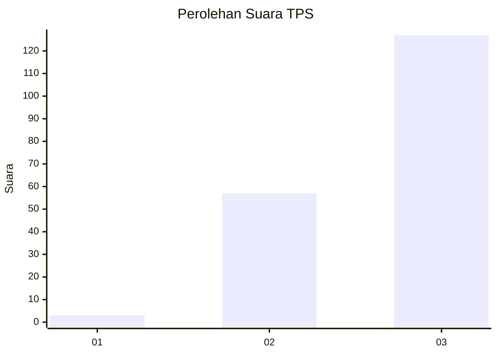
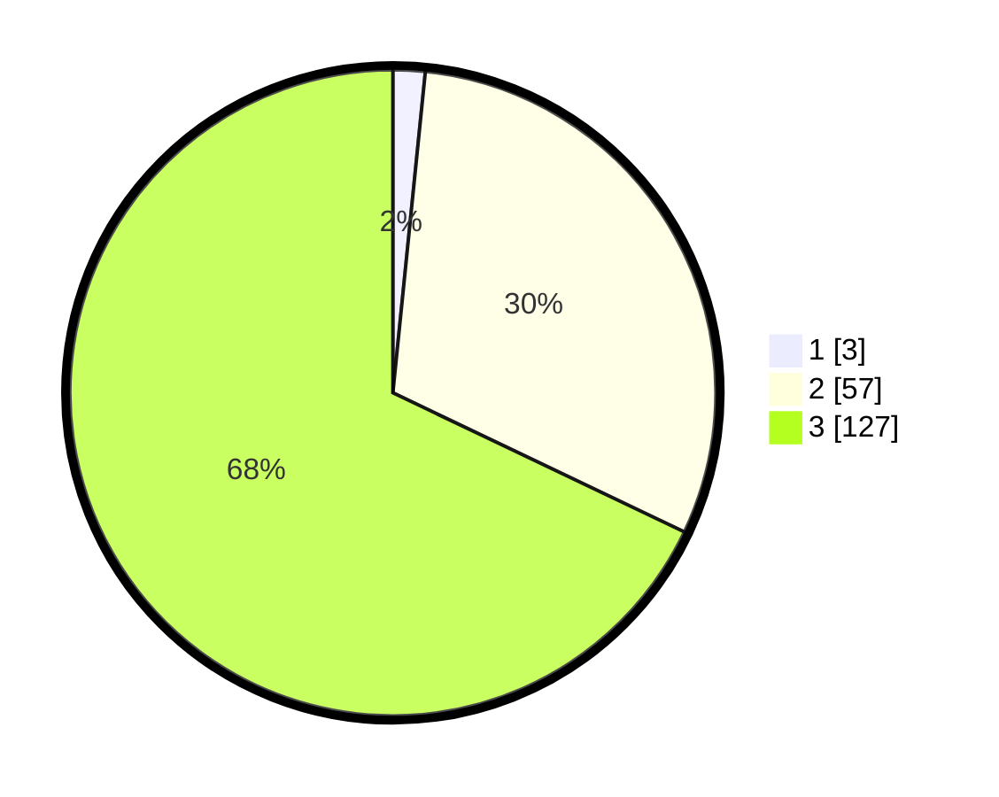

# Hasil

## Grafik

## Tabel

| No. | Nama Paslon    | Suara | Suara (raw) | Persentase |
|:--- |:-------------- | -----:| -----------:| ----------:|
| 1   | ANIES MUHAIMIN | 3     | [3][p-1]    | 1,60       |
| 2   | PRABOWO GIBRAN | 57    | [57][p-2]   | 30,48      |
| 3   | GANJAR MAHFUD  | 127   | [127][p-3]  | 67,91      |

[p-1]: https://github.com/gigit-pemilu/pemilu-2024/blob/main/pilpres/hitung-suara/sub/33-jawa-tengah/sub/02-banyumas/sub/01-lumbir/sub/2003-parungkamal/sub/012-tps/sub/paslon-1.txt
[p-2]: https://github.com/gigit-pemilu/pemilu-2024/blob/main/pilpres/hitung-suara/sub/33-jawa-tengah/sub/02-banyumas/sub/01-lumbir/sub/2003-parungkamal/sub/012-tps/sub/paslon-2.txt
[p-3]: https://github.com/gigit-pemilu/pemilu-2024/blob/main/pilpres/hitung-suara/sub/33-jawa-tengah/sub/02-banyumas/sub/01-lumbir/sub/2003-parungkamal/sub/012-tps/sub/paslon-3.txt

## Foto C Plano

https://sirekap-obj-formc.kpu.go.id/287b/pemilu/ppwp/33/02/01/20/03/3302012003012-20240215-034342--5bb3855f-0281-4b9c-9a7b-214afcabf278.jpg

https://sirekap-obj-formc.kpu.go.id/287b/pemilu/ppwp/33/02/01/20/03/3302012003012-20240215-034533--07325f42-1cf0-4e1b-8c42-635ec9f052bc.jpg

https://sirekap-obj-formc.kpu.go.id/287b/pemilu/ppwp/33/02/01/20/03/3302012003012-20240215-034658--927a7e80-540f-4a93-b4ec-9eacc7a6c7fd.jpg

## Metadata

| Key        | Value               |
| ---------- | ------------------- |
| Time Stamp | 2024-02-17 10:30:03 |

