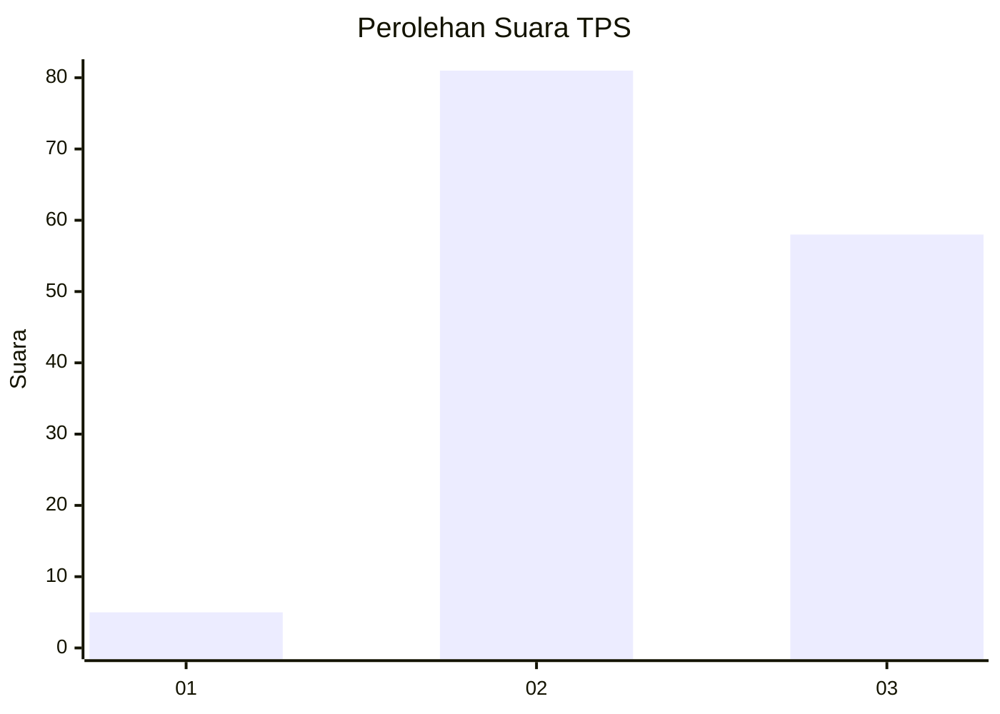
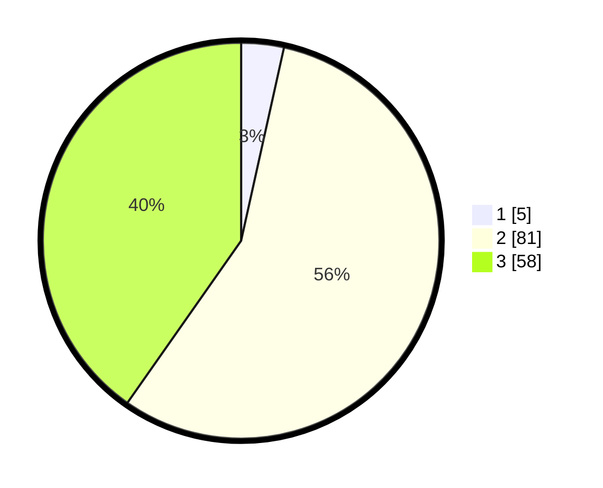

# Hasil

## Grafik

## Tabel

| No. | Nama Paslon    | Suara | Suara (raw) | Persentase |
|:--- |:-------------- | -----:| -----------:| ----------:|
| 1   | ANIES MUHAIMIN | 5     | [5][p-1]    | 3,47       |
| 2   | PRABOWO GIBRAN | 81    | [81][p-2]   | 56,25      |
| 3   | GANJAR MAHFUD  | 58    | [58][p-3]   | 40,28      |

[p-1]: https://github.com/gigit-pemilu/pemilu-2024-33-jawa-tengah/blob/main/pilpres/hitung-suara/sub/33-jawa-tengah/sub/02-banyumas/sub/01-lumbir/sub/2003-parungkamal/sub/021-tps/sub/paslon-1.txt
[p-2]: https://github.com/gigit-pemilu/pemilu-2024-33-jawa-tengah/blob/main/pilpres/hitung-suara/sub/33-jawa-tengah/sub/02-banyumas/sub/01-lumbir/sub/2003-parungkamal/sub/021-tps/sub/paslon-2.txt
[p-3]: https://github.com/gigit-pemilu/pemilu-2024-33-jawa-tengah/blob/main/pilpres/hitung-suara/sub/33-jawa-tengah/sub/02-banyumas/sub/01-lumbir/sub/2003-parungkamal/sub/021-tps/sub/paslon-3.txt

## Foto C Plano

https://sirekap-obj-formc.kpu.go.id/3f9a/pemilu/ppwp/33/02/01/20/03/3302012003021-20240215-002232--70f419c6-2974-456c-ab50-ce793513405f.jpg

https://sirekap-obj-formc.kpu.go.id/3f9a/pemilu/ppwp/33/02/01/20/03/3302012003021-20240214-155903--6ab01480-4050-4a54-b361-d9f56151fe59.jpg

https://sirekap-obj-formc.kpu.go.id/3f9a/pemilu/ppwp/33/02/01/20/03/3302012003021-20240214-181922--2e988f15-e75c-46f2-940b-8b538fcc0fb9.jpg

## Metadata

| Key        | Value               |
| ---------- | ------------------- |
| Time Stamp | 2024-02-15 15:00:29 |

