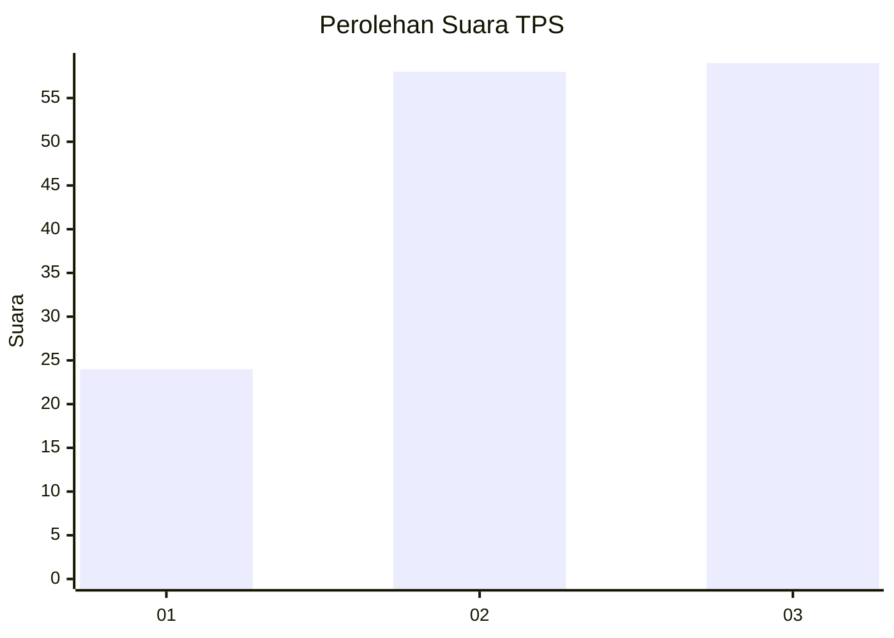
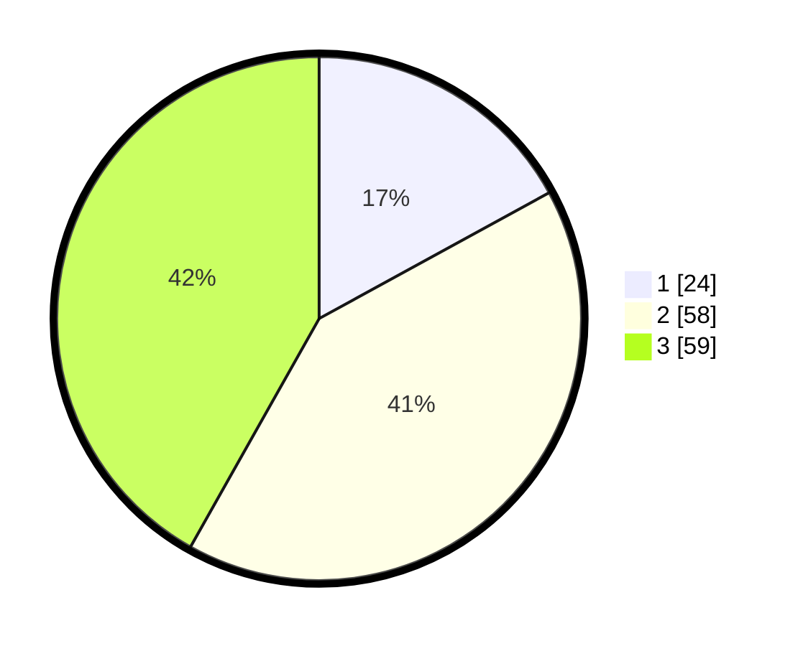

# Hasil

## Grafik

## Tabel

| No. | Nama Paslon    | Suara | Suara (raw) | Persentase |
|:--- |:-------------- | -----:| -----------:| ----------:|
| 1   | ANIES MUHAIMIN | 24    | [24][p-1]   | 17,02      |
| 2   | PRABOWO GIBRAN | 58    | [58][p-2]   | 41,13      |
| 3   | GANJAR MAHFUD  | 59    | [59][p-3]   | 41,84      |

[p-1]: https://github.com/gigit-pemilu/pemilu-2024-33-jawa-tengah/blob/main/pilpres/hitung-suara/sub/33-jawa-tengah/sub/02-banyumas/sub/01-lumbir/sub/2007-lumbir/sub/027-tps/sub/paslon-1.txt
[p-2]: https://github.com/gigit-pemilu/pemilu-2024-33-jawa-tengah/blob/main/pilpres/hitung-suara/sub/33-jawa-tengah/sub/02-banyumas/sub/01-lumbir/sub/2007-lumbir/sub/027-tps/sub/paslon-2.txt
[p-3]: https://github.com/gigit-pemilu/pemilu-2024-33-jawa-tengah/blob/main/pilpres/hitung-suara/sub/33-jawa-tengah/sub/02-banyumas/sub/01-lumbir/sub/2007-lumbir/sub/027-tps/sub/paslon-3.txt

## Foto C Plano

https://sirekap-obj-formc.kpu.go.id/2b09/pemilu/ppwp/33/02/01/20/07/3302012007027-20240214-140954--92d7ad5f-d5c2-4f27-8731-da56439f709c.jpg

https://sirekap-obj-formc.kpu.go.id/2b09/pemilu/ppwp/33/02/01/20/07/3302012007027-20240214-141101--861c24bd-4621-48d3-813b-330c095a79be.jpg

https://sirekap-obj-formc.kpu.go.id/2b09/pemilu/ppwp/33/02/01/20/07/3302012007027-20240214-210617--3dabd693-f8c0-40a2-ae92-3babe0998028.jpg

## Metadata

| Key        | Value               |
| ---------- | ------------------- |
| Time Stamp | 2024-02-15 00:41:44 |

