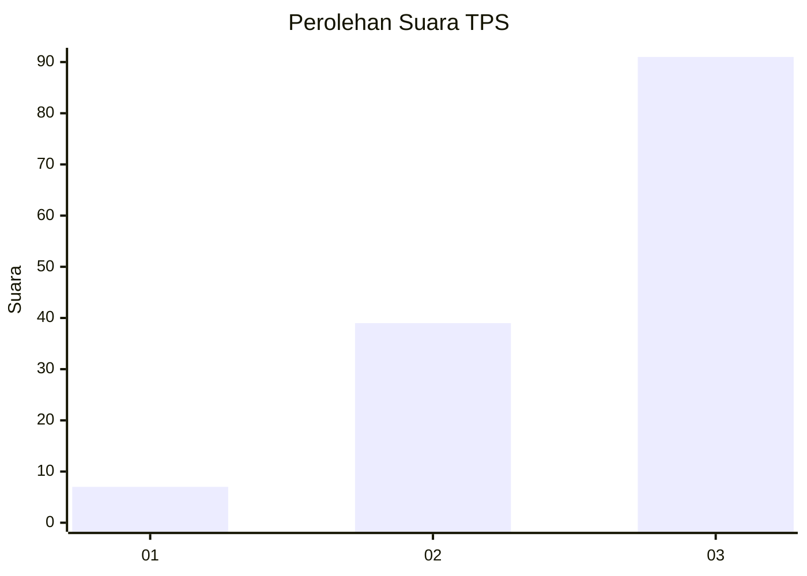
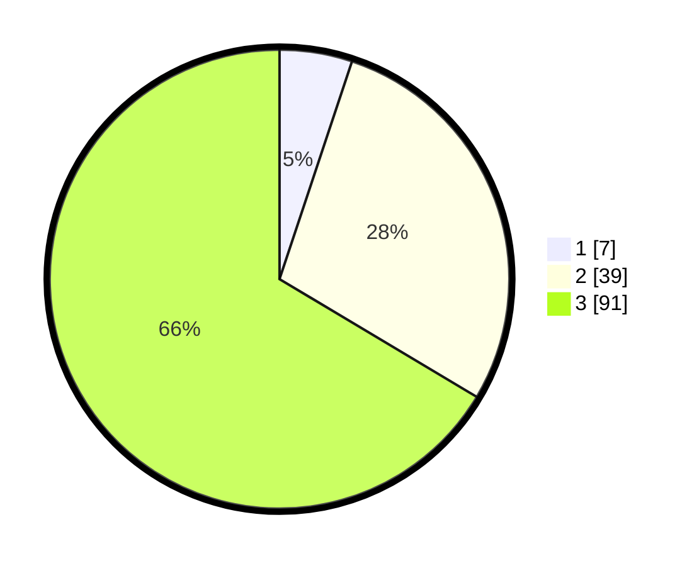

# Hasil

## Grafik

## Tabel

| No. | Nama Paslon    | Suara | Suara (raw) | Persentase |
|:--- |:-------------- | -----:| -----------:| ----------:|
| 1   | ANIES MUHAIMIN | 7     | [7][p-1]    | 5,11       |
| 2   | PRABOWO GIBRAN | 39    | [39][p-2]   | 28,47      |
| 3   | GANJAR MAHFUD  | 91    | [91][p-3]   | 66,42      |

[p-1]: https://github.com/gigit-pemilu/pemilu-2024/blob/main/pilpres/hitung-suara/sub/33-jawa-tengah/sub/02-banyumas/sub/01-lumbir/sub/2008-dermaji/sub/011-tps/sub/paslon-1.txt
[p-2]: https://github.com/gigit-pemilu/pemilu-2024/blob/main/pilpres/hitung-suara/sub/33-jawa-tengah/sub/02-banyumas/sub/01-lumbir/sub/2008-dermaji/sub/011-tps/sub/paslon-2.txt
[p-3]: https://github.com/gigit-pemilu/pemilu-2024/blob/main/pilpres/hitung-suara/sub/33-jawa-tengah/sub/02-banyumas/sub/01-lumbir/sub/2008-dermaji/sub/011-tps/sub/paslon-3.txt

## Foto C Plano

https://sirekap-obj-formc.kpu.go.id/a072/pemilu/ppwp/33/02/01/20/08/3302012008011-20240215-001925--5e36c174-f96a-4eed-a0ab-6b8ec312a049.jpg

https://sirekap-obj-formc.kpu.go.id/a072/pemilu/ppwp/33/02/01/20/08/3302012008011-20240214-141142--64e446a1-70f5-41c6-8e7e-c4a5757bb070.jpg

https://sirekap-obj-formc.kpu.go.id/a072/pemilu/ppwp/33/02/01/20/08/3302012008011-20240214-141448--184e8c36-a72e-4f7e-9fd8-adf7de10987d.jpg

## Metadata

| Key        | Value               |
| ---------- | ------------------- |
| Time Stamp | 2024-02-15 12:00:28 |

