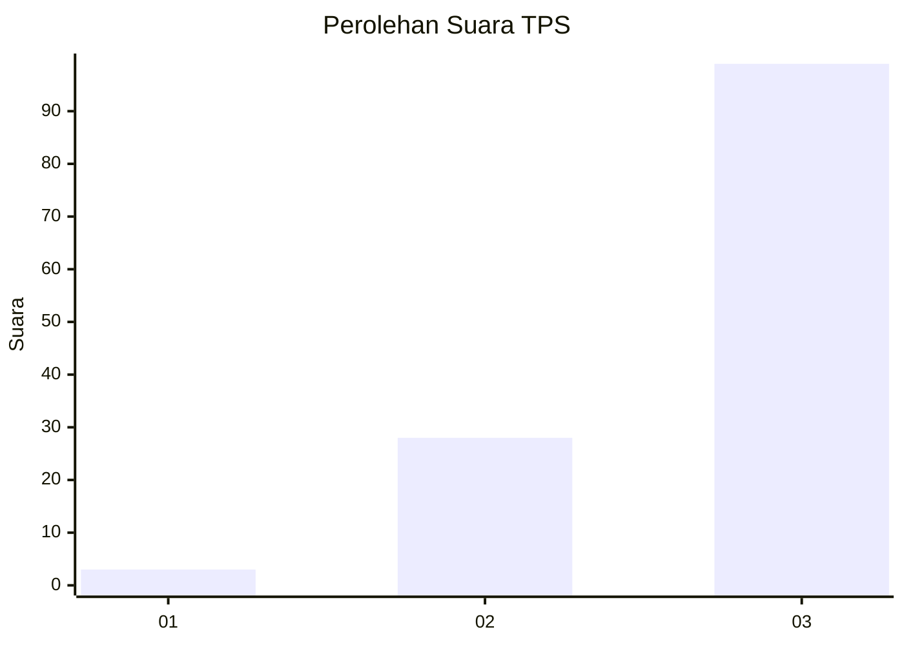
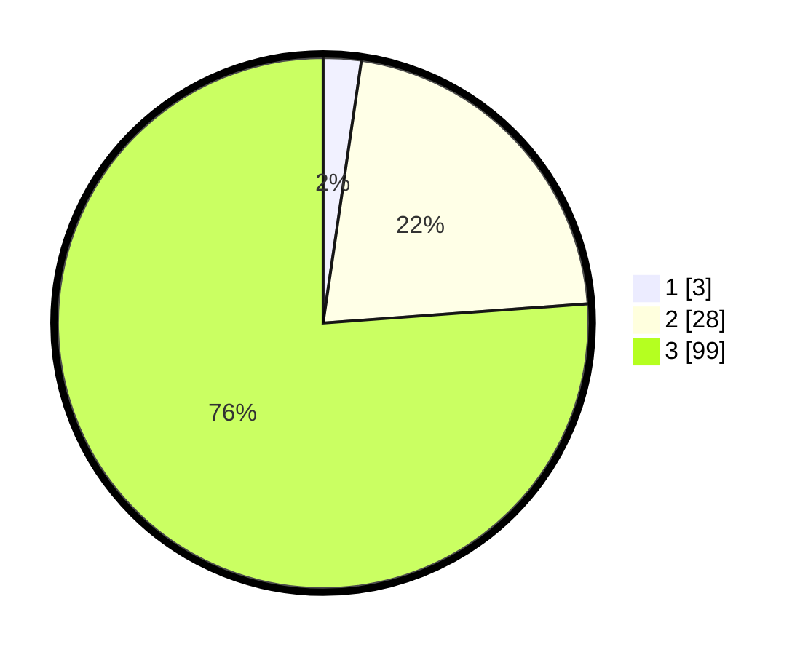

# Hasil

## Grafik

## Tabel

| No. | Nama Paslon    | Suara | Suara (raw) | Persentase |
|:--- |:-------------- | -----:| -----------:| ----------:|
| 1   | ANIES MUHAIMIN | 3     | [3][p-1]    | 2,31       |
| 2   | PRABOWO GIBRAN | 28    | [28][p-2]   | 21,54      |
| 3   | GANJAR MAHFUD  | 99    | [99][p-3]   | 76,15      |

[p-1]: https://github.com/gigit-pemilu/pemilu-2024/blob/main/pilpres/hitung-suara/sub/33-jawa-tengah/sub/02-banyumas/sub/01-lumbir/sub/2008-dermaji/sub/012-tps/sub/paslon-1.txt
[p-2]: https://github.com/gigit-pemilu/pemilu-2024/blob/main/pilpres/hitung-suara/sub/33-jawa-tengah/sub/02-banyumas/sub/01-lumbir/sub/2008-dermaji/sub/012-tps/sub/paslon-2.txt
[p-3]: https://github.com/gigit-pemilu/pemilu-2024/blob/main/pilpres/hitung-suara/sub/33-jawa-tengah/sub/02-banyumas/sub/01-lumbir/sub/2008-dermaji/sub/012-tps/sub/paslon-3.txt

## Foto C Plano

https://sirekap-obj-formc.kpu.go.id/ef49/pemilu/ppwp/33/02/01/20/08/3302012008012-20240214-141256--13d99593-a451-489c-8888-1546db05e67c.jpg

https://sirekap-obj-formc.kpu.go.id/ef49/pemilu/ppwp/33/02/01/20/08/3302012008012-20240214-141415--ad2342a3-c779-49d1-aef7-c0b639e9cf43.jpg

https://sirekap-obj-formc.kpu.go.id/ef49/pemilu/ppwp/33/02/01/20/08/3302012008012-20240215-001300--0318bcbb-f1ca-4c30-a31c-955817e15bb7.jpg

## Metadata

| Key        | Value               |
| ---------- | ------------------- |
| Time Stamp | 2024-02-15 00:41:44 |

