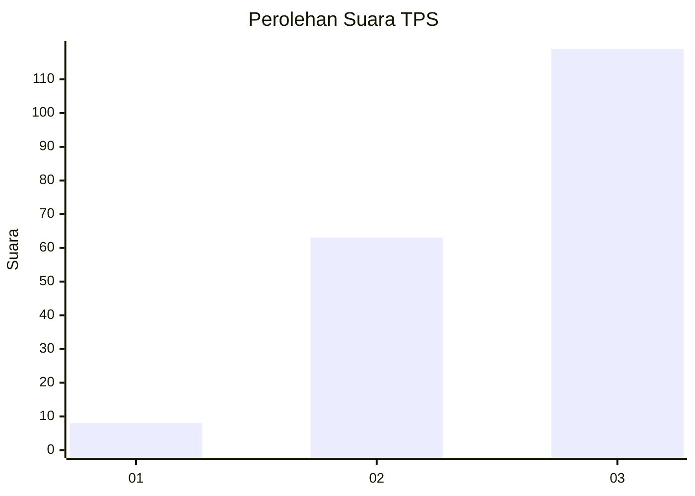
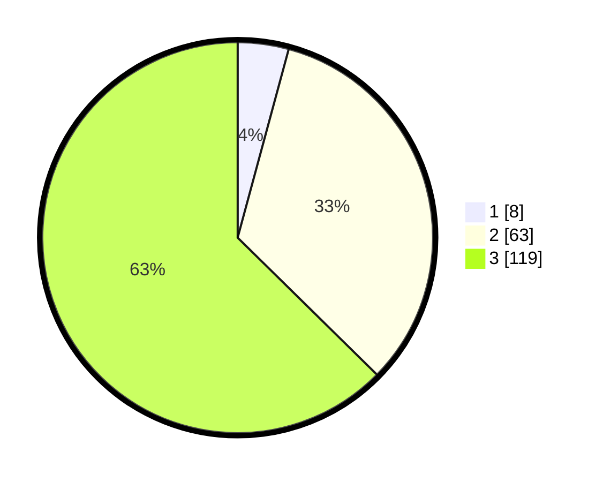

# Hasil

## Grafik

## Tabel

| No. | Nama Paslon    | Suara | Suara (raw) | Persentase |
|:--- |:-------------- | -----:| -----------:| ----------:|
| 1   | ANIES MUHAIMIN | 8     | [8][p-1]    | 4,21       |
| 2   | PRABOWO GIBRAN | 63    | [63][p-2]   | 33,16      |
| 3   | GANJAR MAHFUD  | 119   | [119][p-3]  | 62,63      |

[p-1]: https://github.com/gigit-pemilu/pemilu-2024-33-jawa-tengah/blob/main/pilpres/hitung-suara/sub/33-jawa-tengah/sub/02-banyumas/sub/01-lumbir/sub/2008-dermaji/sub/017-tps/sub/paslon-1.txt
[p-2]: https://github.com/gigit-pemilu/pemilu-2024-33-jawa-tengah/blob/main/pilpres/hitung-suara/sub/33-jawa-tengah/sub/02-banyumas/sub/01-lumbir/sub/2008-dermaji/sub/017-tps/sub/paslon-2.txt
[p-3]: https://github.com/gigit-pemilu/pemilu-2024-33-jawa-tengah/blob/main/pilpres/hitung-suara/sub/33-jawa-tengah/sub/02-banyumas/sub/01-lumbir/sub/2008-dermaji/sub/017-tps/sub/paslon-3.txt

## Foto C Plano

https://sirekap-obj-formc.kpu.go.id/6a34/pemilu/ppwp/33/02/01/20/08/3302012008017-20240215-011754--36306c9b-a931-48eb-8f51-0f8d98782110.jpg

https://sirekap-obj-formc.kpu.go.id/6a34/pemilu/ppwp/33/02/01/20/08/3302012008017-20240215-043506--53702070-5959-467f-80c5-09655e3960b4.jpg

https://sirekap-obj-formc.kpu.go.id/6a34/pemilu/ppwp/33/02/01/20/08/3302012008017-20240215-043511--de093da5-3f0f-4be7-ab59-c0346ebd1c3e.jpg

## Metadata

| Key        | Value               |
| ---------- | ------------------- |
| Time Stamp | 2024-02-15 16:00:26 |

